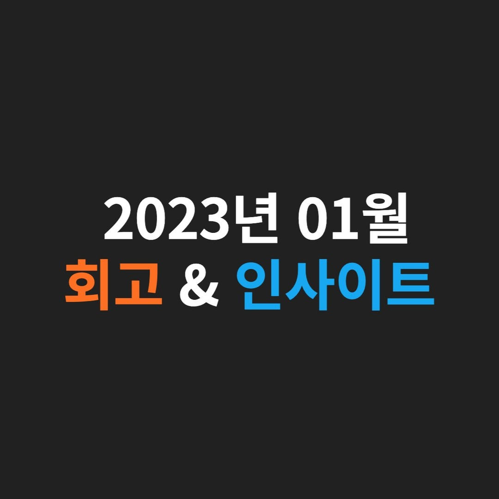

행복의 원천은 '기대감'과 '감사함'이다.@

---

## [1] 삶이 행복해지는 6가지 방법

- 미워하지 않기
- 걱정하지 말기
- 단순하게 살기
- 너무 기대하지 말기
- 항상 웃기
- 그리고 많이 베풀기

## [2] 행복의 원천

‘우와 저렇게 살고 싶다!’에서 ‘저렇게’의 삶 대부분 월요일 아침은 행복할 것이다.

그러면 월요일 아침이 행복하려면 무엇이 있어야 할까?

바로 **‘기대감’과 ‘감사함’** 이 있어야 한다. 이 두 가지가 없으면 삶을 버티게 되기 때문에 팍팍 늙어간다.

당신의 월요일 아침은 행복한가?

## [3] 운동의 중요성

운동은 행복감을 증진시킬 뿐만 아니라, 대부분의 우울증을 치료해 주고 뇌의 효율을 극대화할 수 있다.

1주일에 세 번 정도의 운동은 몸의 노화를 막고 행복도를 높이며, 창의성과 의사 결정력을 극도로 높여준다.

## [4] 목표와 간절함

내가 이루고 싶은 목표가 나에게 정말 간절한가?

간절한지 아닌지 확인하고 싶다면, 목표를 이루었을 때의 내 모습을 상상해 보라.

간절함이 없다면 ‘대부분’처럼 된다.

’대부분’이 되고 싶지 않다면, ’대부분’이 하기 싫은 것을 하자.

그러면 ‘대부분’이 부러워하는 삶을 살게 된다.

## [5] 책 '기분이 태도가 되지 말자' 중

우리는 영원히 살 것처럼 현재를 낭비하면서 서로 다투면서 인생을 살아간다.

그러다 죽음의 앞에서야 소중한 사람에게 못해줬던 것에 대한 후회들이 밀려온다.

삶의 끝에서야 깨닫게 되는 것이다. 소중한 사람이 곁에 있을 때 잘해라. 옆에 있는 게 당연해지면 얼마나 소중한 사람인지 잊어버리게 된다. 시간이 지날수록 더 소중하게 대해주도록 노력해라.

우리는 인생을 살아감과 동시에 죽음을 향해 나아가고 있다. 우리의 삶은 사랑하며 보내기에도 짧은 시간이다. 항상 오늘이 마지막인 것처럼 사랑하며 살아라.

## [6] 독서 빈부 격차

독서 빈부 격차는 경제적 빈부 격차보다 훨씬 더 무서운 것으로, 삶의 양극화를 자기도 모르게 만들게 된다.

하루 중 최소 30분이라도 글을 읽고 정리하는 시간을 갖자.

## [7] 남과 비교

남과 나를 비교하지 마라. 해와 달은 서로를 비교하는 법이 없다. 그들은 모두 각자의 위치에서 각자의 시간에서 빛나고 있을 뿐이다.

하늘에는 동서의 구별이 없다. 하지만 사람들은 자신의 마음대로 구분을 하고 그것을 진실이라고 믿는다.

이 세상 모든 사람과 마찬가지로 나 또한 사랑과 애정을 받을 가치가 있는 존재이다.

다른 사람과 자신을 비교하면서 자신을 괴롭히면 인생의 즐거움이 사라지게 된다.

## [8] 책 '시작의 기술' 중

현재 느끼는 불편함과 어려움의 정도가 크면 클수록 이를 해결했을 때, 느끼는 개인적인 성취의 정도가 더욱 커진다.

그리고 이것이 성공한 사람이 적은 이유이다. 사람들은 불편하고 어려운 것을 좋아하지 않기 때문이다.

스스로의 무의식을 바꾸는 것은 거대한 전함의 방향을 바꾸는 것과 비슷하기에 시간이 걸릴 수밖에 없고 무척 어렵다.

그 어떠한 위대한 일도 바로 하루아침에 되는 것은 절대 없다. (헬스와 비슷하다)

## [9] '김혜자 배우님의 대사' 중

내 삶은 때론 불행했고 때론 행복했습니다.

삶이 한낱 꿈에 불과하다지만, 그래도 살아서 좋았습니다.

후회만 가득한 과거와 불안한 미래 때문에 지금을 망치지 마세요.

오늘을 살아가세요 눈에 부시게.

## [10] 경제적 자유를 위한 최소한의 마인드

만약 지금 나에게 200억 원이 통장에 꽂힌다고 하더라도, 지금의 삶에 대한 태도와 열정을 그대로 유지할 수 있어야 한다.

단순히 돈만 많이 벌면 끝!이라는 생각이 돈을 많이 벌 수 없게 만들고 있을 것이다.

진짜 부자는 열심히 선한 영향력을 행사하며 살아가고 있다는 것을 명심하자.

## [11] 메타인지

메타인지란, 자신을 객관화할 수 있는 능력이다.

자기 객관화가 잘 되면 의사 결정력이 전반적으로 높아진다.

메타인지는 높은 지능, 자의식 해체, 실행을 통한 시행착오, 분석력 등 종합적인 능력이 필요하다.

이를 높이기 위해선 2가지가 필요하다.

1. 독서 : 책을 읽게 되면 저절로 겸손해지고 내 수준을 잘 알게 된다.
2. 실행력 : 아무리 책을 많이 읽어도 본인이 세상에서 어떤 위치에 있는지는 실행을 하지 않는 이상 알 수가 없다.

---

"50대의 추교현이 20대의 추교현에게 감사할 수 있게끔 하루하루 최선을 다해 살고자 합니다."

**_The End._**
