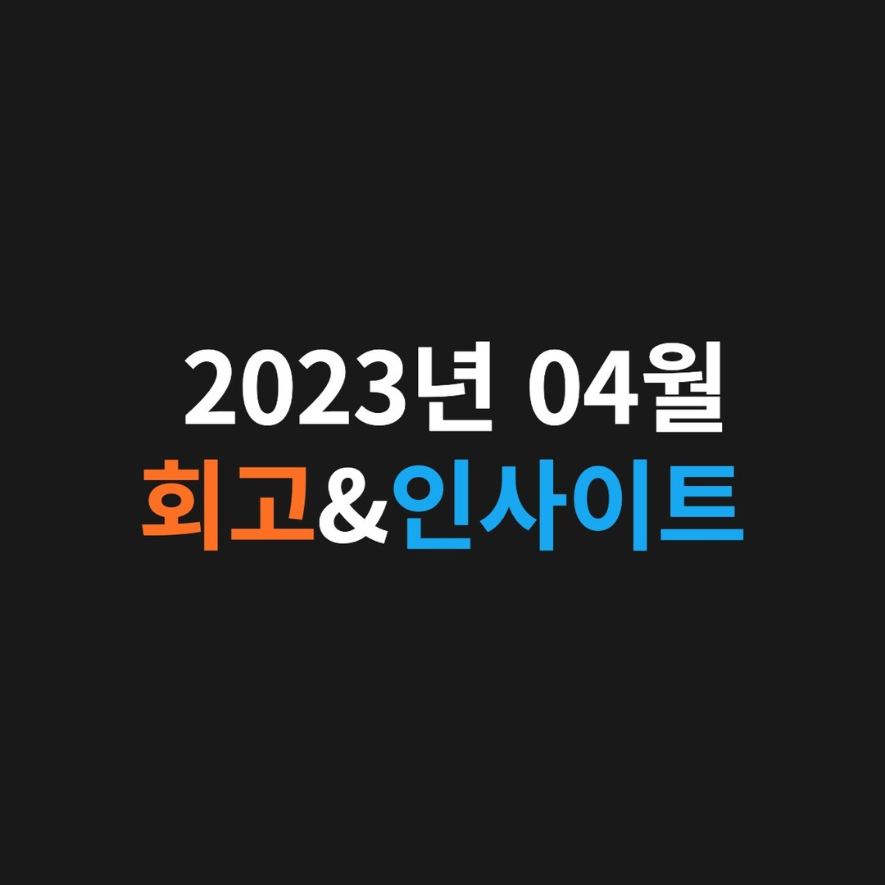

주변이 잘 되는 것이 결국 내가 잘 되는 것이다.@

---

# 🔎 04월 회고 🔎

## [1] 업무지원금으로 소중한 사람들께 책 선물

회사에서 받은 업무지원금으로 제 [주변의 소중한 사람들에게 책을 선물]했습니다. 아이패드 같은 전자기기 등 오로지 저를 위해서 업무지원금을 사용할 수 있었지만, 결국 [제 주변이 잘 되는 것이 궁극적으로 저를 위한 것]이라고 생각했습니다.

그래서 두 번에 걸쳐 직접 서점에 방문하여 [80만 원 어치의 책을 구매]해서 회사에 기증도 하고 주변 지인들에게 선물하고 있는 중입니다. 진짜 뿌듯해요…😄

## [2] 양적보다 질적인 성장에 집중

이번 달에 셰어하우스 사업을 2호점까지 확장할 기회를 얻었고 패스트캠퍼스에서 개발 관련 강의 제안이 들어왔었습니다. 정말 소중한 기회들이고 놓치면 안 될 것 같은 FOMO도 느꼈었습니다.

하지만, 올해 [나의 본질적인 역량과 실력을 확실히 키워서 제대로 성장하자]는 목표를 다시 한번 더 상기시켜준 여자친구 덕분에 해당 제안들을 정중하게 잘 거절하였고 시작하지 않았습니다. 그리고 현재 하고 있는 것들에 더욱 집중할 수 있게 되었습니다.

어떤 중대한 결정을 할 때, 심사숙고해서 결정해야 하고 결정을 했다면, 절대 그 결정을 뒤집지 않는 사람이 되도록 하겠습니다. 제 말 한마디 한마디가 굉장히 무거워야 한다는 것을 한 번 더 배우게 되었습니다.

## [3] 하루를 꽉꽉 채운 2년을 지내면서 배운 것

21년 03월에 전역하고 지금까지 약 2년 동안 항상 해야 할 일이 제가 가용할 수 있는 리소스의 1.2배 정도씩 벅차도록 있었던 것 같습니다. 그렇게 벅찬 일들을 처리하기 위해 하루를 꽉꽉 채워가며 2년을 보내면서 느낀 것은 3가지입니다.

1. 나는 [성장에 목마른 사람]이기에 어떻게든 해야 할 일이 쌓일 수밖에 없다 : 이러한 제 자신을 받아들이고 존중하려고 합니다. (다만, 건강은 꼭 챙기자)

2. 최대한 [효율적으로 시간을 사용]하자 : 해야 할 일에 대한 우선순위를 명확하게 구별해서 시간을 분배해서 쓰고 있습니다.

3. 쉴 때는 해야 할 일을 최대한 머릿속에서 밀어내고 [제대로 쉬자] : 저에겐 가장 어려운 것이었지만 꼭 해야 하는 것이기에 요즘에 쉴 때는 제대로 쉬는 것에 집중하고 있습니다.

# 💡 04월 인사이트 💡

## 책 ‘THE ONE THING’ 중

### “전문가가 되어라”

무엇보다도 전문성은 투자한 시간에 비례한다.

‘단 하나’를 오롯이 자신의 것으로 만드는데 전념하다 보면, 그것이 또 다른 일의 발판이 되는 것을 경험한다.

지식은 또 다른 지식을 가져다주고, 기술은 또 다른 기술 위에 쌓인다.

이것이 또 미래의 도미노를 더 쉽게 쓰러지도록 만든다.

### “집중의 중요성”

성공과 혼란은 늘 함께 오게 되어 있다. 위대함을 추구하다 보면 혼란은 반드시 일어난다.

매일 자기만의 단 하나에 몰두하면 언젠가 놀라운 성과가 일어나게 되어 있다.

단 하나에 집중하다 보면, 결국 원하는 곳에 이르게 될 것이라 믿어라.

### “후회하지 않는 삶”

가치 있는 삶으로 가는 길에서 자신에게 가장 중요한 일을 성공시키기 위해 최선을 다하면,
성공과 행복이라는 보상뿐 아니라, 그보다 더 귀한 무언가를 선물로 받게 된다.

바로 [후회하지 않는 삶]이다.

가치 있는 삶을 측정하는 방법에는 여러 가지가 있겠지만 그중에서도 가장 확실한 것은 그 삶에 후회가 얼마나 있느냐를 알아보는 것이다.

## 책 ‘무엇을 버릴 것인가’ 중

### “자신과 타인을 대하는 태도는 달라야 한다”

작은 길에서는 한 걸음만 멈춰 다른 사람이 먼저 지나가게 하라.

실패의 책임 및 고난은 남과 같이 하되 공적은 상대에게 돌리고 안락도 상대에게 더 주는 게 좋다.

다른 사람의 작은 잘못을 꾸짖지 않으며 지난 잘못을 마음에 간직하지 않는다.

그래야 자신의 인격이 올라가고 다른 사람의 원한을 사는 일이 없을 것이다.

남에게는 너그럽고 자신에게는 엄격하라.

기분에 들떠 가볍게 승낙하지 말고 술 취한 기분에 성을 내지 말고 유쾌함에 들떠 일을 많이 벌리지 말고 싫증 난다 하여 끝내기 전에 그치지 말고 항상 균형 잡힌 상태를 유지하라

행복과 불행은 순환한다.

좋은 시절일수록 긴장을 늦추지 말고 한층 더 신중한 태도로 매사에 임하자.

충고의 말은 귀에 거슬리지만 행실에 이롭다.

---

"50대의 추교현이 20대의 추교현에게 감사할 수 있게끔 하루하루 최선을 다해 살고자 합니다."

**_The End._**
