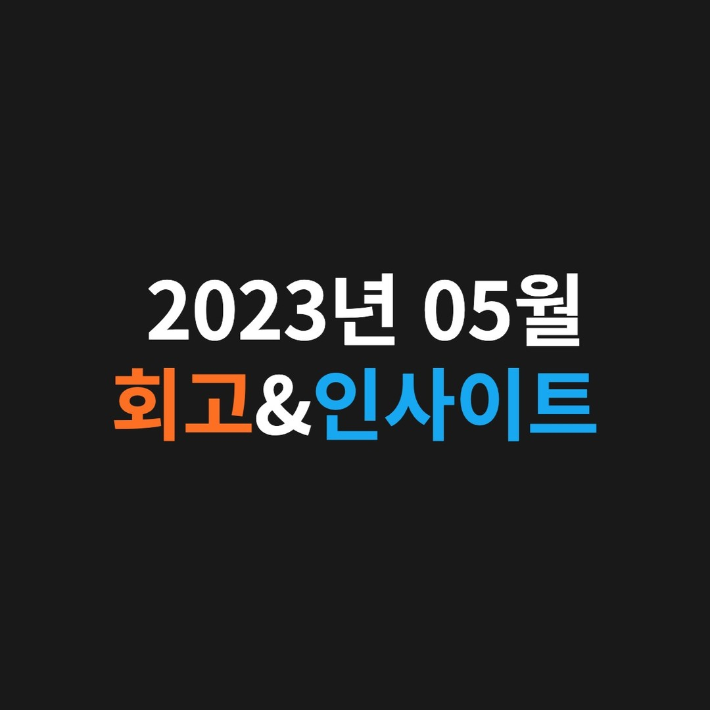

입사한지 벌써 1년 & 독재자의 마음을 알겠다.@

---

# 🔎 05월 회고 🔎

## [1] 입사한지 "벌써 1년"

저는 현재 대학교 3-2를 다니고 있고 블록체인 인프라 스타트업인 A41에서 프론트엔드 개발자로서 풀타임으로 근무 중입니다.

작년 5월 초부터 정말 감사하게도 현재 다니고 있는 A41에 정규직으로 프론트엔드 개발자로서 첫 커리어를 시작하게 되었습니다.

A41은 Seed Round(초기 투자 단계)에서 “150억”을 투자 받고 폭풍성장하고 있는 블록체인 인프라 스타트업입니다. 복지는 말도 안 되게 좋으며(점심 & 저녁 무제한 식대 제공 등등) 동료분들 대다수가 성장하고 싶어 하는 욕구가 크셔서 좋은 자극을 받으며 회사를 다니고 있습니다.

아직도 많이 부족하지만, 약 1년 동안 대학교 개발 동아리나 개발 강의가 아닌 회사에서 실제 프로젝트를 통해 개발 실력을 쌓게 되어 빠른 속도로 성장할 수 있었습니다🥹

## [2] "독재자"의 마음을 어느 정도 이해

60주가 넘는 시간 동안 연합 블록체인 리서치 학회, CURG의 학회장으로 학회를 운영했습니다. 1) 학회의 근간이 되는 회칙과 시스템을 만들고 2) 학회를 개발자 중심으로 피봇팅 했으며 3) 처음으로 학회 차원에서 공개 리쿠르팅을 진행한 덕분에 좋은 분들이 많이 입회하였습니다.

제 Web3(블록체인) 커리어를 본격적으로 시작하게 도와준 CURG에 대한 애정이 남다를 수밖에 없었으며 CURG를 Web3에서 더욱 대체 불가능한 학회로 만들고 싶었습니다. 그러기에 많은 독재자가 그랬듯 “나 아님 안 돼”라는 오만한 생각과 함께 제가 적어도 2년 정도는 학회를 운영해야 된다고 믿고 있었습니다.

하지만 약 2-3주 전쯤 학회 입장에서 1) 오히려 저에 대한 의존성을 낮추고 2) 지속 가능한 학회장 선출 시스템을 구축하고 3) 더 넓은 시야를 바탕으로 제가 뒤에서 서포트하는 것이 학회를 위한 길이라고 판단했습니다.

그래서 저보다 더 성실하고 똑똑하고 책임감 있는 두 분을 학회장(@hereokay88) & 부학회장(@resister_boy)으로 모셨고 약 3개월 정도 인수인계 차원에서 간접적으로 학회를 함께 운영하고 있습니다.

## [3] ”열심히“는 너무 당연하고 “잘”해야 된다

저는 개발 경력이 이제 막 1년 넘은 주니어 개발자입니다. 처음부터 “잘” 하는 사람은 많이 없으며 당연히 부족한 점이 있을 수밖에 없습니다.

자신의 부족함으로 인해 좌절감을 느껴 포기한다면, 그 사람의 그릇은 거기까지인 것 같고 “열심히”를 기본값으로 삼고 “잘” 하기 위해서 최선을 다한다면, 그 사람은 성장할 수밖에 없다고 생각합니다.

“잘” 하기 위해서 기본기(JS & TS 딥다이브 등)를 탄탄하게 쌓을 것이고 모르는 것은 그냥 넘어가지 않고 능동적으로 질문해서 저만의 답을 찾아낼 것이며 양질의 학습을 위해 가용할 수 있는 충분한 시간을 확보하려고 합니다.

# 💡 05월 인사이트 💡

## 팬이 있다면, 안티도 있는 것이 당연하다

모든 사람이 나를 좋아할 수는 없다는 것을 깨닫자. 모든 사람들한테 잘 보이고 싶은 욕심에 자신의 감정을 애써 감추면서까지 억지로 관계를 이어가는 사람들이 있다.

그럴 필요가 없는 게 아무리 노력해도 떠날 사람은 어차피 떠나고 남아 있을 사람은 자연스레 남게 되어 있다. 그러니 모든 사람과 잘 지내야 한다는 욕심을 버리고 자신을 지키면서 자신이 원하는 관계에 집중하는 사람이 되자.

그렇게 자신의 속도와 방향을 가진 사람들이 훨씬 매력적이고 생존력도 높다. 자신의 속도와 방향을 갖고 순간순간 최선을 다해 즐겁게 살아가자.

---

"50대의 추교현이 20대의 추교현에게 감사할 수 있게끔 하루하루 최선을 다해 살고자 합니다."

**_The End._**
