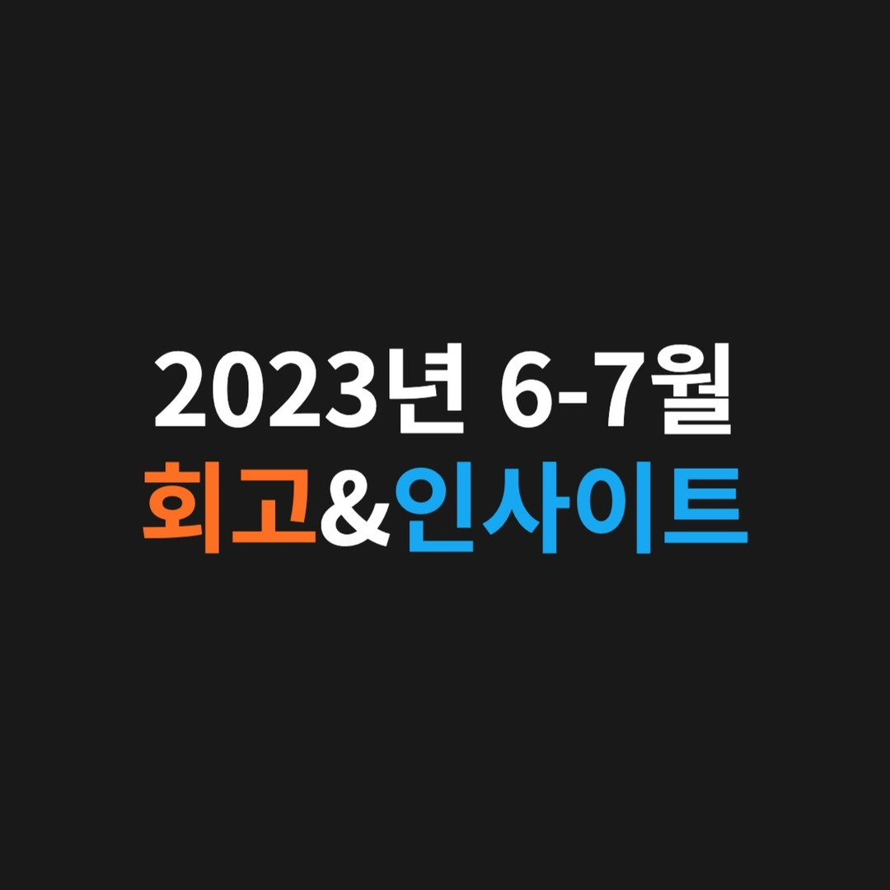

속도보다는 방향. 정말 많은 변화가 있었던 6-7월이었다.@

---

요즘엔 바쁘다는 핑계로 못 뵈었던 많은 분들을 만나면서 커리어 등 여러 조언도 구하고 다양한 생각을 듣는 시간을 갖고 있습니다.

그리고 백준 알고리즘 문제를 매일 조금씩 풀고 있습니다. (졸업 전까지 목표는 백준 플래티넘⭐️)

# 🔎 6-7월 회고 🔎

## [1] 좋은 마무리 & 새로운 출발

졸업을 마무리하고 내실을 다지는데 더욱 집중하고자 1년 넘게 다니던 블록체인 스타트업 A41을 퇴사(22.05 - 23.07) 했습니다. 많은 것을 배웠던 정말 의미있는 시간들이었습니다. 회사에서 퇴사 선물과 롤링페이퍼까지 주셨네요… A41 정말 감사합니다🙇🏻‍♂️

졸업까지 앞으로 1년이 남았는데, CS 공부와 영어 공부 등 기본기를 다지는데 시간을 많이 쓰려고 합니다🙂 + 벌크업도 반드시 성공💪🏼

## [2] ETH SEOUL 2023 해커톤 참가

CURG 학회원분들과 6월 초쯤 Account Abstraction(계정 추상화) 기술에 대한 아이디어로 이더서울 해커톤에 참가했습니다.

비록 수상을 하진 못했지만, 학회원분들과 1박2일 동안 밤을 새우면서 열심히 즐겁게 개발하였고 덕분에 좋은 추억을 만들었습니다.

## [3] CURG 인수인계 끝

올해 5월 중순에 1년 넘게 맡았던 CURG 학회장 자리를 진중님께 위임했었고 그로부터 약 3개월간 인수인계를 진행했습니다. 그리고 이제는 학회의 알럼나이(Alumni)가 되었네요.

현재 학회장 & 부학회장 두 분께서 열정적으로 학회를 운영해 주셔서 감사할 따름이고 든든합니다🙂

앞으로의 CURG가 Web3에서 더욱 대체불가능한 학회가 되기를 진심으로 응원하며 뒤에서 열심히 돕겠습니다🙌

## [4] 몰입할 수 있는 환경세팅

책 '슬로우 싱킹'을 읽으면서 가장 크게 배운 것은 “몰입”의 중요성입니다.

몰입을 통해 오는 생산성과 행복감을 느끼고 싶었습니다. 그래서 저는 크게 2가지를 하고 있습니다.

#### 1. 유튜브 어플 삭제

평소 이동 시간에 이어폰을 끼고 유튜브를 보았기에 ‘생각’ 자체를 많이 하지 않았습니다.

그래서 유튜브 어플을 삭제하고 이동 시간에는 ‘오늘 할 일’ 혹은 ‘특정 주제에 대한 생각’에 집중하고 있습니다. 벌써 6주가 넘었네요. (맥북으로 가끔 보긴 봅니다ㅎㅎ😅)

#### 2. 아침 루틴 고정

아침 8시쯤 일어나서 독서, 명상, 영양제 섭취, 아침 식사, 운동, 계획 정리 등 정말 중요하지만 미루기 쉬운 것들을 오전에 싹 다 처리하고 있습니다.

그리고 공부할 것 혹은 할 일들을 오후부터 본격적으로 카페(혹은 스터디카페)에서 몰입하여 처리하고 있습니다.

책에서 얻은 교훈을 제 삶에 자연스럽게 녹여 삶의 질을 높인 것을 보면서 다시 한번 더 책의 중요함을 알게 되었습니다. (Thanks to 책 “슬로우 싱킹”을 선물해 준 @jun_2.6)

# 💡 6-7월 인사이트 💡

> 2개월 간 읽은 책 ‘슬로우 싱킹’ & ‘소프트 스킬’

## < 다시 생각해 보기 >

아인슈타인이 ‘나의 꿈은 100억을 버는 것’을 목표로 두거나, 스티브 잡스가 ‘돈 많이 모아서 부동산 임대업 할 거야’라고 했다면, 확실히 이질감이 들지 않았을까? (저런 목표가 나쁘다는 것이 절대 절대 아니다.)

그런데 나는 왜 좋은 가치를 제공하는 것이 아닌 재정적인 목표를 서슴없이 나의 꿈이라고 말했을까.

책에서 위의 내용을 읽었을 때, 머리에 뭐를 맞은 듯한 느낌이 들었다.

진짜 내가 이루고 싶은 꿈에 대해서 진지하게 다시 생각해 보면 어떨까?

-책 ‘슬로우 싱킹’을 읽고 정리한 생각-

## < 성공하는 법 >

성공하기 위해선 다른 사람들의 성공을 도우면 된다.

나만 성공하고자 한다면, 오히려 성공하기 어려울 것이다.

무슨 일을 하든 “사람들에게 어떤 가치를 제공할 것인가?”라는 질문을 항상 던지자.

정말 추상적이지만… 나는 “세상을 보다 이롭게 만드는 소프트웨어 엔지니어”가 되고 싶다.

세상에 제공할 가치는 조금씩 구체화해보자.

-책 ‘소프트 스킬’을 읽고 정리한 생각-

---

"50대의 추교현이 20대의 추교현에게 감사할 수 있게끔 하루하루 최선을 다해 살고자 합니다."

**_The End._**
