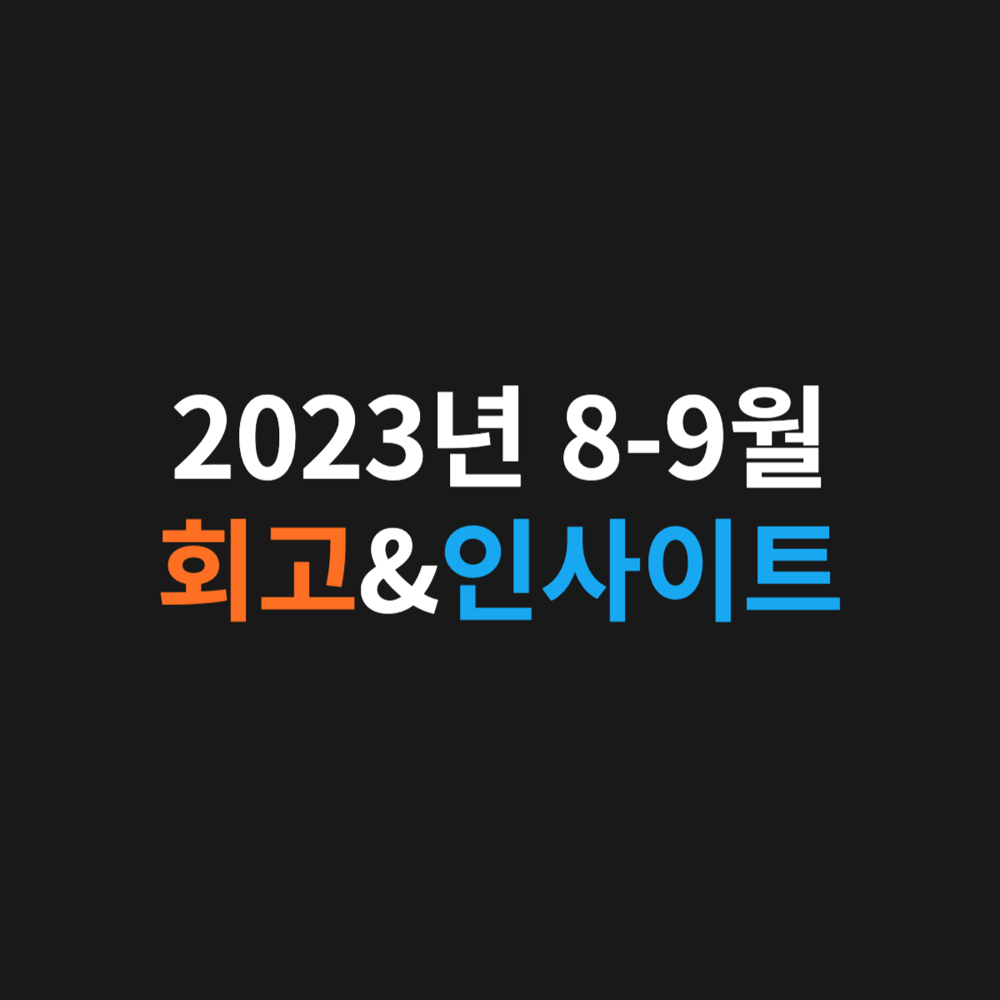

”지금, 여기”에 집중하기.@

---

# 🔎 08-09월 회고 🔎

## [1] 미래를 너무 구체화하지 말자

먼 미래를 구체적으로 예측하려 들지 않고 하루하루 주어진 일에 최선을 다하는데 집중하는 것이 오히려 원하는 미래에 가까워진다는 것을 배웠습니다.

목표가 점점 선명해지도록 “지금, 여기”에 집중하려고 노력하니까 미래에 대한 불안함이 미래에 대한 확신으로 조금씩 변하는 것을 요즘 느끼고 있습니다.

—

## [2] 20대는 충분히 탐색하는 시기

제가 조언을 구했던 많은 분들께서 공통적으로 해주신 얘기가 있습니다. “30대부터 본격적으로 달려도 절대 늦지 않으니 조급하지 말고 20대에는 나 자신을 알아가고 탐색하는데 많은 시간을 쓰세요.”

덕분에 용기를 얻어 더 적극적으로 여러 방향의 커리어를 고민하고 탐색하는 과정을 가졌습니다.

제 고민을 들어주시고 소중한 조언들을 아낌없이 주시는 많은 분들께 이 자리를 빌려 감사하다는 말씀드립니다🙇🏻‍♂️

—

## [3] 딥러닝 수업

9월에 잘한 일 중 하나는 바로 “고체역학(2)” 수업을 “딥러닝” 수업으로 정정한 것입니다. 이 수업을 통해 딥러닝에 대한 도메인 지식과 논문 읽는 법을 배우고 있습니다.

캐글을 활용하면 딥러닝 모델을 구현할 수 있는데, 이때 수업에서 배운 개념들을 적용하여 모델링하는 과정이 재밌습니다. 그리고 관련 논문들을 읽고 있는데 역시 어렵지만 그만큼 많이 얻어 갑니다.

특정 분야에 치우치지 않는 엔지니어를 지향하는 관점에서 이번 딥러닝 수업은 최고의 선택이었습니다.

# 💡 08-09월 인사이트 💡

[1] 생각의 속도는 실행의 속도보다 훨씬 빠르다. 그러기에 매일 11시간의 시간이 주어진다면, 딱 1시간만 생각하고 나머지 모두 실행에 시간을 쓰자.

[2] “그냥 하자” 내가 나중에 가장 후회할 모습은 바로 경험치 0으로 나이를 먹는 것이다.

[3] 최선을 다하는 데에만 집중하고 결과를 걱정하지 않을 때와 운명이 무엇을 가져오든 받아들이고 운명을 사랑하는 방법을 배울 때, 걱정할 것이 없다.

---

"50대의 추교현이 20대의 추교현에게 감사할 수 있게끔 하루하루 최선을 다해 살고자 합니다."

**_The End._**
