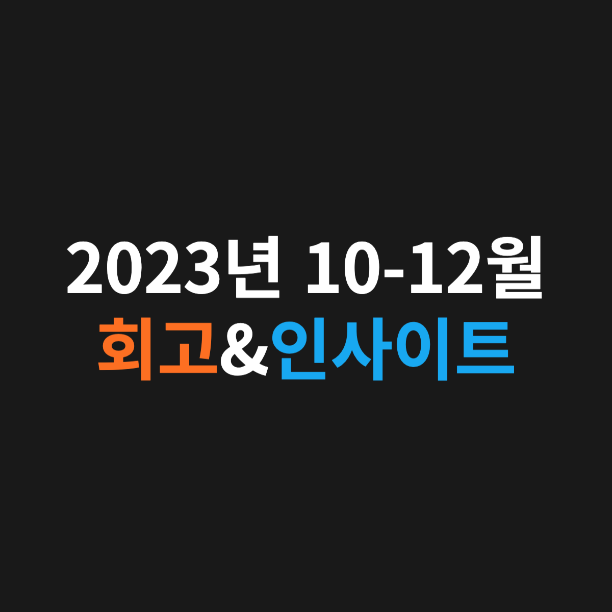

2023년을 잘 마무리했습니다.@

---

# 🔎 10-12월 회고 🔎

## [1] 알고리즘 문제 매일 풀기 📝 | 본질에서 벗어나지 말자

낯선 알고리즘 문제에 익숙해지고 전체적으로 어떤 문제 유형이 있는지 파악하기 위해서 7월부터 11월까지 거의 매일 백준 알고리즘 문제를 풀었습니다.

백준 문제를 풀면 잔디가 심어지는데, 이 잔디를 끊김 없이 매일 심고 싶어서 문제 풀 시간이 부족한 날에는 영양가 없는 브론즈 문제를 풀었습니다.

하지만, 잔디 심는 것 때문에 브론즈 문제를 푸는 것은 제가 목표하는 바에 전혀 도움이 되지 않는다는 것을 알게 되었고 본질에서 벗어난 행동임을 깨달았습니다.

제가 생각한 본질은 한 문제를 풀더라도 실제 코딩테스트를 보는 것처럼 충분한 시간을 사용하여 풀고 그 문제에 대한 여러 풀이들을 보면서 다각도로 문제를 이해하는 것입니다.

—

## [2] 4학년 1학기 끝 🔥 | 기본기의 중요성

이번 학기(9월부터 12월)에는 딥러닝, 운영체제, 객체지향, C/C++ 프로그래밍 언어, 자료구조/알고리즘, 시스템 제어, MATLAB 등을 배웠습니다.

또한, 지식뿐만 아니라 효율적인 시간 관리법, 원활한 커뮤니케이션 능력, 깔끔한 PPT 제작 방법 등 기본기에 해당하는 것들도 배웠습니다.

대학 생활이 유한하다는 것을 알기에 4학년이지만 새내기처럼 열정적으로 이번 학기를 보냈습니다. 한 학기 동안 지도해 주신 교수님들께 진심으로 감사드립니다.

—

## [3] 5주간 운영체제 모의면접 스터디 📚 | 시작을 했으면 끝을 보자

11월부터 12월까지 5주 동안 운영체제를 모의면접 방식으로 학습하는 스터디를 진행했습니다. 이 스터디 하나로 CS 공부, 면접 준비, 블로그 포스팅, 개발자 커뮤니티 참여 등 취업 준비에 필요한 것들을 한 번에 얻을 수 있었습니다.

이번 스터디를 통해서 운영체제의 시분할 시스템, 시스템 콜, 프로세스와 쓰레드, 컨텍스트 스위칭, CPU 스케줄링, 세마포어, 데드락, 외부/내부 단편화, 페이징, 페이지 교체 알고리즘 등을 배웠습니다.

제가 이번 스터디를 신청하기 전에 다짐했던 것은 “단 한 번도 스터디에 불참하지 말자”였습니다.

하지만, 비대면으로 운영되기에 점점 저조해지는 참여율을 보면서 ‘나도 딱 하루만 쉴까’라는 생각이 들었습니다. 그래도 이왕 시작한 것 끝까지 해내겠다는 마음가짐으로 꾸준히 참여했습니다.

마지막 스터디까지 완주한 저는 “시작을 했으면 끝을 보자”라는 교훈을 배웠습니다. 이 스터디를 운영해 주신 JSCODE 재성님께 감사하다는 말씀드리고 싶습니다.

# 💡 10-12월 인사이트 💡

[1] 모든 일에 매 순간마다 최선을 다하고 결과는 겸허하게 받아들이는 자세가 필요하다. 그리고 내가 내 손으로 선택하고 결정한 것은 끝까지 책임지고 최선을 다해서 마무리해야 된다.

[2] 진인사대천명 : 큰일을 앞두고 사람이 할 수 있는 일을 다 한 후, 결과는 하늘에 맡기고 기다린다.

[3] 내가 할 수 있는 최선을 다하기 위해서는 절대적인 시간이 확보되어야 한다. 그러므로 여러 가지 제안이나 약속들로부터 No를 명확하게 할 줄 알아야 되며 항상 “양보단 질”이라는 진리를 잊지 말자.

[4] 정말 진부한 말일 수 있는데, “급할수록 돌아가라”라는 말을 최근에 제대로 이해했다. 마음이 급하니까 오히려 되던 것도 안 되더라. 급하면, 오히려 더 침착하게 본질에 가까운 것부터 하나씩 시작할 줄 알아야 된다.

The End.

---

"50대의 추교현이 20대의 추교현에게 감사할 수 있게끔 하루하루 최선을 다해 살고자 합니다."

**_The End._**
