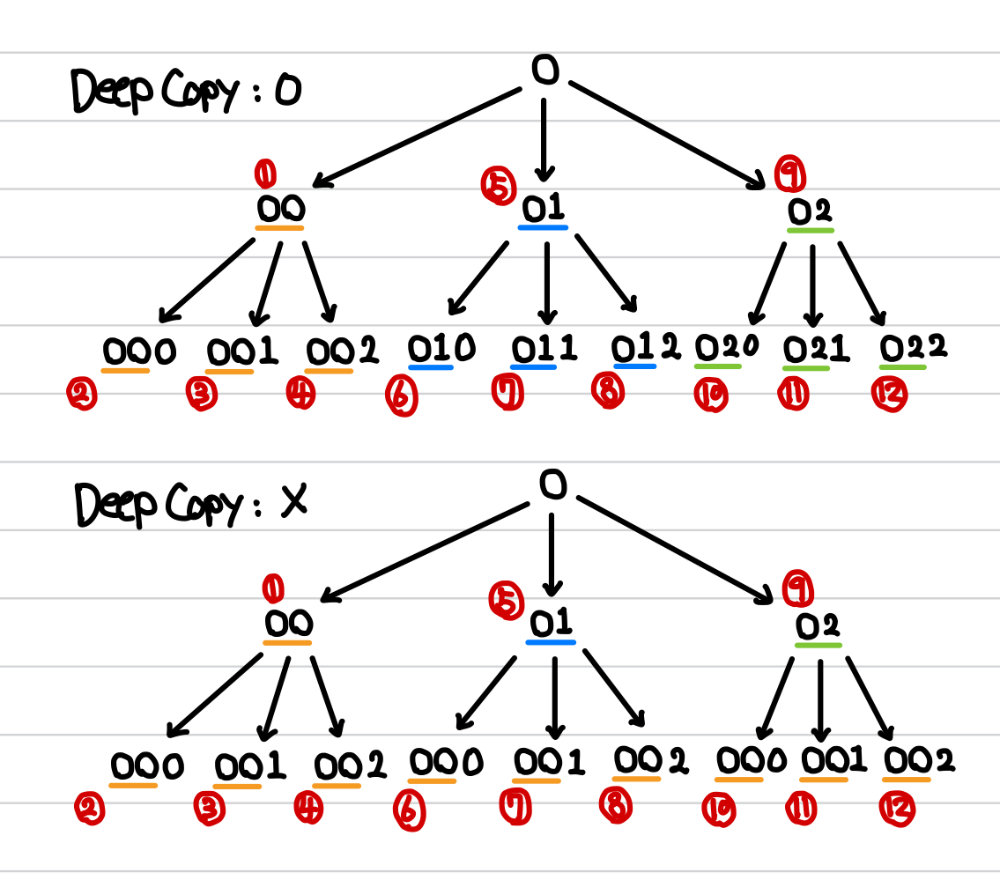
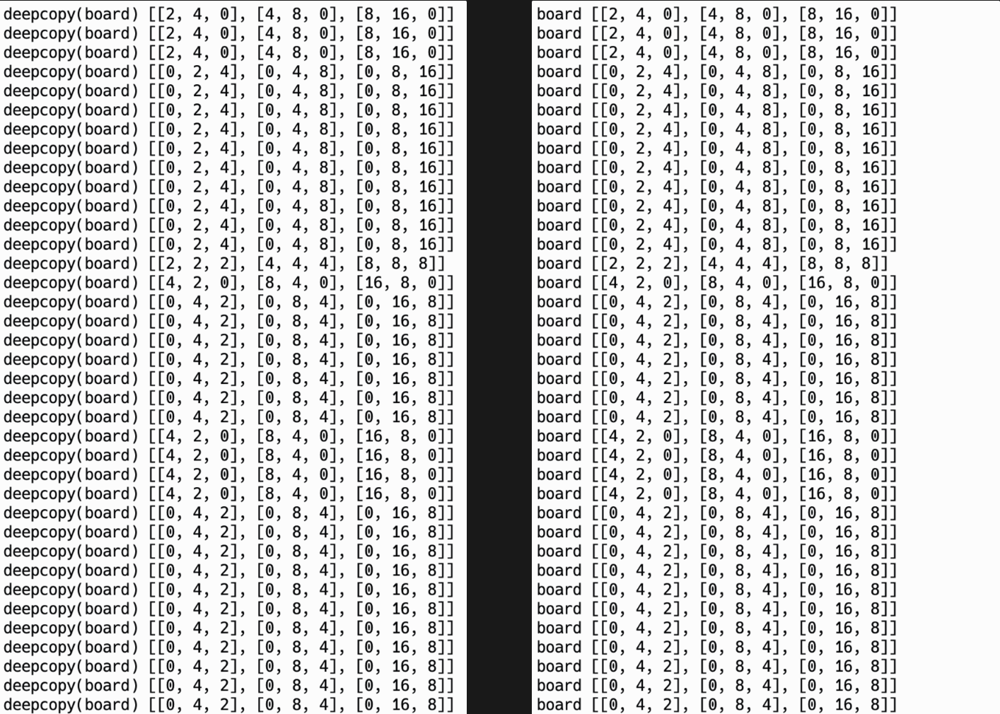

[백준] 2048 (Easy) - 12100 | Gold 2.@

---

## 문제 요약

[문제 링크](https://www.acmicpc.net/problem/12100)

- 보드 위에 있는 전체 블록이 상하좌우 네 방향 중 하나로 이동시킨다.
- 이때, 같은 값을 갖는 두 블록이 충돌하면 두 블록은 하나로 합쳐지게 된다.
- NxN 크기의 보드에서 최대 5번 이동해서 만들 수 있는 가장 큰 블록의 값을 구하시오.

## 정답 코드

```python
from copy import deepcopy

N = int(input())
board = []
for _ in range(N):
  board.append(list(map(int, input().split())))


def move(board, dir):
  if dir == 0:  # 동쪽
    for i in range(N):
      top = N - 1
      for j in range(N - 2, -1, -1):  # N-1, ... , 0
        if board[i][j]:  # 해당 숫자가 0이 아니면
          tmp = board[i][j]  # tmp에 값을 넣고
          board[i][j] = 0  # 0으로 초기화한 뒤,
          if board[i][top] == 0:  # [1] 만약 top 값이 0이면,
            board[i][top] = tmp  # 그 자리에 tmp 넣기
          elif board[i][top] == tmp:  # [2] 만약 top 값이 tmp면,
            board[i][top] = tmp * 2  # 그 자리에 tmp*2 넣기
            top -= 1  # 그리고 top을 왼쪽으로 이동
          else:  # [3] 만약 top 값이 다른 숫자면,
            top -= 1  # top을 왼쪽으로 먼저 이동 후,
            board[i][top] = tmp  # 새로운 top 값에 tmp 넣기
  elif dir == 1:  # 서쪽
    for i in range(N):
      top = 0
      for j in range(1, N):
        if board[i][j]:
          tmp = board[i][j]
          board[i][j] = 0
          if board[i][top] == 0:
            board[i][top] = tmp
          elif board[i][top] == tmp:
            board[i][top] = tmp * 2
            top += 1
          else:
            top += 1
            board[i][top] = tmp
  elif dir == 2:  # 남쪽
    for j in range(N):
      top = N - 1
      for i in range(N - 2, -1, -1):
        if board[i][j]:
          tmp = board[i][j]
          board[i][j] = 0
          if board[top][j] == 0:
            board[top][j] = tmp
          elif board[top][j] == tmp:
            board[top][j] = tmp * 2
            top -= 1
          else:
            top -= 1
            board[top][j] = tmp
  else:
    for j in range(N):
      top = 0
      for i in range(1, N):
        if board[i][j]:
          tmp = board[i][j]
          board[i][j] = 0
          if board[top][j] == 0:
            board[top][j] = tmp
          elif board[top][j] == tmp:
            board[top][j] = tmp * 2
            top += 1
          else:
            top += 1
            board[top][j] = tmp
  return board


def dfs(arr, cnt):
  global ans
  if cnt == 5:
    for i in range(N):
      for j in range(N):
        ans = max(ans, arr[i][j])
    return

  for i in range(4):
    # deepcopy 하는 이유 : 각 탐색 단계에서 다른 탐색에 영향을 주지 않으면서, 이전 이동의 결과를 기반으로 탐색 가능
    tmp_board = move(deepcopy(arr), i)
    dfs(tmp_board, cnt + 1)


ans = 0
dfs(board, 0)
print(ans)
```

## 풀이 및 배운 점

`deepcopy`를 왜 쓰는지 이해가 안 되어서 이 부분을 1시간 넘게 고민했습니다.

제가 생각한 첫 번째 논리는 `deepcopy(arr)`를 하면, 가장 첫 배열인 `board`을 기반으로 계속해서 탐색한다고 착각했습니다. 만약 이렇게 되면, 첫 배열에서 상/하/좌/우만 움직일 수 밖에 없습니다.

두 번째 논리는 "꼭 `deepcopy`를 써야하나? 쓰지 않아도 이전 배열을 기반으로 탐색하기 때문에 괜찮지 않나? 왜 써야하지..." 였습니다.

그래서 (아래 이미지 참고) 차근차근 그림을 그리면서 생각해보았고 만약 `deepcopy`를 쓰지 않는다면, 5에서 6으로 넘어갈 때 이전 배열인 "01"이 아니라 "00"을 참조하여 다음 탐색에 쓴다는 것을 알게 되었습니다.



정리하면, `deepcopy`를 통해 이전 이동의 결과를 기반으로 탐색하면서 각 탐색 단계에서 다른 탐색에 영향을 주지 않을 수 있게 됩니다. (괜히 골드2가 아니네요)



> deepcopy(board)와 board의 차이를 못 느껴서 print 찍어본 이미지

---

"50대의 추교현이 20대의 추교현에게 감사할 수 있게끔 하루하루 최선을 다해 살고자 합니다."

**_The End._**
