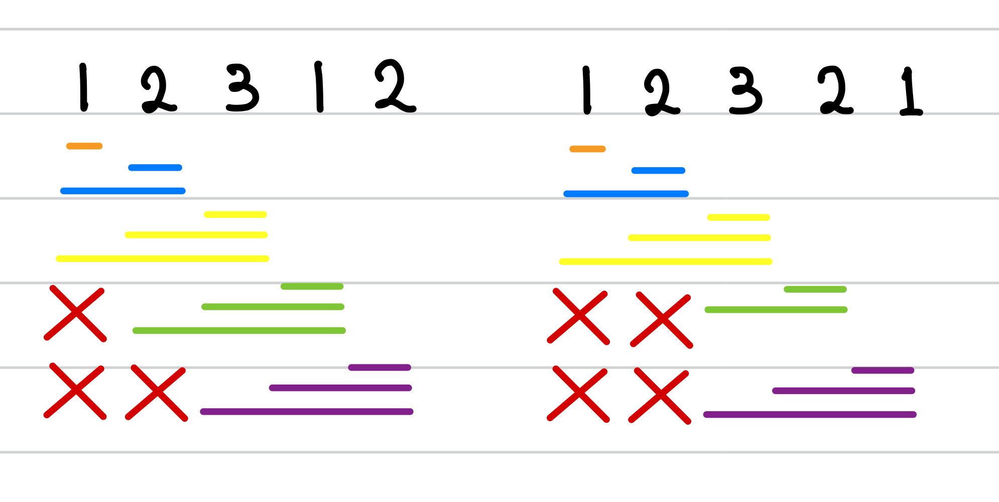

[백준] List of Unique Numbers - 13144 | Gold 4.@

---

## 문제 요약

[문제 링크](https://www.acmicpc.net/problem/13144)

- 길이가 N인 수열이 주어졌다.
- 수열에서 연속한 1개 이상의 수를 뽑았을 때, 같은 수가 여러 번 등장하지 않는 경우의 수를 구하라.

## 정답 코드

```python
N = int(input())
num_list = list(map(int, input().split()))

result = 0
start, end = 0, 0
seq = [False for _ in range(1000001)]
while start < N and end < N: # [1]
  if not seq[num_list[end]]:  # [2]
    seq[num_list[end]] = True # [3]
    end += 1
    result += (end - start)  # [4]
  else: # [5]
    seq[num_list[start]] = False # [6]
    start += 1

print(result)
```

## 풀이 및 배운 점

거의 3시간이 걸린 문제... 1) 문제를 제대로 이해 X (`121`이 된다고 생각했고 `12`, `12` 이렇게 같은 수열이 등장하면 안 된다고 생각함), 2) `투 포인터` 알고리즘 자체가 어색해서 오래 걸렸습니다.

[1] `start`와 `end`가 N보다 작을 때까지 반복한다.

[2] `start`부터 `end`까지 중복되는 숫자가 없으면,

[3] `seq`의 `num_list[end]`에 해당하는 값 위치를 True로 바꿔준다.

[4] `end`를 포함하여 `start`까지 만들 수 있는 수열의 개수를 `result`에 더해준다.

[5] 만약 이미 앞에서 나온 숫자가 있어서 그 부분이 True면,

[6] `seq`의 `num_list[start]`에 해당하는 값 위치를 False로 바꿔준다. 그 이유는 현재 `end` 값과 같은 `start` 값을 포함한 왼쪽에 있는 값들은 무시하고 `경우의수`를 카운트하기 위함이다. (이미지 참고)



---

"50대의 추교현이 20대의 추교현에게 감사할 수 있게끔 하루하루 최선을 다해 살고자 합니다."

**_The End._**
