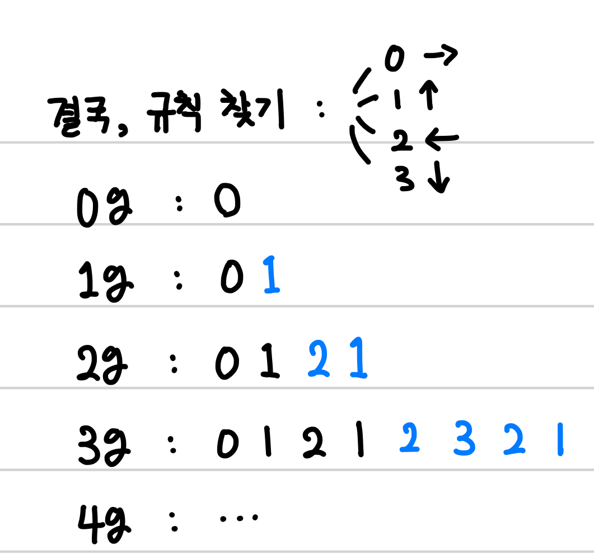

[백준] 드래곤 커브 - 15685 | Gold 3.@

---

## 문제 요약

[문제 링크](https://www.acmicpc.net/problem/15685)

- 드래곤 커브는 세 가지 속성으로 구성된다: 시작 점, 시작 방향, 세대
- K세대 드래곤 커브는 K-1세대 드래곤 커브의 끝 점을 기준으로 90도 시계방향 회전시킨 다음, 그것을 끝 점에 붙인 것이다.
- 100x100인 격자 위에 드래곤 커브가 N개 있는데, 네 꼭짓점이 모두 드래곤 커브의 일부인 정사각형의 개수를 구하라.
- 방향
  - 0: x좌표가 증가하는 방향(RIGHT)
  - 1: y좌표가 감소하는 방향(UP)
  - 2: x좌표가 감소하는 방향(LEFT)
  - 3: y좌표가 감소하는 방향(DOWN)

## 정답 코드

```python
N = int(input())
maps = [[0] * 101 for _ in range(101)]
dx, dy = [(1, 0, -1, 0), (0, -1, 0, 1)]
for _ in range(N):
  x, y, d, g = map(int, input().split())
  maps[x][y] = 1

  curves = [d]
  for j in range(g):
    for k in range(len(curves) - 1, -1, -1):
      curves.append((curves[k] + 1) % 4) # 0, 1, 2, 1 => 2, 3, 2, 1

  for curve in curves:
    nx = x + dx[curve]
    ny = y + dy[curve]
    if not(0 <= nx < 101 and 0 <= ny < 101):
      continue
    maps[nx][ny] = 1
    x, y = nx, ny

def get_cnt():
  global maps
  cnt = 0
  for i in range(100):
    for j in range(100):
      if maps[i][j] and maps[i+1][j] and maps[i][j+1] and maps[i+1][j+1]:
        cnt += 1
  return cnt

ans = 0
for i in range(N):
  ans = get_cnt()

print(ans)
```

## 풀이 및 배운 점

전체적인 설계를 정한 뒤, 구체적인 구현을 시작했습니다.

아래 그림과 같이 각 세대별로 방향을 적어보니, 규칙을 발견했습니다: 이전 세대의 방향을 뒤집은 다음 1을 더해주고 이 값이 4가 되면, 0으로 돌린다.



이를 코드로 구현하면, 다음과 같습니다.

```python
curves = [d]
for j in range(g):
	for k in range(len(curves) - 1, -1, -1):
		curves.append((curves[k] + 1) % 4)
```

---

"50대의 추교현이 20대의 추교현에게 감사할 수 있게끔 하루하루 최선을 다해 살고자 합니다."

**_The End._**
