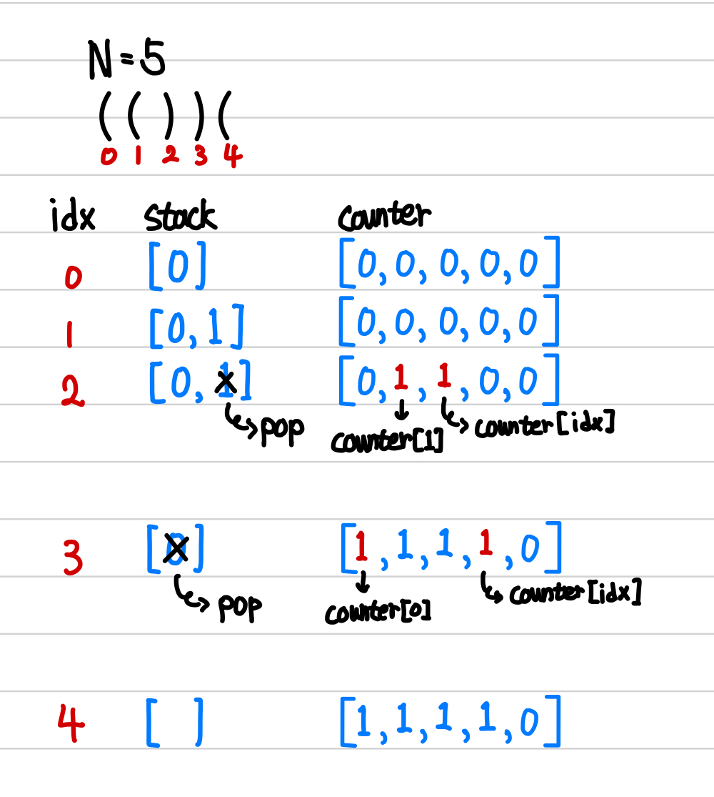

[백준] 현욱이는 괄호왕이야!! - 15926 | Gold 3.@

---

## 문제 요약

- '()'는 올바른 괄호 문자열이다.
- 주어진 문자열에서 올바른 괄호 문자열인 부분 문자열의 길이를 구한다.

## 정답 코드

```python
N = int(input())
S = input().strip()
stack = []
counter = [0] * N

for idx in range(N):
  if S[idx] == '(':
    stack.append(idx)
  else:
    if stack:
      counter[idx] = counter[stack[-1]] = 1
      stack.pop()

ans = 0
cnt = 0
for num in counter:
  if num == 1:
    cnt += 1
    ans = max(ans, cnt)
  else:
    cnt = 0

print(ans)
```

## 풀이 및 배운 것

- `S = input.strip()` : 이렇게 입력하면, `(())(` 이런 식으로 괄호들을 받을 수 있습니다.

- `counter[idx] = counter[stack[-1]] = 1`

  

  - '('와 ')'가 만났을 때, 두 괄호에 해당하는 counter 부분을 1로 수정하고 싶습니다.
  - 따라서, idx에 해당하는 counter와 stack의 맨 마지막 값에 해당하는 counter를 1로 수정합니다.
  - 그리고 stack에 있는 마지막 요소는 pop으로 제거합니다.

- 마지막으로 counter에서 연속인 1 중에서 가장 긴 문자열을 ans에 넣어 출력합니다.

---

"50대의 추교현이 20대의 추교현에게 감사할 수 있게끔 하루하루 최선을 다해 살고자 합니다."

**_The End._**
