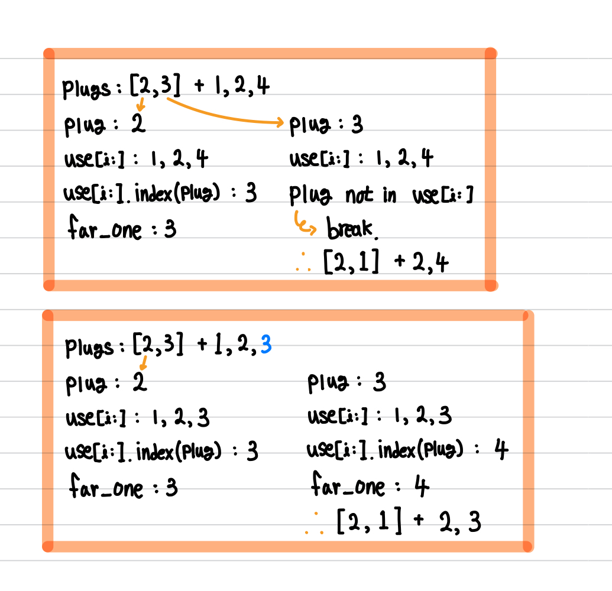

[백준] 멀티탭 스케줄링 - 1700 | Gold 1.@

---

## 문제 요약

[문제 링크](https://www.acmicpc.net/problem/1700)

- 한 개의 멀티탭을 이용하고 있으며 여러 개의 전기용품을 사용하고 있다.
- 각종 전기용품의 플러그를 뺐다 꽂았다 하는 불편함을 겪고 있다.
- 자기가 사용하는 전기용품의 사용순서를 기반으로 플러그를 빼는 횟수를 `최소화`하는 방법을 고안하려고 한다.

## 정답 코드

```python
N, K = map(int, input().split())
use = list(map(int, input().split()))
plugs = []
ans = 0

for i in range(K):
  if use[i] in plugs: # [1]
    continue

  if len(plugs) < N: # [2]
    plugs.append(use[i])
    continue

  # [3]
  far_one = 0
  temp = 0
  for plug in plugs:
    if plug not in use[i:]: # [4]
      temp = plug
      break

    elif use[i:].index(plug) > far_one: # [5]
      far_one = use[i:].index(plug)
      temp = plug

  plugs[plugs.index(temp)] = use[i]
  ans += 1

print(ans)
```

## 풀이 및 배운 점

이번 그리디 문제는 확실히 생각을 많이 해야하네요. 운영체제에서 페이징 교체 알고리즘 중 `Belady's min algorithm` (또는 Belady's optimal algorithm)가 있는데, 이 알고리즘을 떠올렸다면 어렵지 않게 풀었을 것 같습니다.

이 문제의 핵심은 `플러그에 꽂혀있지 않은 전기용품이 들어올 때, 그 전기용품 뒤로 현재 꽂혀있는 전기용품이 있다면 어떤 식으로 처리해야 최적화를 할 수 있을까?` 입니다. (`[5]`에 해당)



[1] 이미 있다면, continue (다음꺼 탐색)

[2] 남는 플러그가 있다면, plugs[]에 넣고 continue

[3] 플러그 자리는 꽉 찼고 새로운 전기용품이 들어온다면?

[4] 플러그에 꽂힌 전기용품이 앞으로 들어올 전기용품에 없다면?

[5] 플러그에 꽂힌 전기용품이 앞으로 들어올 전기용품에 있는데, 가장 먼 미래에 들어올 전기용품을 찾아서 이를 temp에 할당

[6] temp의 index에 해당하는 plugs 요소를 교체해주고 ans + 1

---

"50대의 추교현이 20대의 추교현에게 감사할 수 있게끔 하루하루 최선을 다해 살고자 합니다."

**_The End._**
