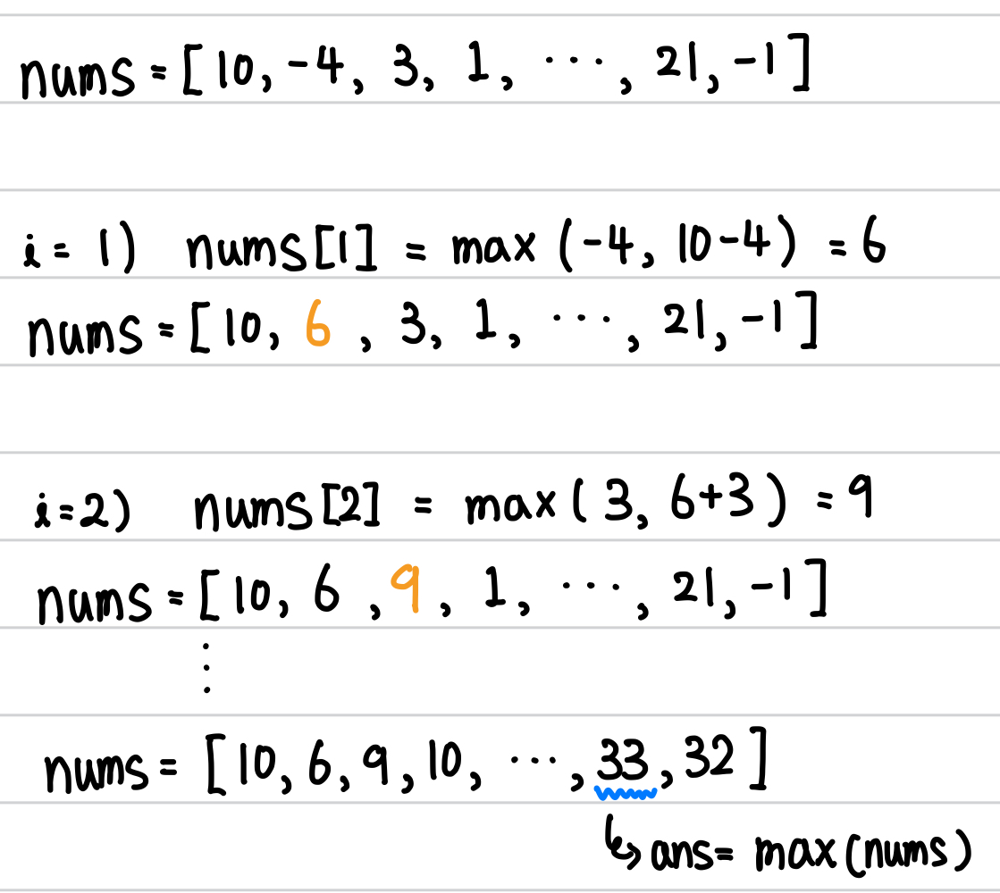

[백준] 연속합 - 1912 | Silver 2.@

---

## 문제 요약

[문제 링크](https://www.acmicpc.net/problem/1912)

- n개의 정수로 이루어진 임이의 수열이 주어진다.
- 이 중 연속된 몇 개의 수를 선택해서 구할 수 있는 합 중 가장 큰 합을 구하라
- 단, 수는 한 개 이상 선택해야 됨

## 정답 코드

```python
N = int(input())
nums = list(map(int, input().split(' ')))

for i in range(1, N):
    nums[i] = max(nums[i], nums[i-1] + nums[i])

print(max(nums))
```

## 풀이 및 배운 점

```python
# 틀린 코드 (완전탐색)
N = int(input())
nums = input().split()
ans = 0

for i in range(0, N):
  for j in range(i+1, N+1):
    res = 0
    for num in nums[i:j]:
      res += int(num)
    ans = max(ans, res)

print(ans)
```

처음에는 위의 코드처럼 `완전탐색`으로 문제를 풀었고 예상대로 `시간 초과`가 났습니다.

대표적인 DP 스킬 중 하나인 Memorization(기억법)을 사용해서 풀었습니다. 아래 이미지를 참고해주세요.



---

"50대의 추교현이 20대의 추교현에게 감사할 수 있게끔 하루하루 최선을 다해 살고자 합니다."

**_The End._**
