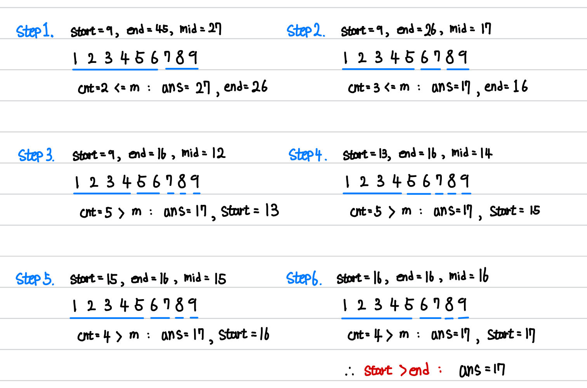

[백준] 기타 레슨 - 2343 | Silver 1.@

---

## 문제 요약

[문제 링크](https://www.acmicpc.net/problem/2343)

- 블루레이에는 총 N개의 강의가 들어간다.
- 강의를 연속적으로 M개의 블루레이에 넣을 것이다.
- 블루레이의 크기는 강의 길이의 최대가 되며 블루레이의 크기가 최소를 출력하라.

## 정답 코드

```python
N, M = map(int,input().split())
time = list(map(int,input().split()))

start = max(time)
end = sum(time)

while start <= end:
    mid = (start + end) // 2

    total = 0
    count = 1
    for t in time:
        if total + t > mid:
            count += 1
            total = 0
        total += t

    if count <= M:
        ans = mid
        end = mid - 1
    else:
        start = mid + 1

print(ans)
```

## 풀이 및 배운 점

"이분 탐색"에 대한 문제가 낯설어서 시간이 꽤 걸렸습니다.

`mid 값을 무엇으로 설정하느냐`가 중요한 포인트이고 여기서는 블루레이의 크기로 설정했습니다. mid를 기준으로 처음부터 차례대로 합을 구한 뒤, mid보다 작으면, cnt++ 해주어 블루레이 개수를 셉니다.

그렇게 mid를 기준으로 cnt를 다 센 뒤, cnt가 M보다 작거나 같다면, 그 mid를 ans로 할당하고 end 값을 mid - 1로 할당합니다. cnt가 M보다 크다면, start를 mid + 1로 할당합니다.



이번 문제를 통해서 이분 탐색은 end를 확확 줄이면서 정답에 근접한 뒤, start로 미세하게 조정하여 정답에 접근한다는 느낌을 배웠습니다.

---

"50대의 추교현이 20대의 추교현에게 감사할 수 있게끔 하루하루 최선을 다해 살고자 합니다."

**_The End._**
