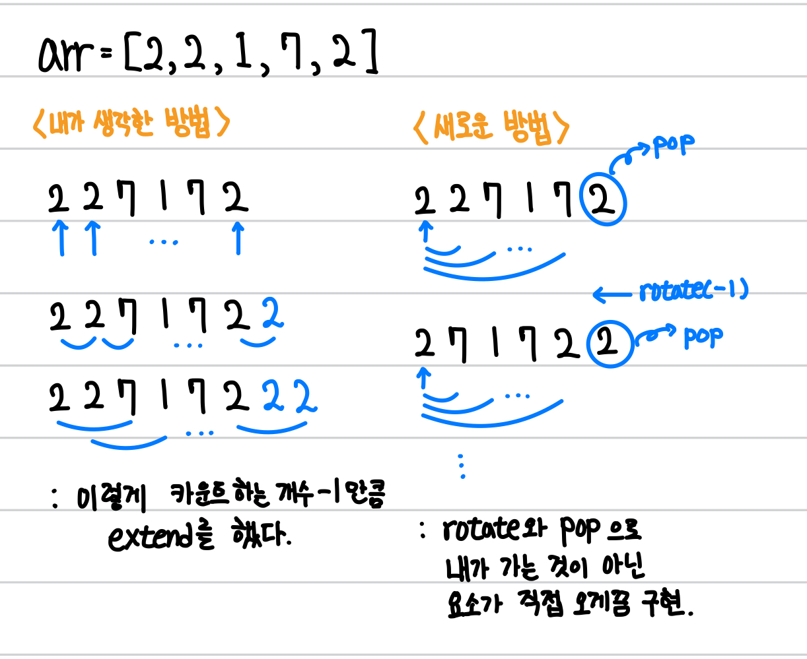

[백준] 피자판매 - 2632 | Gold 2.@

---

## 문제 요약

[문제 링크](https://www.acmicpc.net/problem/2632)

- 피자 A와 B가 있는데, 다양한 크기의 여러 개 피자조각으로 나누어져 있다.
- 고객이 원하는 피자의 크기를 피자 A, B의 조각으로 채워서 줄 수 있다.

## 정답 코드

```python
from collections import deque

Target = int(input())
M, N = map(int, input().split())
a, b = [], []
for _ in range(M):
  a.append(int(input()))
for _ in range(N):
  b.append(int(input()))

def get_cnt(arr, m):
  cnt_arr = [0] * (sum(arr) + 1)
  cnt_arr[0], cnt_arr[-1] = 1, 1
  for i in range(m):
    dq = deque(arr)
    for _ in range(i):
      dq.rotate(-1)
    dq.pop()
    summ = 0
    while dq:
      summ += dq.popleft()
      cnt_arr[summ] += 1
  return cnt_arr

cnt_a = get_cnt(a, M)
cnt_b = get_cnt(b, N)
ans = 0
for i in range(Target+1):
  j = Target - i
  if 0 <= i < len(cnt_a) and 0 <= j < len(cnt_b):
    ans += cnt_a[i] * cnt_b[j]
print(ans)
```

## 풀이 및 배운 점

원형의 배열을 연속으로 잘라야 합니다. 그래서 저는 `temp = pizza_a[i-1:i], pizza_a.extend(temp)` 이런 식으로 연장하는 방법을 택했습니다.

그런데, deque을 활용하는 방법이 있네요?



```python
for i in range(m):
	dq = deque(arr)
	for _ in range(i):
		dq.rotate(-1)
	dq.pop()
```

이런 식으로 deque에 배열을 넣어서 한 칸씩 왼쪽으로 당기며 연속합을 구할 수 있습니다.

여기서 `pop()`을 하는 이유는 `cnt_a = [0] * (sum(arr) + 1), cnt_a[-1] = 1` 이 두 코드를 통해 `cnt_a` 배열의 맨 마지막 index가 전체 합이며 이를 이미 1로 카운트했기에 맨 끝에 요소는 계산에서 제외해야 하기 때문입니다.

---

"50대의 추교현이 20대의 추교현에게 감사할 수 있게끔 하루하루 최선을 다해 살고자 합니다."

**_The End._**
