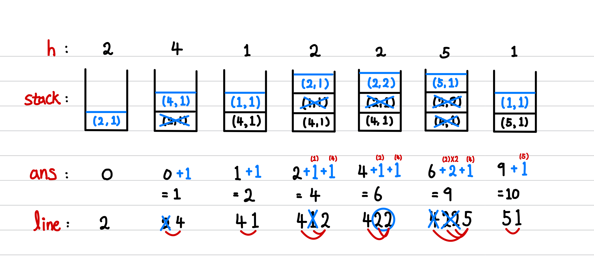

[백준] 오아시스 재결합 - 3015 | Platinum V.@

---

## 문제 요약

[문제 링크](https://www.acmicpc.net/problem/3015)

- N명이 한 줄로 서서 기다리고 있다.
- 두 사람 A와 B가 서로 볼 수 있으려면, 두 사람 사이에 A 또는 B보다 키가 큰 사람이 없어야 한다.
- 즉, A나 B보다 키가 큰 사람이 한 명이라도 있으면 안 된다. (이 부분을 잘못 이해해서 오래 걸림...)
- 서로 볼 수 있는 쌍의 수를 출력한다.

## 정답 코드

```python
N = int(input())
arr = [int(input()) for _ in range(N)]
H, CNT, ans = 0, 1, 0
stack = []

for h in arr:
  while stack and stack[-1][H] < h: # [1] 스택이 비어있지 않고 스택의 끝 값보다 크면
    ans += stack.pop()[CNT] # 스택의 끝 값 pop & ans 추가

  if not stack: # [2] 스택이 비어있으면
    stack.append((h, 1)) # 스택에 넣어주기
    continue

  if stack[-1][H] == h: # [3] 스택의 끝 값과 같다면
    cnt = stack.pop()[CNT] # 스택의 끝 값 pop & cnt 추가
    ans += cnt # ans에 cnt 추가

    if stack: # 스택이 비어있지 않다는 것은 마주 볼 수 있는 사람이 있다는 것
      ans += 1
    # 연속인 수들을 하나로 취급하기 위해서 cnt + 1을 추가
    stack.append((h, cnt + 1))

  else: # [4] 스택의 끝 값보다 작다면
    stack.append((h, 1))
    ans += 1

print(ans)
```

## 풀이 및 배운 점

배열(`arr`)에서 한 사람씩(`h`) 꺼내어 탐색할 예정입니다.

[1] 스택이 비어있지 않고 스택의 끝 값보다 크다면?

- pop 해주고 ans에 pop한 요소의 CNT를 더한다.

[2] 스택이 비어 있으면?

- 스택에 현재 사람을 넣어준다.

[3] 스택의 끝 값과 같다면?

- pop 해주고 cnt를 pop한 요소의 CNT로 정의한다.
- ans에 cnt를 더한다.
- 만약, pop을 했는데도 스택이 비어있지 않다는 것은 마주 볼 수 있는 사람이 있다는 것
  - ans에 1을 더한다.
- 그리고 연속인 수들을 하나로 취급하기 위해서 `cnt + 1`을 현재 사람의 CNT에 넣고
- 스택에 현재 사람을 넣어준다.

[4] 스택의 끝 값보다 작다면?

- 스택에 현재 사람을 넣어준다.
- ans에 1을 더한다.



각 h마다 stack과 ans 그리고 이해를 돕기 위한 line을 하나씩 그려봤습니다.

문제를 이해하는 데 시간이 많이 걸렸습니다. "두 사람 사이에 A 또는 B보다 키가 큰 사람이 없어야 한다." = "A나 B보다 키가 큰 사람이 한 명이라도 있으면 안 된다."

이 문제는 시간을 길게 갖고 여러 번 반복하면서 이해하면 좋을 것 같습니다.

---

"50대의 추교현이 20대의 추교현에게 감사할 수 있게끔 하루하루 최선을 다해 살고자 합니다."

**_The End._**
