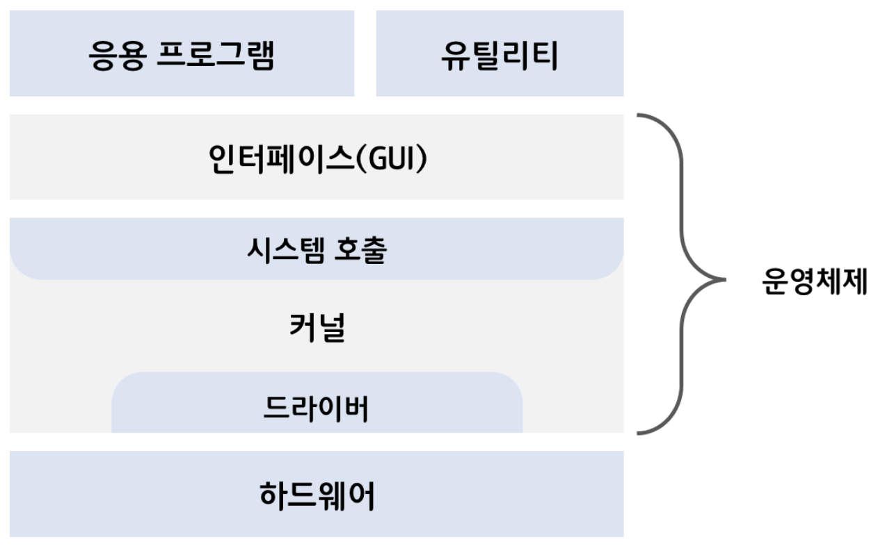

운영체제는 무엇이고 운영체제가 하는 역할과 구조에 대해서 알아봅시다.@

---

## 운영체제란?

운영체제는 소프트웨어와 하드웨어 사이의 중재자 역할을 하는 시스템 소프트웨어입니다. 컴퓨터의 자원들을 효율적으로 관리하며 사용자가 컴퓨터를 편리하고 효과적으로 사용할 수 있도록 환경을 제공합니다.

단순한 프로그램 실행을 넘어 자원 할당, 파일 관리, 보안 및 통신 등을 담당하며 이 모든 것을 사용자에게 보이지 않는 곳에서 조율합니다.

저희가 알고 있는 Window, MAC OS, Unix, Linux, Android, iOS 등이 운영체제죠.

## 운영체제의 역할

운영체제의 역할은 크게 4가지가 있습니다.

### 1. 프로세스 관리

운영체제는 시스템 상의 모든 프로세스를 관리합니다. 프로세스는 실행 중인 프로그램으로, 운영체제는 이들에게 CPU 시간을 할당하고 실행 순서를 결정하며 필요에 따라 중단시키고 다시 시작할 수 있어야 합니다.

### 2. 메모리 관리

모든 프로그램은 실행을 위해 메모리가 필요합니다. 운영체제는 각 프로그램에 적절한 메모리 공간을 할당하고, 사용이 끝난 후에는 그 메모리를 회수하는 역할을 담당합니다.

### 3. 파일 시스템 관리

사용자와 프로그램이 파일을 쉽게 저장하고 접근할 수 있도록, 파일 시스템을 통해 데이터를 관리하는 것도 운영체제의 중요한 역할입니다.

### 4. I/O 디바이스 관리

운영체제는 키보드, 마우스 디스플레이 등 다양한 입출력 장치를 관리하며, 이들 장치 간의 데이터 전송을 조율합니다.

### 5. 보안 및 접근 권한 관리

시스템 보안을 유지하기 위해서 운영체제는 사용자 인증, 접근 권한 부여, 데이터 암호화 등을 관리합니다.

## 운영체제의 구조

유저가 사용하는 응용 프로그램 및 유틸리티가 맨 위에 있고 그다음으로 인터페이스(GUI), 시스템 호출(편의상 시스템 콜로 부르겠습니다), 커널, 드라이버가 있으며 가장 밑에 하드웨어가 있는 구조입니다.

그리고 여기서 인터페이스(GUI), 시스템 콜, 커널, 드라이버 부분이 바로 운영체제를 지칭합니다.

1. **인터페이스(Interface)**:
   CLI 또는 GUI 형태로 유저가 시스템과 상호 작용할 수 있게 해주는 인터페이스입니다.
2. **시스템 콜(System Call)**:
   유저 또는 응용 프로그램이 커널에 서비스를 요청할 수 있게 해주는 인터페이스입니다. 이를 통해 프로그램은 메모리 할당, 파일 접근, 프로세스 생성 및 관리 등의 커널 수준의 기능을 요청할 수 있습니다.
3. **커널(Kernel)**:
   시스템의 핵심 부분으로 하드웨어와 직접적으로 상호 작용합니다. 커널은 시스템 콜을 통해 전달된 요청을 실행하고, 하드웨어 자원을 관리하는 역할을 수행합니다.
4. **드라이버(Driver)**:
   커널의 일부로, 특정 하드웨어 장치를 제어하는 소프트웨어 모듈입니다. 드라이버는 하드웨어의 세부 사항을 커널로부터 추상화하여 커널이 다양한 하드웨어와 일관된 방식으로 상호작용할 수 있게 합니다.

💡 **GUI (Graphical User Interface)** :
유저가 컴퓨터와 상호작용하는 방식 중 하나입니다. GUI는 텍스트 기반의 명령줄 인터페이스(CLI) 대신 시각적인 아이콘과 간단한 조작을 사용하여 상호작용합니다.

## 레퍼런스

[1] [[IT 상식사전] 컴퓨터 운영체제의 개념과 역할](https://yozm.wishket.com/magazine/detail/1453/)

[2] [[운영체제] 운영체제란? - 정의, 역할, 구조](https://velog.io/@dddooo9/%EC%9A%B4%EC%98%81%EC%B2%B4%EC%A0%9C-%EC%9A%B4%EC%98%81%EC%B2%B4%EC%A0%9C%EB%9E%80-%EC%A0%95%EC%9D%98-%EC%97%AD%ED%95%A0-%EA%B5%AC%EC%A1%B0)

---

"50대의 추교현이 20대의 추교현에게 감사할 수 있게끔 하루하루 최선을 다해 살고자 합니다."

**_The End._**
