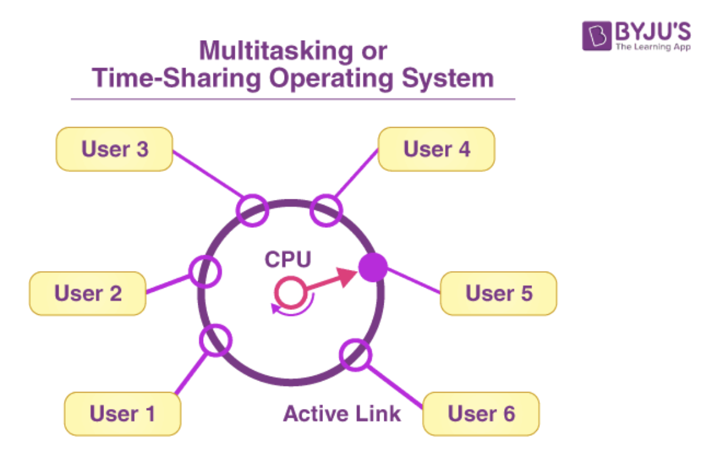

다중 작업 운영체제 중 가장 대표적인 시분할 시스템에 대해서 알아봅시다.@

---

한 번에 하나의 프로그램만 수행시킬 수 있는 “단일 작업 운영체제”가 있습니다.

그리고 하나의 프로그램의 수행이 끝나기 전이라도 다른 프로그램을 수행시킬 수 있는 “다중 작업 운영체제”가 있는데요.

“다중 작업 운영체제” 중에서 가장 대표적인 “시분할 시스템”에 대해서 알아보고 다른 다중 작업 운영체제들에 대해서도 알아보도록 하겠습니다.

## 시분할 시스템이란?

시분할 시스템(Time Sharing System)은 여러 유저가 동시에 컴퓨터를 사용할 수 있도록 CPU 시간을 나누어 주는 운영체제의 기법입니다. 각 유저는 컴퓨터가 자신에게 전적으로 할당된 것처럼 느끼지만, 실제로는 CPU가 빠르게 여러 작업들을 전환하며 각 사용자에게 작은 시간 단위를 할당해 주는 시스템입니다.

컴퓨터를 대화식으로 사용하려는 시도에서 탄생했으며 멀티태스킹을 가능하게 하는 운영체제의 한 방식이며 라운드 로빈(Round Robin) 방식이라고도 합니다.

## 시분할 시스템의 원리

시분할 시스템의 핵심 원리는 시간 조각(time slice) 또는 퀀텀(quantum)입니다. 운영체제는 CPU를 작은 단위로 나누고, 각 프로세스에 일정 시간 동안 CPU를 사용할 기회를 제공합니다. 이렇게 함으로써, 모든 프로세스가 공정하게 CPU 시간을 할당받고, 유저는 거의 동시에 실행되는 것처럼 느낄 수 있습니다.

다음과 같은 방식으로 운영체제는 이를 관리하는데요:

1. **스케줄링 알고리즘**:
   각 프로세스를 공정하게 CPU 시간을 분배하기 위해 스케줄링 알고리즘이 사용됩니다.
2. **컨텍스트 스위칭**:
   CPU는 한 작업에서 다른 작업으로 빠르게 전환할 수 있어야 합니다. 이 과정을 컨텍스트 스위칭이라고 하며, 시스템의 효율성을 결정짓는 중요한 요소입니다.

## 다중 작업 운영체제들

### [1] 다중 프로그래밍 시스템 (Multi-programming system)

다중 프로그래밍 시스템은 여러 프로그램이 메모리에 동시에 적재되어, CPU가 한 프로그램의 실행을 대기하는 동안 다른 프로그램을 실행함으로써 CPU의 유휴 시간을 최소화하는 기술입니다.

시분할 시스템이 사용자와의 상호작용에 초점을 맞춘다면, 다중 프로그래밍 시스템은 시스템의 자원을 최대한 활용하여 생산성을 높이는데 중점을 둡니다.

### [2] 대화형 시스템 (Interactive system)

대화형 시스템은 사용자의 입력에 신속하게 반응하여 결과를 제공하는 시스템을 말합니다. 이는 시분할 시스템의 기본적인 특성 중 하나로, 사용자의 명령어나 행동에 즉각적으로 응답할 수 있는 환경을 제공합니다.

### [3] 다중 처리기 시스템 (Multi-processor system)

다중 처리기 시스템은 둘 이상의 CPU와 하나의 주 기억장치가 통합된 시스템으로 여러 개의 프로그램을 동시에 처리할 수 있는 능력을 갖추고 있습니다.

하나의 CPU가 고장 나더라도 다른 CPU를 이용하여 업무를 처리할 수 있어서 시스템의 신뢰성과 안정성이 높습니다.

## 레퍼런스

[1] [위키백과 : 시분할 시스템](https://ko.wikipedia.org/wiki/%EC%8B%9C%EB%B6%84%ED%95%A0_%EC%8B%9C%EC%8A%A4%ED%85%9C)

[2] [<운영체제> 시분할 시스템이란](https://pinelover.tistory.com/153)

[3] [시분할 시스템(Time Sharing System)이란?](https://velog.io/@weweweme/1731-221217)

## 면접 질문 대비

Q. 시분할 시스템에 대해서 설명해주세요.

A. 시분할 시스템은 여러 유저가 동시에 컴퓨터를 사용할 수 있도록 CPU 시간을 나누어 주는 운영체제의 기법입니다. 각 유저는 컴퓨터가 자신에게 전적으로 할당된 것처럼 느끼지만, 실제로는 CPU가 빠르게 여러 작업들을 전환하며 각 사용자에게 작은 시간 단위를 할당해 주는 시스템입니다.

Q. 다중 프로그래밍 시스템(multi-programming system)에 대해서 설명해주세요.

A. 다중 프로그래밍 시스템은 여러 프로그램이 메모리에 동시에 적재되어, CPU가 한 프로그램의 실행을 대기하는 동안 다른 프로그램을 실행함으로써 CPU의 유휴 시간을 최소화하는 기술입니다.

Q. 대화형 시스템(interactive system)에 대해서 설명해주세요.

A. 대화형 시스템은 사용자의 입력에 신속하게 반응하여 결과를 제공하는 시스템을 말합니다.

Q. 다중 처리기 시스템(multi-processor system)에 대해서 설명해주세요.

A. 다중 처리기 시스템은 둘 이상의 CPU와 하나의 주 기억장치가 통합된 시스템으로 여러 개의 프로그램을 동시에 처리할 수 있는 능력을 갖추고 있습니다.

---

"50대의 추교현이 20대의 추교현에게 감사할 수 있게끔 하루하루 최선을 다해 살고자 합니다."

**_The End._**
