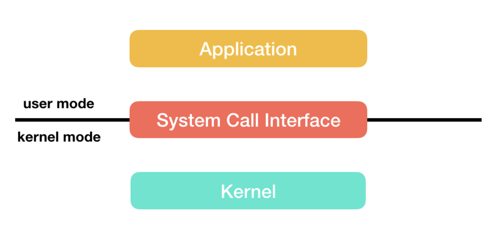
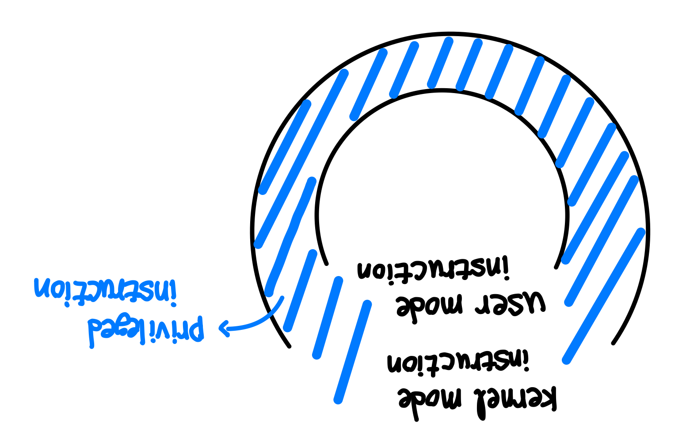
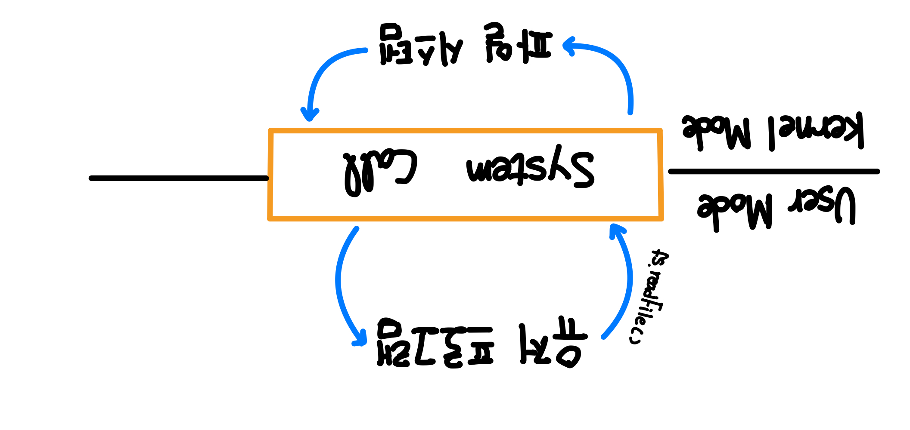

운영체제의 핵심인 커널과 시스템 콜에 대해서 알아봅시다.@

---

## 커널이란?

소프트웨어는 컴퓨터 시스템에서 수행되기 위해서는 메모리에 그 프로그램이 올라가 있어야 합니다. 마찬가지로 운영체제 자체도 소프트웨어로서 전원이 켜짐과 동시에 메모리에 올라가야 합니다.

하지만 운영체제처럼 규모가 큰 프로그램이 모두 메모리에 올라가면 한정된 메모리 공간 낭비가 심할 것입니다.

따라서, 운영체제 중 항상 필요한 부분만을 전원이 켜짐과 동시에 메모리에 올려놓고, 그렇지 않은 부분은 필요할 때 메모리에 올려서 사용합니다. 이때 메모리에 상주하는 운영체제의 부분을 커널(kernel)이라고 합니다.

커널은 운영체제의 핵심 부분으로, 시스템의 모든 중요한 관리 작업을 담당합니다. 하드웨어와 소프트웨어 사이의 통신을 조정하고 시스템 리소스를 할당하며 저수준의 시스템 작업을 수행하여 시스템의 안정성과 효율성을 보장합니다.

## 이중 모드 (Dual Mode)

CPU는 유저 애플리케이션(User Application)이 시스템을 손상시키는 것을 방지하기 위해서 2가지 모드를 제공합니다. CPU에 있는 Mode bit로 모드를 구분하여 0은 `커널 모드(kernel mode)`, 1은 `유저 모드(user mode)`로 나뉘어서 구동됩니다.

운영체제에서 프로그램이 구동되는 데 있어서 파일을 읽어오거나, 파일을 쓰거나, 혹은 화면에 메시지를 출력하는 등 많은 부분이 커널 모드를 사용합니다.

### 유저 모드 (User Mode)

유저 모드에서 유저 애플리케이션 코드가 실행이 됩니다.

유저가 접근할 수 있는 영역에 제한이 있기 때문에 해당 모드에서는 하드웨어(디스크, I/O 등)에 접근할 수 없습니다. 접근을 위해서는 시스템 콜(System Call)을 사용해야 합니다.

### 커널 모드 (Kernel Mode)

운영체제가 CPU를 사용하는 모드입니다.

시스템 콜을 통해 커널 모드로 전환이 되면, 운영체제는 하드웨어를 제어하는 명령어(Privileged Instructions)를 실행합니다.

> Privileged Instructions | 필자가 그린 이미지

Privileged Instructions는 커널 모드에서 사용이 가능하지만 유저 모드에서는 사용하지 못하는 명령어들입니다. 이는 정말 조심히 사용해야 하는 명령어들인데, 자칫 잘못하면 시스템에 치명적인 손상을 야기할 수 있기 때문입니다.

## 시스템 콜이란?

> System Call 작동 방식 | 필자가 그린 이미지

운영체제는 다양한 서비스들을 수행하기 위해 하드웨어를 직접 관리합니다. 이와 반면에 응용 프로그램은 운영체제가 제공하는 인터페이스를 통해서만 자원을 사용할 수 있습니다. 운영체제가 커널에 접근하기 위한 인터페이스를 시스템 콜(System Call)이라고 합니다.

또한, 시스템 콜은 이러한 커널 영역의 기능을 유저 모드가 사용 가능하게 해줍니다 (즉, 응용 프로그램은 시스템 콜을 통해서 원하는 기능을 수행할 수 있습니다).

## 시스템 콜의 역할

시스템 콜은 프로세스 관리, 파일 조작, 장치 관리, 정보 유지 및 통신과 같은 다양한 운영체제 기능에 대한 접근을 관리합니다. 이는 유저와 시스템 사이의 중재자 역할을 하여, 응용 프로그램이 필요로 하는 복잡한 작업을 운영체제가 대신 수행할 수 있게 합니다.

## 시스템 콜의 종류

시스템 콜은 크게 6가지로 분류할 수 있습니다 (아래 명령어는 Unix에서 사용하는 명령어입니다).

### 1. 프로세스 제어 (Process Control)

- 끝내기 (`exit`), 중지 (`abort`)
- 적재 (`load`), 실행 (`execute`)
- 프로세스 생성 (`create process`) - fork
- 프로세스 속성 획득과 속성 설정
- 시간 대기 (`wait time`)
- 사건 대기 (`wait event`)
- 사건을 알림 (`signal event`)
- 메모리 할당 및 해제

### 2. 파일 조작 (File Manipulation)

- 파일 생성 / 삭제 (`create` / `delete`)
- 열기 / 닫기 / 읽기 / 쓰기 (`open` / `close` / `read` / `write`)
- 위치 변경 (`reposition`)
- 파일 속성 획득 및 설정 (`get file attribute` / `set file attribute`)

### 3. 장치 관리 (Device Manipulation)

- 하드웨어의 제어와 상태 정보를 얻음 (`ioctl`)
- 장치를 요구 (`request device`), 장치를 방출 (`release device`)
- 읽기 (read), 쓰기 (write), 위치 변경
- 장치 속성 획득 및 설정
- 장치의 논리적 부착 및 분리

### 4. 정보 유지 (Information Maintenance)

- `getpid()`, `alarm()`, `sleep()`
- 시간과 날짜의 설정과 획득 (`time`)
- 시스템 데이터의 설정과 획득 (`date`)
- 프로세스 파일, 장치 속성의 획득 및 설정

### 5. 통신 (Communication)

- `pipe()`, `shm_open()`, `mmap()`
- 통신 연결의 생성, 제거
- 메시지의 송신, 수신
- 상태 정보 전달
- 원경 장치의 부착 및 분리

### 6. 보호 (Protection)

- `chmod()`
- `umask()`
- `chown()`

## 레퍼런스

[1] [GitHub | CS-start](<https://github.com/JulSaMo/CS-start/blob/main/Computer%20Science/Operating%20System/SystemCall(%EC%8B%9C%EC%8A%A4%ED%85%9C%EC%BD%9C%2C%20%EC%8B%9C%EC%8A%A4%ED%85%9C%ED%98%B8%EC%B6%9C).md>)

[2] [2. 시스템 콜 (System call)](https://ddongwon.tistory.com/7)

[3] [운영체제 - 유저 모드와 커널 모드](https://ghleokim.github.io/%EC%9A%B4%EC%98%81%EC%B2%B4%EC%A0%9C-%EC%9C%A0%EC%A0%80%EB%AA%A8%EB%93%9C%EC%99%80-%EC%BB%A4%EB%84%90%EB%AA%A8%EB%93%9C/)

## 면접 질문 대비

Q. 시스템 콜에 대해 설명해주세요.

A. 시스템 콜은 운영체제가 커널에 접근하기 위한 인터페이스입니다.

Q. 커널에 대해 설명해주세요.

A. 커널은 운영체제 중 항상 메모리에 올라가 있는 운영체제의 핵심 부분으로써 하드웨어와 응용 프로그램 사이에서 인터페이스를 제공하는 역할을 하며 컴퓨터 자원을 관리하는 역할을 합니다.

Q. 커널 모드에 대해 설명해주세요.

A. 이중 모드는 유저가 쉽게 운영체제에 접근하지 못하도록 보호하는 기법입니다. CPU에 있는 Mode bit로 모드를 구분하는데, 0은 커널 모드(kernel mode), 1은 유저 모드(user mode)로 나뉘어서 구동됩니다. 운영체제 내부에서 실제로 CPU를 포함한 하드웨어를 제어할 수 있는 모드입니다 (은행원이 데스크 뒤에서 작업하는 것과 비슷).

Q. 유저 모드에 대해 설명해주세요.

A. 이중 모드는 유저가 쉽게 운영체제에 접근하지 못하도록 보호하는 기법입니다. CPU에 있는 Mode bit로 모드를 구분하는데, 0은 커널 모드(kernel mode), 1은 유저 모드(user mode)로 나뉘어서 구동됩니다. 유저가 하드웨어에 접근할 수 없는 모드이며 유저 애플리케이션 코드가 실행되는 모드입니다 (은행원이 데스크에서 고객과 상담하는 것과 비슷).

---

"50대의 추교현이 20대의 추교현에게 감사할 수 있게끔 하루하루 최선을 다해 살고자 합니다."

**_The End._**
