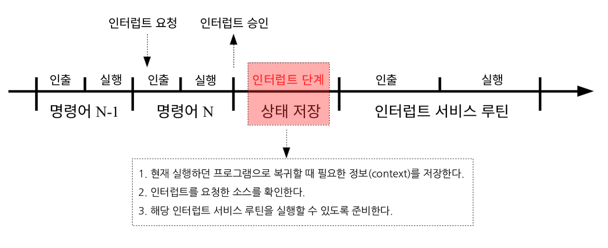
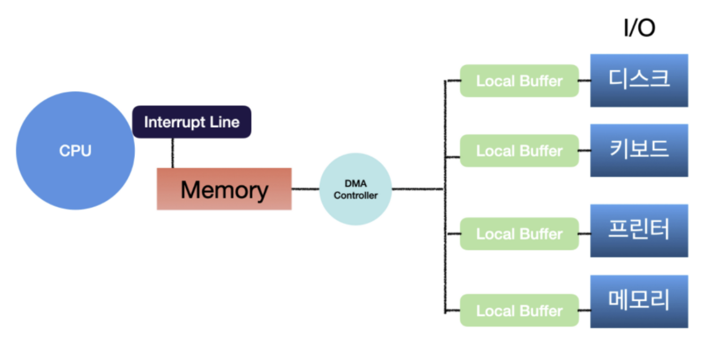

CPU가 자원을 효율적으로 사용할 수 있는 인터럽트와 인터럽트 오버헤드를 해결하고자 등장한 DMA 방식에 대해서 알아보겠습니다.@

---

## 인터럽트란?

인터럽트는 CPU가 프로그램을 실행하고 있을 때, I/O 디바이스 등의 장치에서 처리가 필요한 경우에 CPU에게 이를 알려 처리할 수 있도록 하는 기능입니다. 인터럽트를 받은 CPU는 현재 처리 중인 작업을 중단하고, 긴급하게 처리해야 할 작업에 대응할 수 있으며 해당 작업을 처리하면 원래 작업으로 복귀합니다.

이는 시스템 자원을 효율적으로 관리할 수 있게 해주는 운영체제의 핵심 기능입니다.

## 인터럽트 발생 과정

1. **인터럽트 요청 신호(IRQ: Interrupt Request)**:
   인터럽트가 발생하면, 장치나 소프트웨어에서 IRQ를 발생시킵니다.
2. **인터럽트 인식과 처리**:
   CPU는 현재 작업을 마친 후, 인터럽트 요청을 확인하고 인터럽트 벡터를 사용하여 해당 인터럽트를 처리할 서비스 루틴의 주소를 찾습니다.
3. **컨텍스트 스위치**:
   CPU는 현재 작업의 상태(컨텍스트)를 저장하고 인터럽트 서비스 루틴(ISR)의 실행을 위해 필요한 새로운 컨텍스트로 전환합니다.
4. **인터럽트 서비스 루틴(ISR) 실행**:
   ISR이 실행되어 해당 인터럽트를 처리합니다.
5. **작업 재개**:
   인터럽트가 처리되면, CPU는 저장된 컨텍스트를 복원하고 중단되었던 작업을 계속합니다.

## 인터럽트 종류

- **외부 인터럽트**:
  입출력 장치, 타이밍 장치, 전원 등 하드웨어에 의해 발생하는 인터럽트
- **내부 인터럽트**:
  Trap 이라고 부르며, 잘못된 명령이나 데이터를 사용할 때 발생하는 인터럽트 (Ex. 0으로 나누기 발생, 오버플로우 등)
- **소프트웨어 인터럽트**:
  프로그램 처리 중 명령의 요청에 의해 발생한 인터럽트

## 인터럽트 특징 (vs 폴링)

폴링(Polling)은 CPU가 주기적으로 하드웨어 장치를 체크하여 작업이 필요한지를 확인하는 방법입니다. 폴링 대비 인터럽트가 갖고 있는 특징이 무엇인지 살펴보겠습니다.

- **비동기 처리**:
  인터럽트는 비동기적으로 이벤트를 처리하므로, CPU는 불필요한 폴링 없이 다른 작업을 수행할 수 있습니다.
- **자원 사용 최적화**:
  폴링은 주기적인 체크로 CPU 시간을 낭비하지만, 인터럽트는 이벤트가 실제로 발생했을 때만 CPU 자원을 사용합니다.
- **실시간 대응 가능**:
  인터럽트는 이벤트 발생 즉시 대응하기 때문에, 시스템의 반응 시간을 최소화합니다.

인터럽트 기반의 시스템은 폴링 방식이 가진 한계를 극복하고, 현대의 다양한 컴퓨팅 환경에 적합한 유연성과 효율성을 제공합니다.

## DMA란?

DMA는 Direct Memory Access의 약자로, I/O 디바이스 등의 장치가 CPU의 도움 없이 데이터를 메모리로 직접 전송할 수 있게 하는 방식입니다.

DMA 컨트롤러는 I/O 디바이스가 메모리에 직접 접근할 수 있도록 하는 하드웨어 장치죠.

## DMA의 등장 배경

DMA가 등장하기 전, I/O 디바이스가 데이터를 전송할 때마다 CPU가 인터럽트를 받았습니다. 이러한 데이터 처리가 효율적인 것처럼 보일 수 있지만, 빈번한 인터럽트는 CPU에 심각한 오버헤드를 야기했습니다.

DMA의 등장으로 이러한 인터럽트 오버헤드를 줄이고 CPU가 기본적인 컴퓨팅 작업에 더 집중할 수 있도록 만들었습니다.

## I/O란?

I/O는 Input과 Output을 뜻하며 컴퓨터가 데이터를 입/출력하는 방법을 나타냅니다. 파일을 읽고 쓰는 것과 네트워크를 통해 데이터를 보내거나 받는 것 등을 포함합니다.

## 비동기식 I/O

비동기식 I/O는 프로그램이 I/O 작업을 요청하고 그 작업이 완료되기를 기다리지 않고 즉시 다음 작업으로 넘어가는 방식입니다.

I/O 작업이 끝날 때까지 다른 작업을 계속해서 진행할 수 있어 효율성이 높습니다.

## 동기식 I/O

동기식 I/O는 프로그램이 I/O를 요청하고 그 작업이 완료될 때까지 기다리는 방식입니다.

데이터의 입/출력 작업이 진행되는 동안 프로그램은 다른 작업을 진행하지 않고 기다리기 때문에 가장 간단하고 직관적이지만 효율성이 크게 떨어지는 방식입니다.

## 레퍼런스

[1] [[OS기초] 인터럽트 제대로 이해하기](https://velog.io/@adam2/%EC%9D%B8%ED%84%B0%EB%9F%BD%ED%8A%B8)

[2] [IRQ란?](https://blog.naver.com/PostView.nhn?blogId=ssoon0&logNo=60024863563)

[3] [ISR이 뭐죠?](https://horae.tistory.com/entry/ISR-interrupt-service-routine-%EC%9D%B4-%EB%AD%90%EC%A3%A0)

[4] [개발자도 알면 좋은 DMA(Direct Memory Access)](https://ksk-developer.tistory.com/40)

[5] [DMA (Cycle Stealing)](http://www.jidum.com/jidums/view.do?jidumId=470)

[6] [[네트워크] 동기 I/O와 비동기 I/O의 비교](https://12bme.tistory.com/232)

[7] [[운영체제] I/O모델: 동기, 비동기, Blocking, Non-Blocking](https://snoop-study.tistory.com/85)

## 면접 질문 대비

Q. 인터럽트에 대해 설명해주세요.

A. 인터럽트는 CPU가 프로그램을 실행하고 있을 때, 입출력 디바이스 등의 장치에서 처리가 필요한 경우에 CPU에게 이를 알려 처리할 수 있도록 하는 기능입니다.

Q. DMA에 대해 설명해주세요.

A. DMA는 Direct Memory Access의 약자로, 입출력 디바이스 등의 장치가 CPU의 도움 없이 데이터를 메모리로 직접 전송할 수 있게 하는 방식입니다. DMA 컨트롤러는 I/O 디바이스가 메모리에 직접 접근할 수 있도록 하는 하드웨어 장치죠.

Q. 동기식 I/O에 대해 설명해주세요.

A. 동기식 I/O는 프로그램이 I/O를 요청하고 그 작업이 완료될 때까지 기다리는 방식입니다.

Q. 비동기식 I/O에 대해 설명해주세요.

A. 비동기식 I/O는 프로그램이 I/O 작업을 요청하고 그 작업이 완료되기를 기다리지 않고 즉시 다음 작업으로 넘어가는 방식입니다.

---

"50대의 추교현이 20대의 추교현에게 감사할 수 있게끔 하루하루 최선을 다해 살고자 합니다."

**_The End._**
