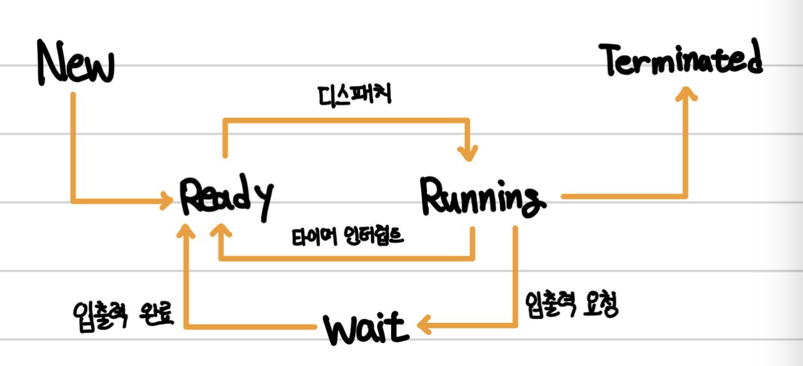

프로세스의 구조와 상태, PCB 그리고 병렬성과 동시성에 대해서 알아보겠습니다.@

---

## 프로그램과 프로세스

프로그램은 HDD나 SSD와 같은 하드디스크에 저장된 명령문의 집합체입니다. 애플리케이션 또는 앱이라고 불리는데요. 컴퓨터 관점에서 저장 장치만 사용하는 수동적인 존재입니다.

프로세스는 실행 중인 프로그램입니다. 하드디스크에 저장된 프로그램이 메모리(RAM)에 적재(load) 되면 프로세스가 됩니다. 컴퓨터 관점에서 메모리도 사용하고 운영체제의 CPU 스케줄링 알고리즘에 따라 CPU도 사용하며 필요에 따라 입출력도 하기에 능동적인 존재입니다.

**💡TIP💡**

- Windows에서는 .exe 파일이 프로그램이다.
- 사용자가 보는 앞에서 실행되는 프로세스는 포그라운드 프로세스(foreground process)이고 사용자가 보지 못하는 뒤편에서 실행되는 프로세스는 백그라운드 프로세스(background process)라고 한다.

## 프로세스 구조

프로그램이 실행되어 프로세스가 만들어진다면 다음 4가지의 메모리 영역으로 구성되어 할당받게 됩니다.

- 코드 영역(CODE / TEXT) : 프로그래머가 작성한 코드가 CPU가 해석이 가능한 상태인 기계어 형태로 저장되어 있다.
- 데이터 영역(DATA) : 코드가 실행되면서 사용하는 전역 변수나 각종 데이터들이 모여있다. (Ex. 전역 변수, static 변수 등)
  ⇒ 정적 할당 영역 (크기 고정)
- 힙 영역(HEAP) : 생성자, 인스턴스와 같은 동적으로 할당되는 데이터들을 위해 존재하는 공간이다. 사용자에 의해 메모리 공간이 할당되고 해제된다. (낮은 주소 → 높은 주소)
- 스택 영역 : 지역 변수와 같은 함수가 종료되면 되돌아올 임시적인 자료를 저장하는 독립적인 공간이다. (높은 주소 → 낮은 주소)
  ⇒ 동적 할당 영역

**💡TIP💡**
**[컴파일 과정] :** `test.c` → 전처리기 ⇒ `test.i` → 컴파일러 (어셈블리어로 변환) ⇒ `test.s` → 어셈블러 (기계어로 변환) ⇒ `test.o` → 링커 (여러 가지 라이브러리나 다른 소스코드 연결) ⇒ `text.exe`

## CPU의 작업 처리 방식

### 병렬성 (Parallelism)

병렬성은 직관적으로 명령어를 메모리에서 뽑아 해석하고 실행하는 반도체 유닛인 여러 개의 코어에 맞춰 여러 개의 프로세스, 쓰레드를 사용해 병렬로 작업들을 동시 수행하는 것을 말합니다.

듀얼코어, 쿼드코어, 옥타코어 등 이런 명칭이 붙는 멀티코어 프로세서가 달린 컴퓨터에서 할 수 있는 방식입니다.

### 동시성 (Concurrency)

동시성은 둘 이상의 작업이 동시에 실행되는 것을 의미합니다. 이 ‘동시’라는 의미에서 병렬성과 동시성의 한글 의미가 헷갈릴 수 있습니다. Parallelism이 물리적으로 정말 동시에 실행하는 것이라면, Concurrency는 동시에 실행하는 것처럼 보이게 하는 것으로 이해하시면 됩니다.

즉, 1개의 코어가 있고 4개의 작업이 있다고 가정하면, 프로세스들은 계속 번갈아가면서 조금씩 처리함으로써 마치 프로그램이 동시에 실행되는 것처럼 보입니다. 이때 프로세스들을 번갈아가면서 매우 빠르게 처리하기 때문에 컴퓨터를 모르는 사람들이 보면 마치 동시에 돌아가는 것처럼 보이게 됩니다.

단, 이때 작업들을 번갈아가면서 실행할 때 작업들을 아주 잘게 나누어 아주 조금씩만 작업을 수행하고 다음 작업으로 넘어가는 식으로 동작합니다. 이렇게 하는 이유는 여러 작업을 동시에 처리하는 것처럼 보이게 만들어 사용자에게 자연스러운 화면을 보여주기 위하기 때문입니다. 그리고 이렇게 작업들을 A → B → C → A 등으로 번갈아 바꾸는 것을 `Context Switching`이라고 부릅니다.

## PCB (Process Control Block)

프로세스가 만들어지면, 운영체제는 해당 프로세스의 정보를 갖고 있는 PCB(Process Control Block)를 만들고 저장합니다. PCB는 서로 자료구조 중 하나인 연결리스트로 연결되어 있습니다.

프로세스를 Context Switching 할 때, 기존 프로세스의 상태를 어딘가에 저장해 둬야 다음에 똑같은 작업을 이어서 할 수 있을 것이고, 새로 해야 할 작업의 상태 또한 알고 있어야 어디서부터 다시 작업을 시작할지 결정할 수 있을 것입니다.

즉, PCB는 프로세스에 관한 모든 정보를 저장하는 임시 저장소인 셈입니다.

운영체제에 따라 PCB에 포함되는 항목이 다를 수 있지만, 일반적으로 PCB 내에는 다음과 같은 정보가 포함되어 있습니다.

- 프로세스 상태 : 생성(New), 준비(Ready), 실행(Running), 대기(Waiting), 완료(Terminated)
- 프로세스 아이디 (PID) : 프로세스 식별을 위한 고유한 ID
- 프로그램 카운터 (PC) : 프로세스를 위해 실행될 다음 명령어의 주소를 포함하는 카운터를 저장
- 레지스터 정보 : 프로세스가 메모리에 있는 위치 정보 등 레지스터에 있는 정보 저장
- 포인터 : 프로세스의 현재 위치를 저장하는 포인터 정보

## 프로세스 상태

- New (생성) : 프로세스가 생성되고 아직 준비가 되지 않은 상태
- Ready (준비) : 프로세스가 실행을 위해 기다리는 상태. 즉, CPU를 할당받을 수 있는 상태이며, 언제든지 실행될 준비가 되어있다.
- Running (실행) : 프로세스가 CPU를 할당받아 실행되는 상태
- Waiting (대기) : 프로세스가 특정 이벤트(주로 입출력 요청)가 발생하여 대기하는 상태. CPU를 할당받지 못하며, 이벤트가 발생하여 다시 Ready 상태로 전환될 때까지 대기한다.
- Terminated (종료) : 프로세스가 실행을 완료하고 종료된 상태. 더 이상 실행될 수 없으며, 메모리에서 제거된다.

## 레퍼런스

[[1] 완전히 정복하는 프로세스 vs 스레드 개념](https://inpa.tistory.com/entry/%F0%9F%91%A9%E2%80%8D%F0%9F%92%BB-%ED%94%84%EB%A1%9C%EC%84%B8%EC%8A%A4-%E2%9A%94%EF%B8%8F-%EC%93%B0%EB%A0%88%EB%93%9C-%EC%B0%A8%EC%9D%B4)

---

"50대의 추교현이 20대의 추교현에게 감사할 수 있게끔 하루하루 최선을 다해 살고자 합니다."

**_The End._**
