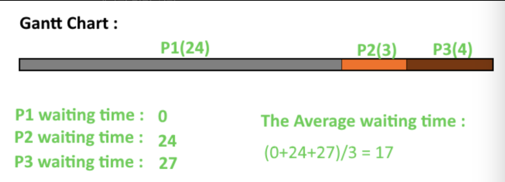
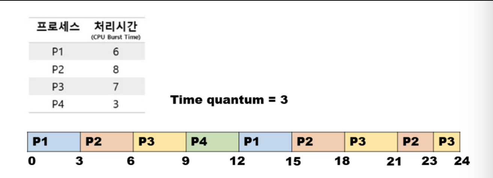
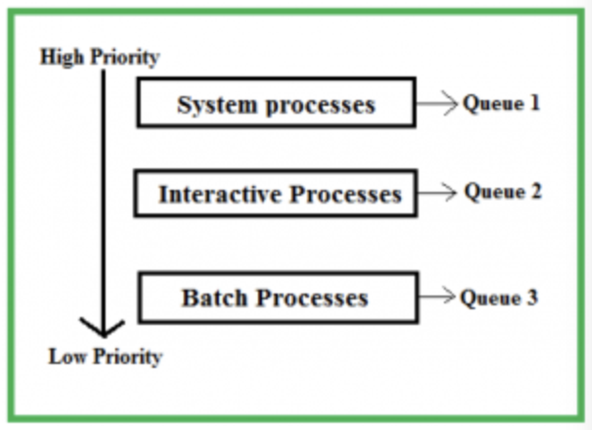
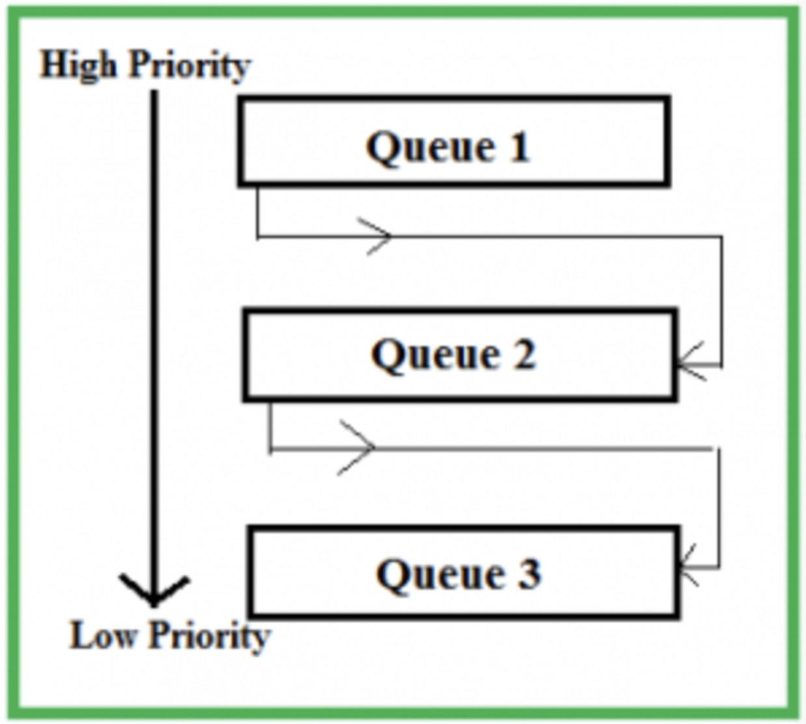

CPU 스케줄링 알고리즘인 FCFS, SJF, RR, SRT, Priority, Multi-Level Queue, MLFQ 스케줄링에 대해서 알아보겠습니다.@

---

CPU 스케줄링 알고리즘에 대해 알아보기 전, 각 알고리즘의 성능은 어떤 기준으로 측정할 것인지에 대해 먼저 알아보겠습니다.

CPU 스케줄링의 성능은 **시스템 입장에서의 성능**과 **사용자 입장에서의 성능** 이렇게 두 가지로 나눠 생각할 수 있습니다. 시스템 입장에서는 CPU를 쉬지 않고 최대한 많이 돌리는 것이 중요하고, 사용자 입장에서는 자신이 요청한 작업이 빨리 처리되는 것이 중요합니다.

하지만 두 입장 모두를 완벽하게 만족시킬 수는 없습니다. 따라서, 상황에 맞게 CPU 스케줄링을 설계해야 됩니다.

시스템 입장에서의 성능 척도는 무엇이 있을까요?

- CPU Utilization (CPU 이용률) : 전체 시간 중 CPU가 일한 시간의 비율
- Throughput (처리량) : 단위 시간당 처리량. 즉, 단위 시간당 프로세스를 몇 개 완료시켰는가를 의미

사용자 입장에서의 성능 척도는 무엇이 있을까요?

- Waiting time (대기 시간) : 프로세스가 Ready queue에서 기다린 시간
- Response time (응답 시간) : 프로세스가 최초로 CPU를 할당받을 때까지 걸린 시간
- Turnaround time (소요 시간) : 프로세스가 처음 도착해서 끝나기까지 걸린 시간

## [1] FCFS(First-Come First-Served) 스케줄링

FCFS 스케줄링은 단순히 Ready queue(준비 큐)에 삽입된 순서대로 프로세스들을 처리하는 비선점형 스케줄링 방식입니다.

즉, 이 스케줄링은 CPU를 먼저 요청한 프로세스부터 CPU를 할당하는 스케줄링 방식입니다.

이는 언뜻 보기에는 가장 공정해 보이지만, CPU를 가장 오래 사용하는 프로세스가 먼저 도착하면 작은 실행 시간을 갖는 프로세스가 오랫동안 기다리는 현상인 **호위 효과**가 발생한다는 부작용이 있습니다.

## [2] SJF(Shortest Job First) 스케줄링

FCFS 스케줄링의 호위 효과를 방지하기 위해서 나온 방식이 SJF 스케줄링입니다.

Ready queue에 삽입된 프로세스들 중 CPU 이용 시간의 길이가 가장 짧은 프로세스부터 실행하는 비선점형 스케줄링 방식입니다.

하지만, 여전히 문제점이 존재합니다.

1. Starvation(기아 현상) : Ready queue에 먼저 삽입되었음에도 불구하고 우선순위가 높은 프로세스를 우선하여 처리하기에 우선순위가 낮은 프로세스는 실행이 계속해서 연기될 수 있는 현상입니다.

2. 프로세스의 CPU Burst time 예측 불가 : 해당 프로세스가 CPU를 얼마나 사용할지, 예측하는 것은 거의 불가능합니다.

## [3] RR(Round Robin) 스케줄링

RR 스케줄링은 FCFS 스케줄링에 각 프로세스에 동일한 크기의 시간(time slice)이라는 개념이 더해진 스케줄링 방식입니다.

타임 슬라이스란 각 프로세스가 CPU를 사용할 수 있는 정해진 시간을 의미합니다. 즉, RR 스케줄링은 정해진 타임 슬라이스만큼의 시간 동안만 돌아가면서 CPU를 이용하는 선점형 스케줄링입니다.

큐에 삽입된 프로세스들은 삽입된 순서대로 CPU를 이용하되, 정해진 시간만큼만 CPU를 이용하고 정해진 시간을 모두 사용하였음에도 아직 프로세스가 완료되지 않았다면 다시 큐의 맨 뒤에 삽입됩니다. 이때 컨텍스트 스위칭이 발생합니다.

타임 슬라이스가 지나치게 크면 사실상 FCFS 스케줄링과 다를 바가 없어 호위 효과가 생길 수 있습니다. 타임 슬라이스가 지나치게 작으면 컨텍스트 스위칭으로 발생하는 비용이 커져 자칫 배보다 배꼽이 더 큰 상황이 생길 수 있습니다.

보통 타임 슬라이스를 I/O bound process의 CPU Burst time 정도로 잡게 된다면 합리적이며 일반적으로 10ms ~ 100ms 정도로 설정한다고 합니다.

## [4] SRT(Shortest Remaining Time) 스케줄링

SJF 스케줄링과 RR 스케줄링을 합친 스케줄링 방식입니다.

SRT 스케줄링은 정해진 타임 슬라이스만큼 CPU를 사용하되, CPU를 사용할 다음 프로세스는 남아있는 작업 시간이 가장 적은 프로세스를 처리하는 선점형 스케줄링 방식입니다.

## [5] 우선순위 스케줄링 (Priority Scheduling)

우선순위 스케줄링은 프로세스들에게 우선순위를 부여하고, 가장 높은 우선순위를 가진 프로세스부터 먼저 처리해 주는 방식입니다.

위에서 언급한 SJF 스케줄링과 SRT 스케줄링은 넓은 의미에서 우선순위 스케줄링의 일종이라고 볼 수 있습니다.

SJF 스케줄링에서 얘기한 기아 현상이 우선순위 스케줄링에서도 나타나 문제점으로 작용합니다. 여기서 Aging 기법을 사용하여 이 문제를 해결합니다. Aging 이란 프로세스가 기다리는 시간이 길어질수록 우선순위를 높여 한 프로세스가 무한정 기다리지 않도록 해주는 방법입니다.

## [6] Multi-Level Queue 스케줄링

Multi-Level Queue 스케줄링은 우선순위별로 Ready queue를 여러 개 사용하는 방식입니다. 우선순위가 가장 높은 큐에 있는 프로세스들을 먼저 처리하고, 우선순위가 가장 높은 큐가 비어 있으면 그다음 우선순위 큐에 있는 프로세스들을 처리합니다.

각 큐마다 독립적인 스케줄링 알고리즘을 적용하여 효율성을 높일 수 있습니다. 예를 들어, Interactive 프로세스들이 있는 큐에서는 RR 스케줄링을, Batch 프로세스들이 있는 큐에는 FCFS 스케줄링을 적용하여 각 프로세스의 성격에 맞게 효율적인 스케줄링을 적용할 수 있습니다.

## [7] MLFQ(Multi-Level Feedback Queue) 스케줄링

Multi-Level Queue 스케줄링이 발전된 형태입니다. Multi-Level Queue 스케줄링은 프로세스들이 큐 사이를 이동할 수 없습니다. 이런 방식이라면 우선순위가 낮은 프로세스는 계속 연기되어 실행하지 못하는 기아 현상이 발생할 수 있습니다.

MLFQ 스케줄링은 새로 준비 상태가 된 프로세스가 있다면 우선순위가 가장 높은 우선순위 큐에 삽입되고 타임 슬라이스 동안 실행됩니다. 그리고 만약 프로세스가 해당 큐에서 실행이 끝나지 않는다면, 해당 프로세스는 그다음 우선순위 큐에 삽입됩니다.

그러면 결국 CPU를 오래 사용해야 하는 프로세스는 점차 우선순위가 낮아지게 되며 CPU를 비교적 적게 사용하는 I/O bound process들이 자연스럽게 우선순위가 높은 큐에서 실행이 됩니다.

## 레퍼런스

[1] [[운영체제(OS)] CPU 스케줄링 - (1) CPU 스케줄링의 개념](https://kjhoon0330.tistory.com/entry/%EC%9A%B4%EC%98%81%EC%B2%B4%EC%A0%9COS-CPU-%EC%8A%A4%EC%BC%80%EC%A4%84%EB%A7%81)

---

"50대의 추교현이 20대의 추교현에게 감사할 수 있게끔 하루하루 최선을 다해 살고자 합니다."

**_The End._**
