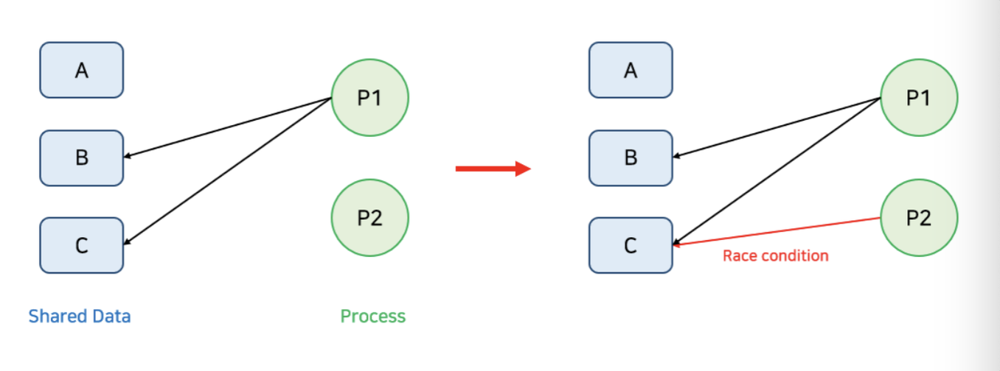
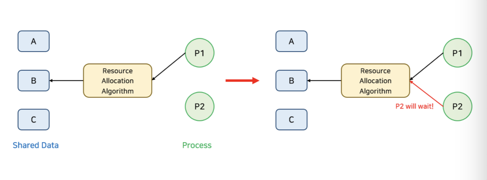
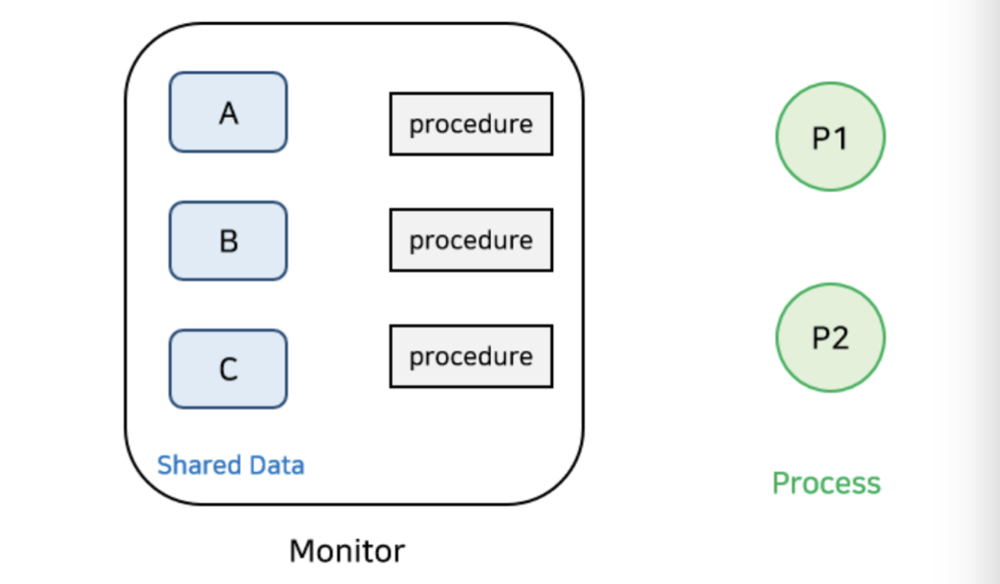
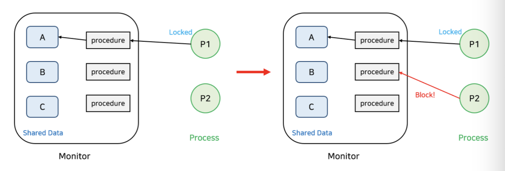
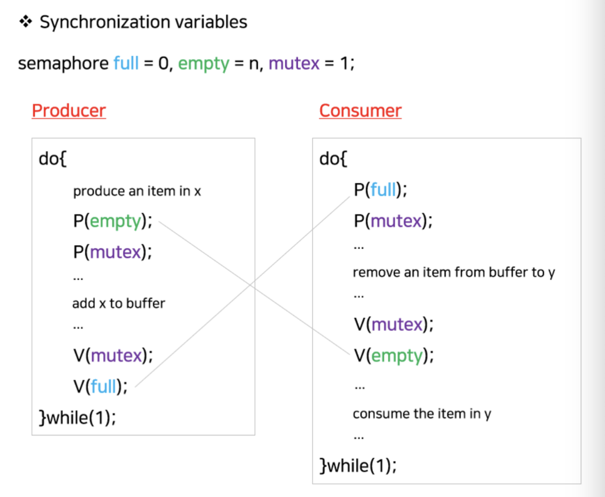
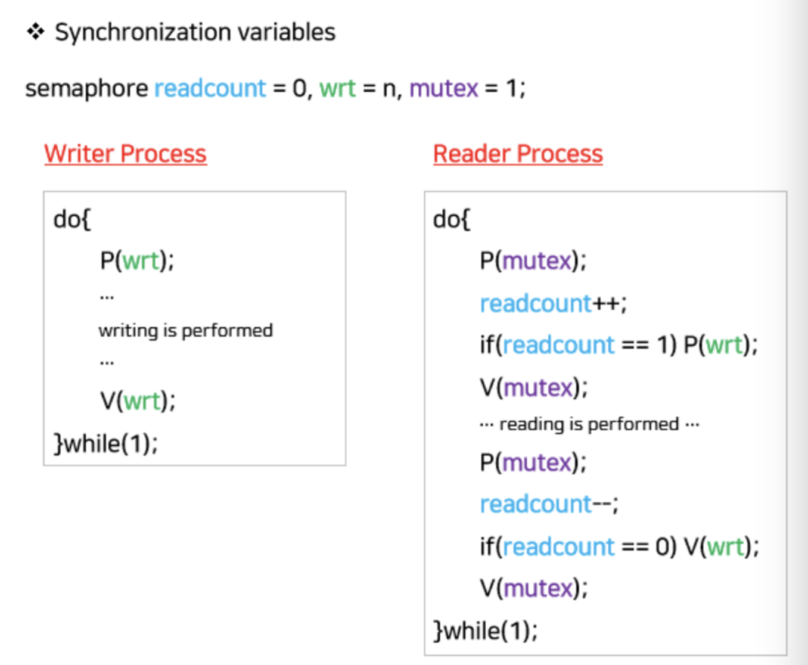
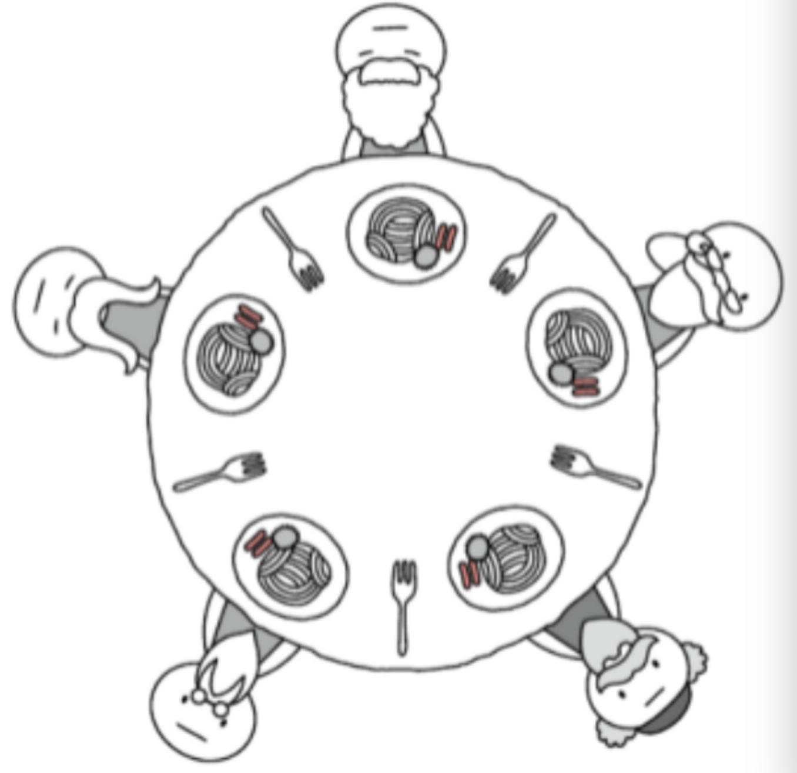

프로세스의 동기화에 대해서 알아봅시다.@

---

## 프로세스 동기화란?

“프로세스 동기화”를 알아보기 전에 “동기화”는 무슨 뜻일까요? “작업들 사이의 수행 시기를 맞추는 것”으로 국어사전에 나와있습니다.

그러면, “프로세스 동기화”는 무슨 뜻일까요? 프로세스들 사이의 수행 시기를 맞추는 것입니다. 실행의 흐름을 갖는 쓰레드 또한 동기화의 대상입니다.

## 상호 배제 (Mutual Exclusion)

상호 배제는 멀티 프로그래밍(여러 개의 계산들을 병렬 처리)에서 공유 불가능한 자원(동시에 접근해서는 안 되는 공유 자원)의 동시 사용을 피하기 위해 사용되는 알고리즘입니다.

상호 배제의 조건으로 다음과 같습니다:

1. 두 프로세스는 동시에 공유 자원에 접근할 수 없다.
2. 여러 요청이 와도 하나의 프로세스만 접근이 가능하다.
3. 프로세스가 공유 자원을 너무 오래 사용해서는 안 된다.

## 경쟁 상태 (Race Condition)

경쟁 상태는 여러 프로세스들이 동시에 데이터에 접근하는 상황에서 어떤 순서로 데이터에 접근하냐에 따라 결괏값이 달라질 수 있는 상황을 말합니다.

공유 자원의 동시 접근은 데이터의 불일치 문제를 발생시킬 수 있어서 경쟁 상태를 막고 일관성을 유지하기 위해서는 협력 프로세스 간의 실행 순서를 정해주는 알고리즘인 동기화(Synchronization)가 필요합니다.

위 그림은 경쟁 상태(Race Condition)이 발생할 수 있는 경우의 예시입니다. P1이 B와 C를 사용하고 있을 때, P2가 C에 접근한다면 경쟁 상태가 발생할 수 있습니다.

## 임계 구역 (Critical Section)

임계 구역은 코드 상에 경쟁 상태가 발생할 수 있는 특정 부분을 말합니다. 즉, 공유 자원에 접근하는 코드 부분을 뜻합니다.

임계 구역으로 인해 발생하는 문제들을 해결하기 위해서는 다음 조건들을 만족해야 합니다:

**1. 상호 배제 (Mutual Exclusion)** : 이미 어떤 프로세스가 임계 구역에서 작업 중이면, 어떠한 프로세스도 임계 구역에 접근해서는 안 됩니다.

**2. 진행 (Progress)** : 임계 구역에서 작업 중인 프로세스가 없다면, 임계 구역에 진입하고자 하는 프로세스가 존재하는 경우 진입할 수 있어야 합니다.

**3. 한정 대기 (Bounded Waiting)** : 프로세스가 임계 구역에 들어가기 위해 요청한 후부터 그 요청이 허용될 때까지 다른 프로세스들이 임계 구역에 들어가는 횟수에 한계가 있어야 합니다. 쉽게 말해서, 임계 구역에 진입하려는 프로세스가 무한정 기다려서는 안 된다는 말입니다.

## 뮤텍스 락 (Mutex Locks)

임계 구역 문제를 해결하기 위한 소프트웨어 도구 중 가장 단순한 방법으로 Mutex(Mutual Exclusion) Locks이 있습니다. 이는 lock이 하나만 존재할 수 있는 메커니즘을 따릅니다. 즉, 이미 하나의 프로세스가 임계 구역에서 작업 중이면 다른 프로세스들은 임계 구역에 들어갈 수 없도록 합니다.

임계 구역의 진입이 가능한지 기다리면서 체크함으로써 계속 CPU와 메모리를 사용하는 Busy Wait의 문제점이 있습니다.

- 전역 변수 `lock` : 자물쇠 역할
- `acquire` 함수 : 임계 구역을 잠그는 역할
- `release` 함수 : 임계 구역의 잠금을 해제하는 역할

## 세마포어 (Semaphore)

세마포어는 Busy Wait이 필요 없는 동기화 도구이며, 여러 프로세스나 쓰레드가 임계 구역에 진입할 수 있는 Signaling 메커니즘입니다.

- 전역 변수 `S` : 사용 가능한 공유자원 개수
- `wait` 함수 : 임계 구역에 들어가도 좋은지, 기다려야 할지 판단
  ⇒ 사용 가능한 자원이 없다면, 프로세스를 Wait 상태로 바꾸고 해당 PCB를 Wait 큐에 넣음
- `signal` 함수 : 임계 구역 앞에서 기다리는 프로세스에게 ‘이제 들어가!’라고 말해줌
  ⇒ 대기 중인 프로세스를 Wait 큐에서 제거하고 프로세스의 상태를 Ready 상태로 바꾸며 해당 PCB를 Ready 큐에 넣음

## 모니터 (Monitor)

세마포어의 문제점은 코딩하기가 힘들고 프로그래머가 실수하기 쉬우며, 정확성을 입증하기 어렵습니다. 그리고 `wait` 과 `signal` 함수의 순서에 따라 데드락이 생기거나 상호 배제가 깨질 수 있습니다. 모니터는 이러한 단점을 보완할 수 있는 동기화 도구입니다.

경쟁 상태를 방지하기 위해서 세마포어와 같은 도구가 있으며, 이를 사용하면 아래 이미지와 같이 작용합니다.

반면, 모니터는 아래와 같이 이루어져 있습니다.

모니터는 공유 데이터 구조, 공유 데이터에 대한 연산을 제공하는 프로시저(Procedure), 현재 호출된 프로시저 간의 동기화를 캡슐화한 모듈(module)입니다.

프로세스가 공유 데이터를 사용하기 위해서는 반드시 모니터 내의 프로시저를 통해야 합니다. 그리고 동일한 시간에는 오직 하나의 프로세스나 쓰레드만 모니터에 들어갈 수 있습니다.

내부에 프로세스가 있어 모니터로 진입하지 못한 프로세스들은 모니터 큐에서 기다립니다. 프로세스가 모니터 내에서 기다릴 수 있도록 조건 변수(Conditional Variable)가 사용됩니다.

## 고전적인 동기화 문제

고전적인 동기화 문제로 유명한 세 가지가 있습니다.

### 1. Producer-Consumer Problem (Bounded-Buffer Problem)

생산자 쓰레드와 소비자 쓰레드가 있고 그 사이에 공유 버퍼가 있다고 가정하겠습니다. 만약 둘 이상의 생산자가 비어있는 버퍼를 동시에 보고 데이터를 만들어 넣는다면, 문제가 발생할 수 있습니다.

마찬가지로 둘 이상의 소비자가 동시에 버퍼의 데이터를 사용한다면, 문제가 발생할 수 있습니다. 따라서, 동시에 버퍼에 접근할 수 없도록 락을 걸어줘야 합니다.

이때, 락을 걸고 푸는 용도와 자원의 개수를 카운팅하는 용도로 세마포어 변수를 사용합니다.

### 2. Readers-Writers Problem

이 문제는 한 프로세스가 데이터를 수정하는 작업을 수행할 때, 다른 프로세스가 접근하면 안 되고, 읽는 작업을 여러 프로세스가 동시에 수행이 가능하도록 하는 문제입니다.

만약 데이터에 대해 하나의 lock을 사용하게 되면 데이터의 일관성을 지킬 수 있으나, 여러 프로세스가 동시에 읽지 못하고 한 프로세스만 읽도록 강제하는 것은 비효율적입니다.

따라서, 현재 수정하려는 프로세스가 없다면 모든 대기 중인 Reader들의 접근을 허용하고, Writer는 대기 중인 Reader가 하나도 없는 경우 접근하도록 합니다. 그리고 Writer가 접근 중이면 Reader들은 접근할 수 없도록 합니다.

만약 n개의 reader가 기다리고 있다면, 제일 처음 reader만 wrt 세마포어에 넣고 나머지 n-1개의 reader는 mutex 세마포어 큐에 넣어둠으로써 효율성을 높여줍니다.

만약 계속해서 reader가 들어오거나 writer가 들어오는 경우 한쪽이 계속 수행되지 않을 수 있어서 기아현상이 발생할 수 있습니다. 이는 큐에 우선순위를 부여한다거나, 일정 시간이 지나면 자동으로 write or read가 되도록 하여 해결할 수 있습니다.

### 3. Dining-Philosophers Problem

이 문제는 데드락(교착 상태)의 대표적인 예시입니다.

동그란 원탁에 다섯 명의 철학자가 앉아 있습니다. 철학자들 앞에는 두 개의 포크로 먹을 수 있는 음식이 있고, 철학자들 사이사이에는 포크가 있습니다.

철학자들은 다음과 같은 순서로 식사를 합니다.

1. 생각을 하다가 왼쪽 포크가 사용 가능하면 잡는다.
2. 생각을 하다가 오른쪽 포크가 사용 가능하면 잡는다.
3. 왼쪽과 오른쪽 포크를 모두 잡으면 정해진 시간 동안 밥을 먹는다.
4. 식사 시간이 끝나면 오른쪽 포크를 내려놓는다.
5. 오른쪽 포크를 내려놓은 뒤, 왼쪽 포크를 내려놓는다.
6. 다시 1번부터 반복한다.

이런 순서로 식사를 한다면, 모든 철학자들이 동시에 포크를 집게 되었을 때 영영 식사를 못하게 됩니다.

왜냐하면, 모든 철학자는 다른 철학자가 포크를 내려놓을 때까지 하염없이 기다려야 하기 때문입니다.

## 레퍼런스

[[1] 프로세스 동기화](https://rebro.kr/176)

[[2] 상호 배제와 동기화](https://velog.io/@woga1999/%EC%83%81%ED%98%B8-%EB%B0%B0%EC%A0%9C%EC%99%80-%EB%8F%99%EA%B8%B0%ED%99%94)

[[3] Deadlock](https://velog.io/@oeckikek/Deadlock)

---

"50대의 추교현이 20대의 추교현에게 감사할 수 있게끔 하루하루 최선을 다해 살고자 합니다."

**_The End._**
