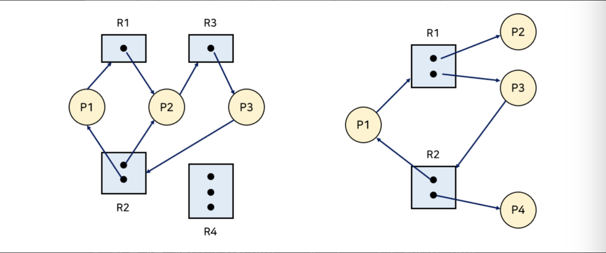
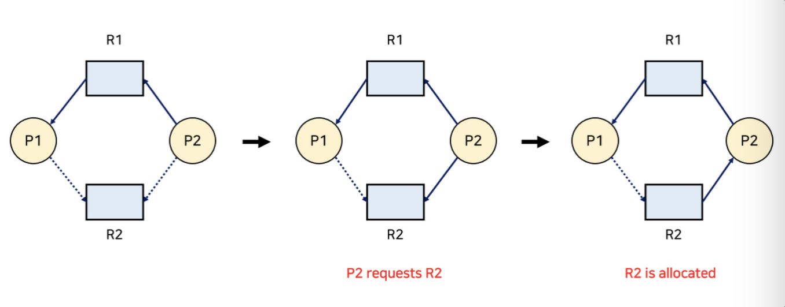
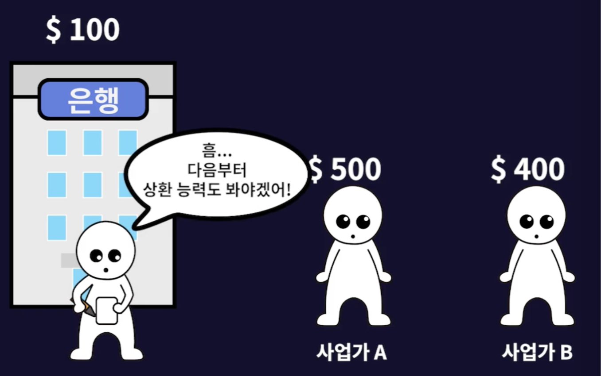

프로세스나 쓰레드가 서로 자원을 얻지 못하여 진행이 안 되는 현상인 데드락(교착 상태)에 대해서 알아봅시다.@

---

## 데드락이란?

데드락은 두 개 이상의 프로세스나 쓰레드가 서로 자원을 얻지 못하여 다음 처리를 진행하지 못하는 상태를 말합니다.

마치, 외나무다리의 양 끝에서 서로가 비켜주기를 기다리고만 있는 것과 같습니다.

## 데드락 발생 조건

데드락이 발생하기 위해선 아래의 4가지 조건을 만족해야 합니다.

### 1. 상호 배제 (Mutual Exclusion)

해당 자원을 한 번에 하나의 프로세스만 이용이 가능해야 합니다.

### 2. 점유와 대기 (Hold & Wait)

자원을 할당받은 상태에서 다른 자원을 할당받기 기다리는 상태여야 합니다.

### 3. 비선점 (No preemption)

어떤 프로세스도 다른 프로세스의 자원을 강제로 뺏지 못하는 상태여야 합니다.

### 4. 원형 대기 (Circular Wait)

자원을 기다리는 프로세스 간에 사이클(Cycle)이 형성되어야 합니다.

프로세스 간의 관계를 그래프로 도식화해 보면 데드락이 발생할지 예상할 수 있는데, 이 그래프를 자원 할당 그래프(Resource-Allocation Graph)라고 합니다. 위의 이미지에서 R은 자원이고 P는 프로세스를 의미하며 자원 내의 동그라미는 자원의 개수입니다.

만약 그래프에 사이클(Cycle)이 없다면, 데드락이 아닙니다. 반면, 사이클이 있어도 데드락이 아닐 수가 있습니다.

데드락 문제를 해결하기 위한 방법으로 대표적으로 미리 예방하는 방법(Prevention)과 아예 발생하지 않도록 피하는 방법(Avoidance) 그리고 발생했을 때 처리하는 방법(Detection and Recovery), 무시하는 방법(Ignorance) 총 네 방법으로 나뉩니다.

## 데드락 예방 (Prevention)

데드락을 미리 예방하는 방식은 데드락의 4가지 발생 조건 중 어느 하나가 만족되지 않도록 하는 방식입니다.

### 1. 상호 배제 (Mutual Exclusion) 제거

한 번에 여러 프로세스가 공유 자원을 사용할 수 있게 합니다. 그러나 추후 동기화 관련 문제가 발생할 수 있습니다.

### 2. 점유와 대기 (Hold & Wait) 제거

프로세스가 자원을 요청할 때, 다른 어떠한 자원도 갖지 않도록 해야 합니다. 따라서, 특정 프로세스에 자원을 모두 할당하거나 아예 할당받지 못하여 기아 현상이 발생할 수 있습니다.

### 3. 비선점 (No preemption) 제거

타임 슬라이스를 활용하는 CPU와 같은 자원에는 효과적일 수 있으나, 프린터처럼 실행 도중에 자원을 뺏기면 안 되는 자원도 있습니다.

### 4. 원형 대기 (Circular Wait) 제거

자원의 타입에 따라 프로세스마다 할당 순서를 정하여 정해진 순서대로만 자원을 할당할 수 있습니다. 하지만, 수많은 자원에 번호를 붙이는 일이 효율적이지 않으며 각 자원에 어떤 번호를 붙이는지에 따라 특정 자원의 활용도가 낮아질 수 있습니다.

이러한 조건들을 제거해서 데드락을 예방하는 방법은 시스템의 효율성을 떨어뜨리는 단점이 발생할 수 있습니다.

## 데드락 회피 (Avoidance)

데드락 회피는 데드락이 발생할 가능성이 있는 경우에 아예 자원을 할당하지 않는 방식입니다. 데드락이 발생할 가능성을 알기 위해서는 아래의 두 용어를 알아야 합니다.

**Safe Sequence :** 데드락 없이 안전하게 프로세스들에 자원을 할당할 수 있는 순서

**Safe state :** 시스템 내의 프로세스들에 대한 Safe Sequence가 존재하는 상태

반면, **Unsafe state**는 Safe state가 아닌 상태를 말합니다. 즉, 데드락이 발생할 ‘수’ 있는 상태입니다.

### 1. 자원 할당 그래프 알고리즘 (Resource Allocation Graph Algorithm)

점선으로 표시된 간선(Claim edge)은 프로세스가 자원을 미래에 요청할 수 있음을 의미합니다. 그리고 해당 자원을 요청한 경우 실선(Request edge)으로 바뀌게 됩니다.

자원을 할당받으면 방향이 반대인 간선(Assignment edge)가 되며 만약 자원을 다 쓰고 반납하게 되면 다시 Claim edge로 바뀝니다.

데드락을 피하는 방법은 Request edge가 Assignment edge로 변경될 때, 점선을 포함하여 사이클이 생기지 않는 경우에만 요청된 자원을 할당합니다.

### 2. 은행원 알고리즘 (Banker’s Algorithm)

여러 자원(인스턴스)이 존재하는 경우에는 존재하는 경우에는 사이클만으로 판단할 수 없어서 다익스트라(dijkstra)가 Banker’s Algorithm을 고안했습니다.

> [인프런] 그림으로 쉽게 배우는 운영체제

이 알고리즘은 프로세스가 자원을 요청했을 때, Safe state인 경우에만 할당을 합니다. 즉, 요청할 수 있는 자원의 총 수가 남아있는 자원의 수보다 적은 프로세스만 선택하여 할당합니다. 만약 그런 프로세스가 없다면, Unsafe state인 것입니다.

할당받은 프로세스가 종료되면, 모든 자원을 반납하고, 모든 프로세스가 종료될 때까지 이 과정을 반복합니다.

## 데드락 검출 후 회복 (Detection and Recovery)

데드락이 발생했다는 사실을 인정하고 확인하여 이를 해결하는 방식입니다. 프로세스를 강제 종료시키거나 자원을 선점하여 회복하는 방법이 있습니다.

프로세스를 종료시킬 땐, 데드락에 빠진 모든 프로세스를 종료하거나 데드락이 해결될 때까지 한 번에 한 프로세스씩 종료시킬 수 있습니다.

자원을 선점할 땐, 어떤 프로세스를 종료시킬지 결정(Selecting a victim) 하고, 데드락이 발생하기 전 상태로 돌아가(Rollback) 프로세스를 재시작합니다. 이때 동일한 프로세스가 계속해서 victim으로 선정되어 강제로 종료 당한다면, 기아현상이 발생할 수 있습니다. 이는 Rollback된 횟수를 저장함으로써 해결할 수 있습니다.

## 데드락 무시 (Ignorance)

데드락이 일어나지 않는다고 생각하고 아무런 조치도 취하지 않는 방식입니다. 이를 타조 알고리즘(ostrich algorithm)이라고도 합니다.

이게 가능한 이유는 데드락 자체가 매우 드물게 발생하여 데드락에 대한 조치 자체가 더 큰 오버헤드를 발생시키기 때문입니다.

따라서 만약 시스템에 데드락이 발생한 경우, 시스템이 비정상적으로 작동하는 것을 사람이 느낀 후, 직접 프로세스를 죽이는 등의 방법으로 대처할 수 있습니다. 이 방식은 Unix, Windows 등 대부분의 범용 운영체제에서 채택하는 방식입니다.

## 레퍼런스

- [데드락(Deadlocks)](https://rebro.kr/177)

---

"50대의 추교현이 20대의 추교현에게 감사할 수 있게끔 하루하루 최선을 다해 살고자 합니다."

**_The End._**
