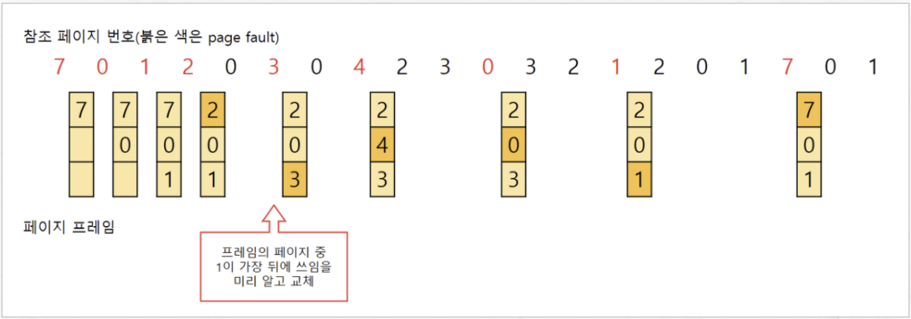
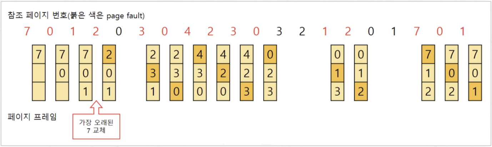
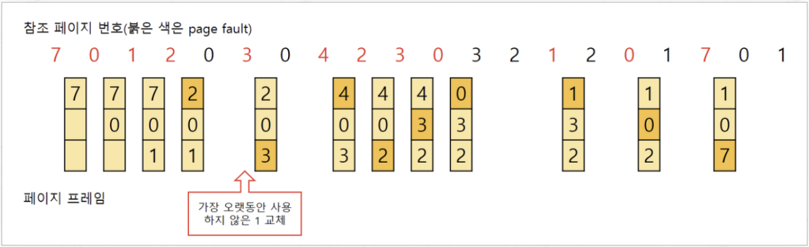
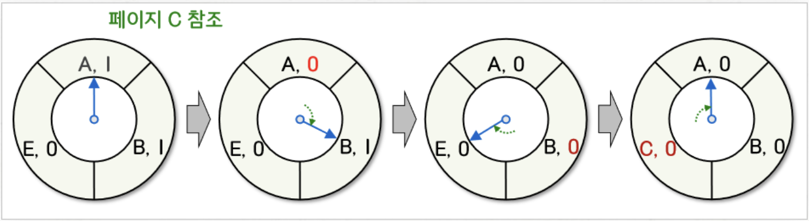
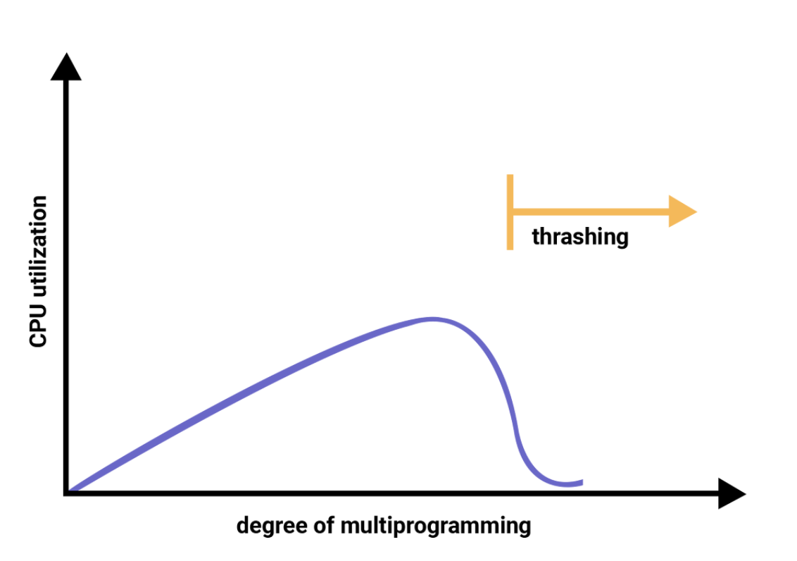
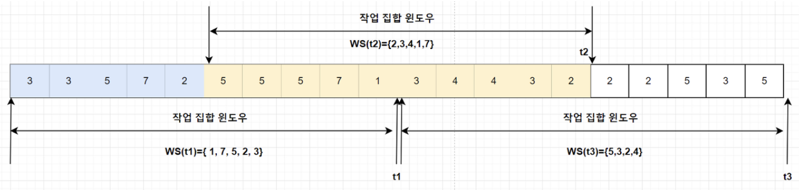

페이지 교체 알고리즘과 Page Fault 그리고 쓰레싱에 대해서 알아봅시다.@

---

## 페이지 교체란?

페이지 교체는 운영체제가 물리적 메모리(RAM)에 새로운 페이지를 로드하기 위해 현재 메모리에 있는 페이지 중 하나를 교체하는 과정을 말합니다.

페이지 교체는 메모리가 부족할 때, 발생하며 어떤 페이지를 교체할지 결정하는 다양한 알고리즘이 있습니다.

## 페이지 부재 (Page Fault)

페이지 부재는 프로세스가 접근하려는 데이터가 물리적 메모리(RAM)에 적재되어 있지 않을 때, 발생하는 현상입니다.

이를 최소화하기 위해서는 적절한 페이지 교체 알고리즘을 사용하는 방법이 있습니다.

## 페이지 교체 알고리즘

### OPT (Optimal Algorithm)

OPT는 가장 먼 미래에 참조되는 page를 대체하는 방법입니다. 이 방법은 항상 최적의 결과를 갖습니다.

하지만, 미래의 참조를 모두 알고 있어야 하므로 실제로 사용하기는 어렵습니다. 그래서 다른 알고리즘의 성능 비교 기준으로 사용됩니다.

### FIFO (First In First Out Algorithm)

FIFO는 제일 먼저 들어온 페이지를 가장 먼저 내쫓는 방법입니다. 구현하기 쉽지만, 페이지 사용 빈도나 중요도를 고려하지 않아 오버헤드가 발생하는 단점이 있습니다.

### LRU (Least Recently Used Algorithm)

LRU는 가장 오래전에 참조된 페이지를 지우는 방법입니다.

실제 사용 빈도를 반영하여 효율적인 교체가 가능합니다. 다만, 구현이 어렵고 접근되는 빈도를 고려하지 않는다는 단점이 있습니다.

### LFU (Least Frequently Used Algorithm)

LFU는 참조 횟수가 가장 적은 페이지를 지우는 방법입니다.

LRU에 비해 장기적인 시간 규모를 보기 때문에 페이지의 인기도를 조금 더 정확히 반영할 수 있지만, 최근성은 반영하지 못합니다.

### Second Chance Algorithm (CLOCK Algorithm)

최근에 참조되었는지를 나타내는 Reference bit가 0인 것을 찾을 때까지 시계처럼 한 바퀴씩 포인터를 이동하다가 0인 것을 찾으면 해당 페이지를 교체하는 방법입니다.

만약 Reference bit가 1인 페이지를 만나면, 0으로 바꿔주고 지나갑니다. 그리고 한 바퀴 돌고 왔는데도 여전히 0이면 해당 페이지를 교체합니다.

FIFO와 유사하지만, 각 페이지에 Reference bit를 사용해서 최근성을 참고한 알고리즘입니다.

## 쓰레싱 (Thrasing)

쓰레싱은 프로세스가 원활한 수행에 필요한 최소한의 프레임을 할당받지 못하여 실행보다 스와핑 하는데 더 많은 시간을 소모하는 현상입니다.

쓰레싱이 발생하는 과정은 다음과 같습니다:

1. 페이지가 부족하여 Page Fault가 증가한다.
2. 스와핑 작업이 증가하여 CPU 효율성이 감소한다.
3. 운영체제는 멀티프로그래밍 정도를 높여야 한다고 판단하여 다른 프로세스를 시스템에 추가한다.
4. 프로세스당 할당된 프레임이 더욱 감소하여 Page Fault가 증가한다.
5. 프로세스는 스와핑 작업이 늘어나고 CPU의 이용률은 더 감소하는 악순환에 빠진다.

### Working-Set Model

Working-Set Model은 가능한 최대 멀티프로그래밍 정도를 유지하면서 쓰레싱을 막는 방법입니다.

> 참조 지역성의 원리(Locality of reference) : 프로세스가 특정 시간 동안 일정 장소를 집중적으로 참조하는 성질

작업 집합 모델은 참조 지역성의 원리를 바탕으로 하며, 가장 최근에 접근한 프레임이 이후에도 또 참조될 가능성이 높다는 가정에서 출발합니다.

최근 일정 시간 동안 참조한 페이지들을 집합(Working set)으로 만들고, 이 집합에 있는 페이지들을 물리 메모리에 유지하여 프로세스의 실행을 돕습니다.

운영체제가 지속적으로 각 프로세스의 Working set을 지켜보면서 충분한 프레임을 할당해 주며 멀티프로그래밍 정도를 조절하는 방법입니다.

### PFF(Page-Fault Frequency) Scheme

PFF는 Page Fault의 상한 값과 하한 값을 두고, Page Fault가 상한 값을 넘으면 프레임을 더 할당하고, 하한 값보다 낮으면 할당된 프레임 수를 줄이는 방법입니다.

## 레퍼런스

- [[운영체제(OS)] 9. 가상 메모리(Virtual Memory)](https://rebro.kr/179)
- [[운영체제] Page Fault, Thrashing](https://yamyam-spaghetti.tistory.com/116)
- [[운영체제] 페이징 교체 알고리즘](https://steady-coding.tistory.com/526)

---

"50대의 추교현이 20대의 추교현에게 감사할 수 있게끔 하루하루 최선을 다해 살고자 합니다."

**_The End._**
