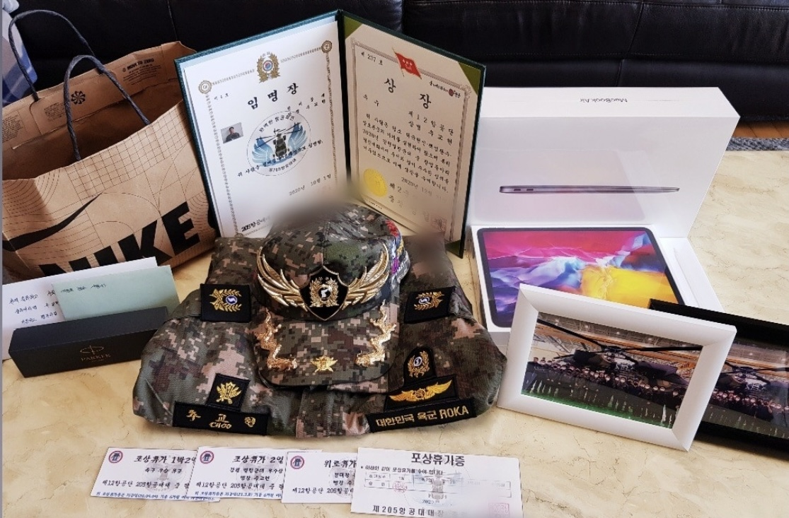
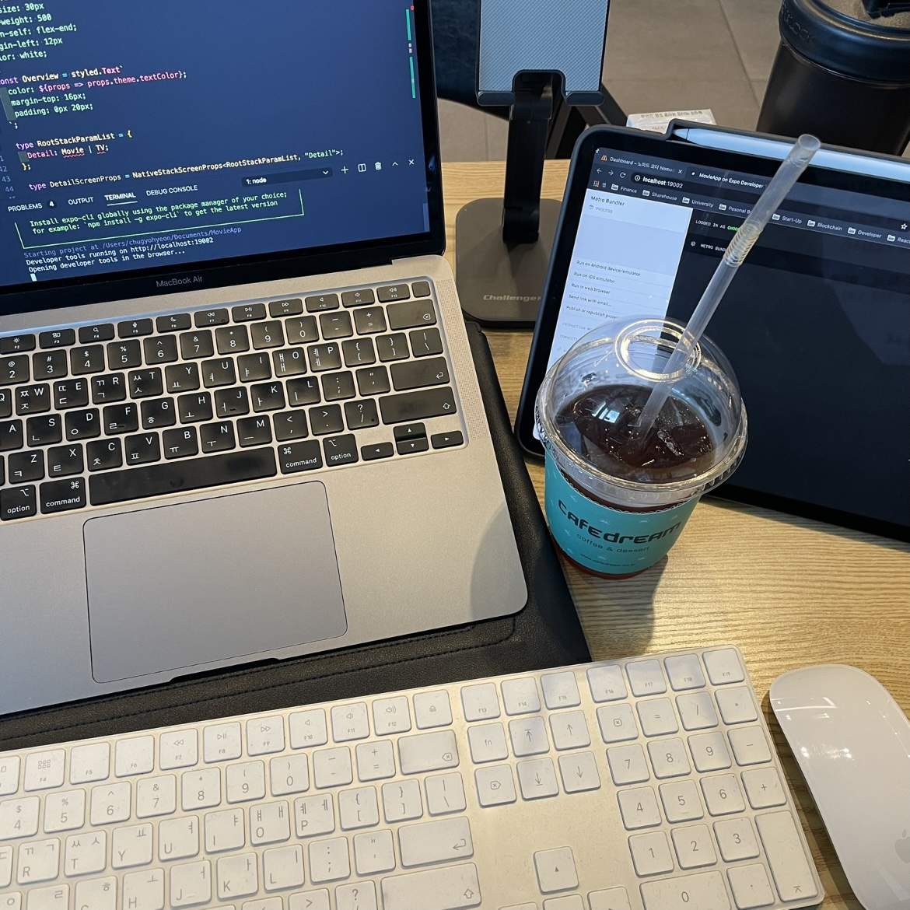
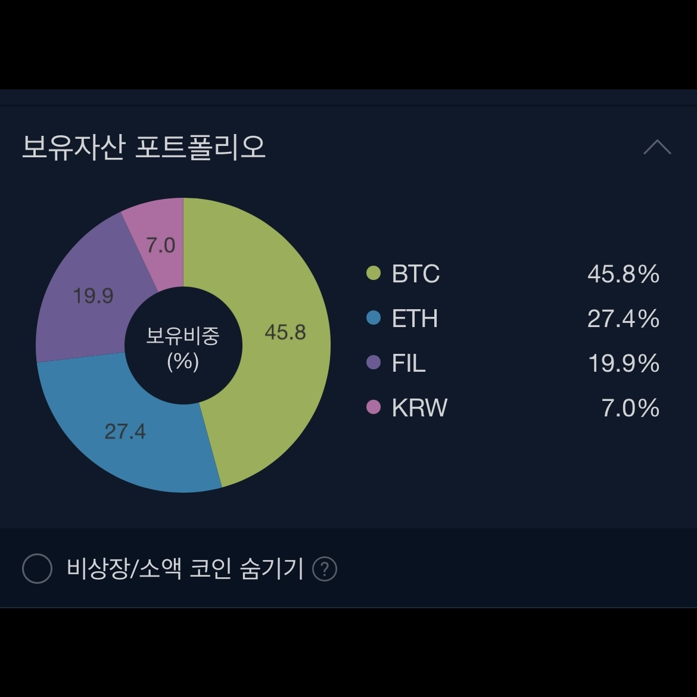
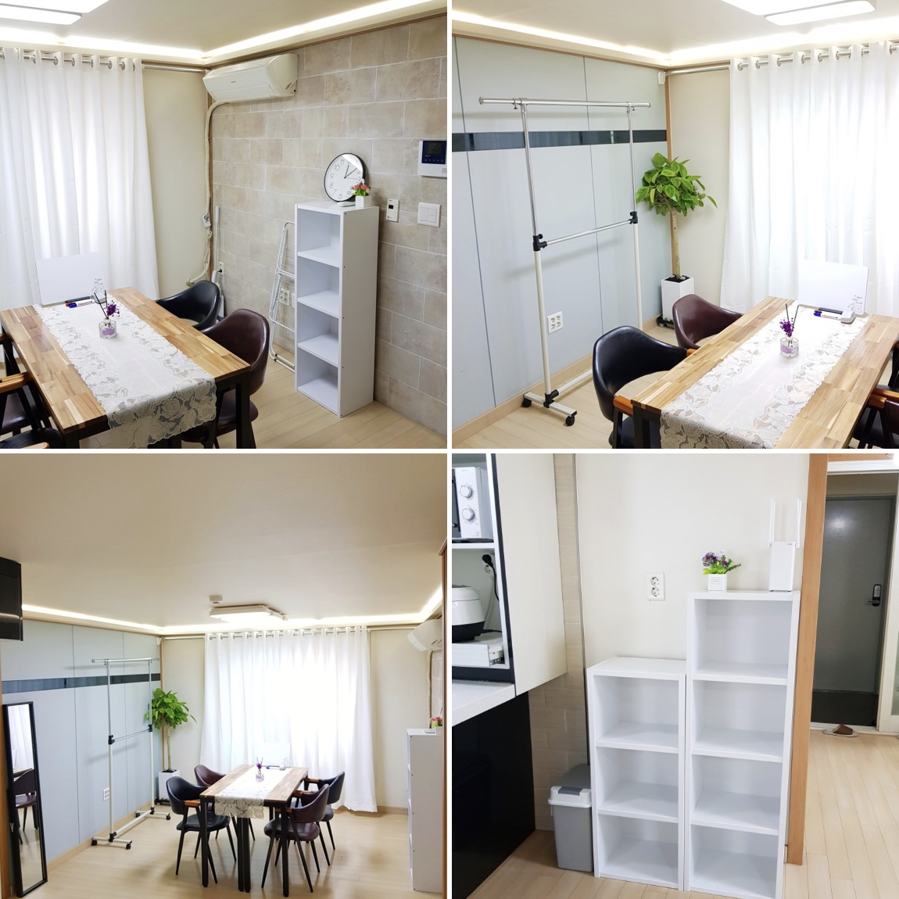
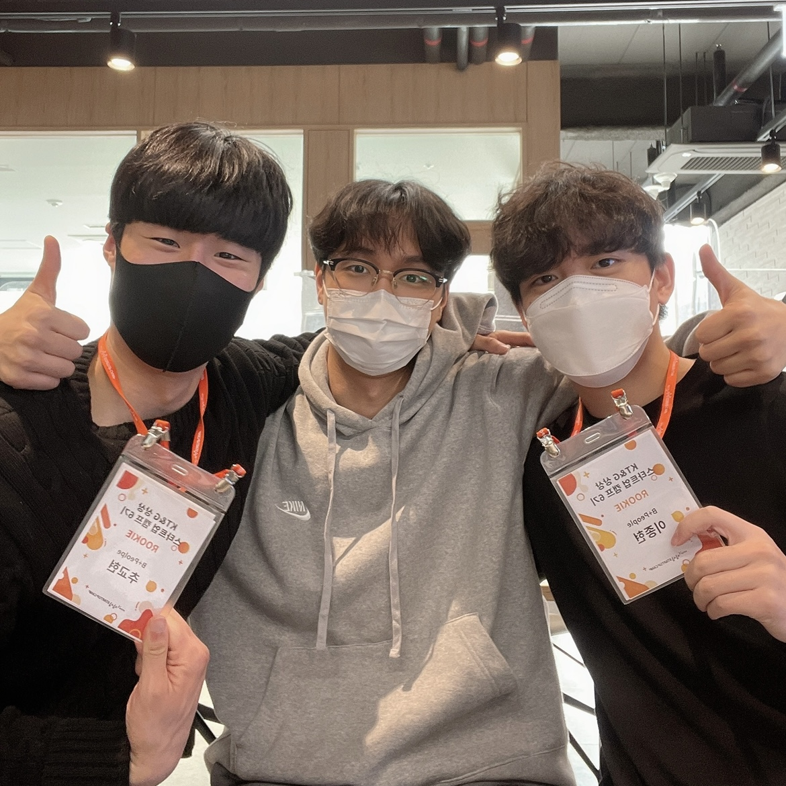
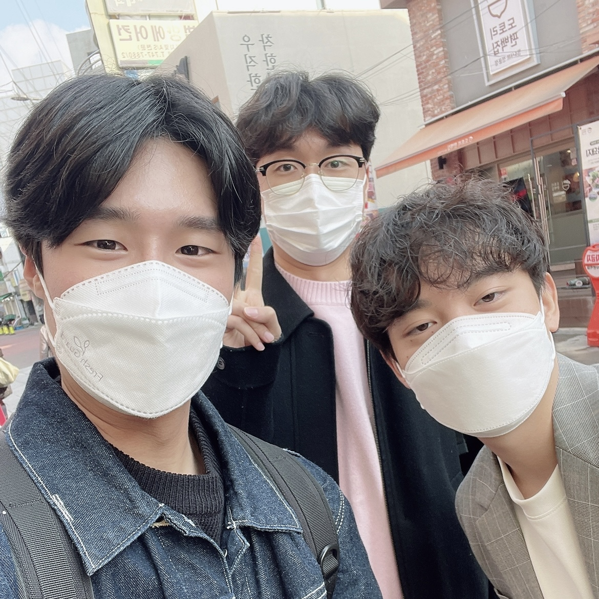
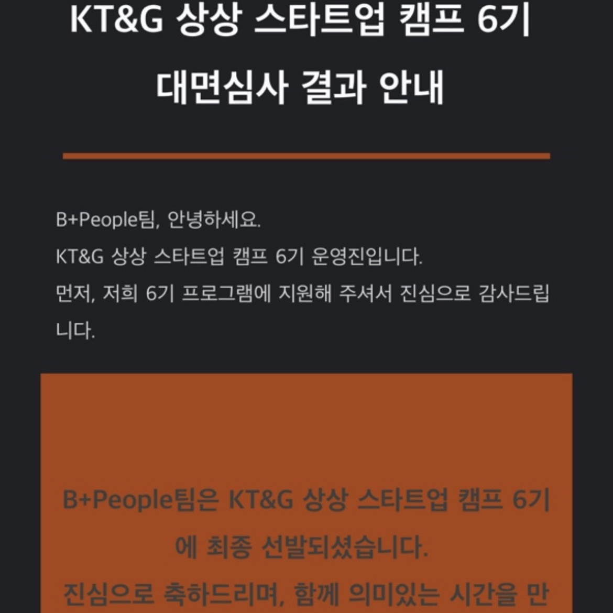

21년 03월에 전역하자마자 연말까지 개발 공부, 셰어하우스 사업, 창업 도전, 복학 등 쉴 새 없이 달려온 2021년이었습니다. 2021년에는 어떻게 보냈는지 회고를 하면서 2022년에는 어떤 핵심가치를 기준으로 살아갈지 짧게 정리해 보도록 하겠습니다.@

---

# Bye 2021

## 🪖 드디어 전역!

19년 10월 21일에 입대해서 원래는 21년 05월 08일이 실제 전역일이지만, 50일 정도 휴가를 영끌해서 조기 전역으로 21년 03월 22일에 사회로 드디어 나왔습니다!(감격...🥲)

시간이 빨리 갔으면 하는 마음에서 부대에서 제초병, 분대장, 취사 지원 등 정말 가리지 않고 열심히 군복무를 했는데... 시간이 느리게 간 것은 여전했네요😅

## 💻 개발 공부 시작

군대에서 개발자로 전향하고 블록체인 공부를 하자는 계획을 세우고 전역을 했습니다.

그래서 전역하자마자 군적금으로 모아뒀던 돈으로 맥북과 아이패드를 구매했고 바로 개발 공부를 시작했습니다.

거의 매일 중앙대 310관 1층 카페에 자리 잡아서 아이스아메리카노와 함께 하루종일 개발 공부하다가 집에 돌아오곤 했네요🙂

## 🪙 암호화폐 투자 시작

블록체인 공부를 본격적으로 시작하면서 자연스럽게 암호화폐 투자에 관심이 가게 되었습니다.

그래서 정말 소액이지만 조금씩 BTC와 ETH를 사서 모아가고 있습니다 :)

## 🏡 셰어하우스 사업 시작

21년 05월부터 수입 파이프라인을 하나 만들기 위해서 중앙대 중문 1분 거리에 여성전용 셰어하우스 사업을 시작했습니다.

사업을 시작하기 전에는 많이 두려웠는데, 현재까지 정말 많이 배웠고 많이 배우는 중입니다.

입주자분들께 퇴실하실 때, "매니저님 덕분에 잘 지냈습니다~"라는 마지막 인사를 받으면 정말 기분 좋고 뿌듯합니다...😊

> 궁금하신 분들은 [블로그](https://blog.naver.com/cnryguscnrygus/222350700228) 한 번 봐주세요!

## 🔥 창업 도전

### 프롭테크 스타트업 B+People 팀

직접 셰어하우스 사업을 운영하면서 느꼈던 Pain Point인 **"단기 임대를 원하는 대학생들은 많지만, 이를 위한 솔루션이 없어 어려움을 겪고 있다."** 를 직접 해결하고자 [대학생 전대차 계약 플랫폼, 대단(DEDAN)]을 창업했습니다.

대단(DEDAN) 서비스를 하기 위해서 대학 연합 창업 동아리 [SEIO](https://www.campuspick.com/club/view?id=14930)에서 알게 된 종현이형과 학교 후배이자 개발 선배인 정택이와 함께 **B+People** 이라는 팀을 결성했습니다.

### KT&G 상상 스타트업 캠프 6기 최종합격

21년 11월은 여러 창업 관련 지원 사업 지원서를 쓰면서 시간을 많이 사용했었습니다.

그중 [KT&G 상상 스타트업 캠프 6기](https://blog.naver.com/PostView.naver?blogId=ktngstartupcamp&logNo=222664717203&parentCategoryNo=&categoryNo=73&viewDate=&isShowPopularPosts=true&from=search)에 지원하였고 감사하게도 최종합격까지 되어서 약 3개월간 스타트업 인큐베이팅 프로그램에 참여합니다.

B+People 팀원분들과 열심히 참여해서 좋은 결과를 내보도록 하겠습니다!

---

# Hello 2022

## ⭐️ 22년 핵심가치

### 1. 몰입

21년에는 짧은 시간 내에 정말 많은 것들을 하게 된 한 해였습니다.

빠르고 과감한 추진력은 좋지만, 과한 실행력은 오히려 독이 될 수 있다는 것을 배웠습니다.

22년에는 선택과 집중을 통해 정말 제 인생에 도움이 되는 것들에 조금 더 몰입하려고 합니다.

### 2. 건강

젊을 때, 오히려 더 건강에 신경써야 나중에 후회하지 않는다고 합니다.

주 3-4회 이상 꾸준히 운동하고 건강한 음식 먹도록 신경쓰려고 합니다.

### 3. 성장

내실이 탄탄한 사람이 되고 싶습니다.

겉만 번지르르한 사람이 아닌 알맹이가 있는 실력 좋은 개발자가 되고 싶습니다.

이를 위해서 계속 성장하도록 노력하겠습니다🙂

## 📌 22년 투두리스트

#### 1. 주 4회 이상 헬스

#### 2. 지속가능한 루틴한 삶

#### 3. 블록체인 리서치

#### 4. 여러 분야의 독서

#### 5. 투자 및 관련 공부

---

"50대의 추교현이 20대의 추교현에게 감사할 수 있게끔 하루하루 최선을 다해 살고자 합니다."

**_The End._**
