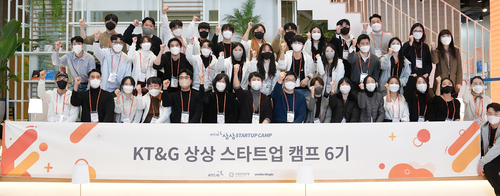
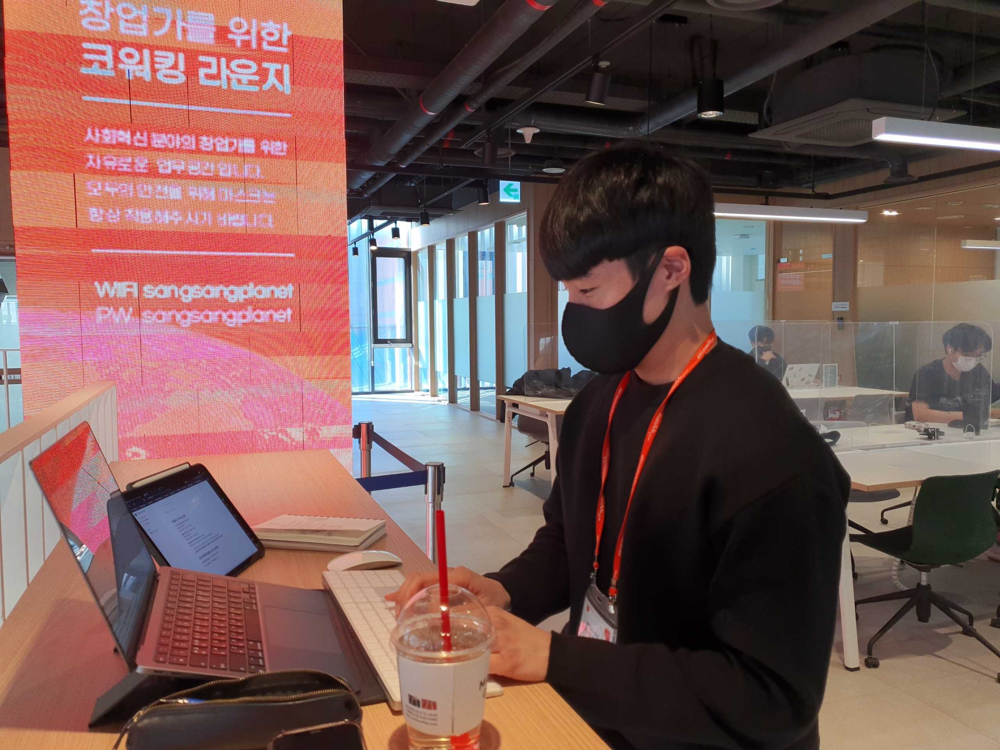
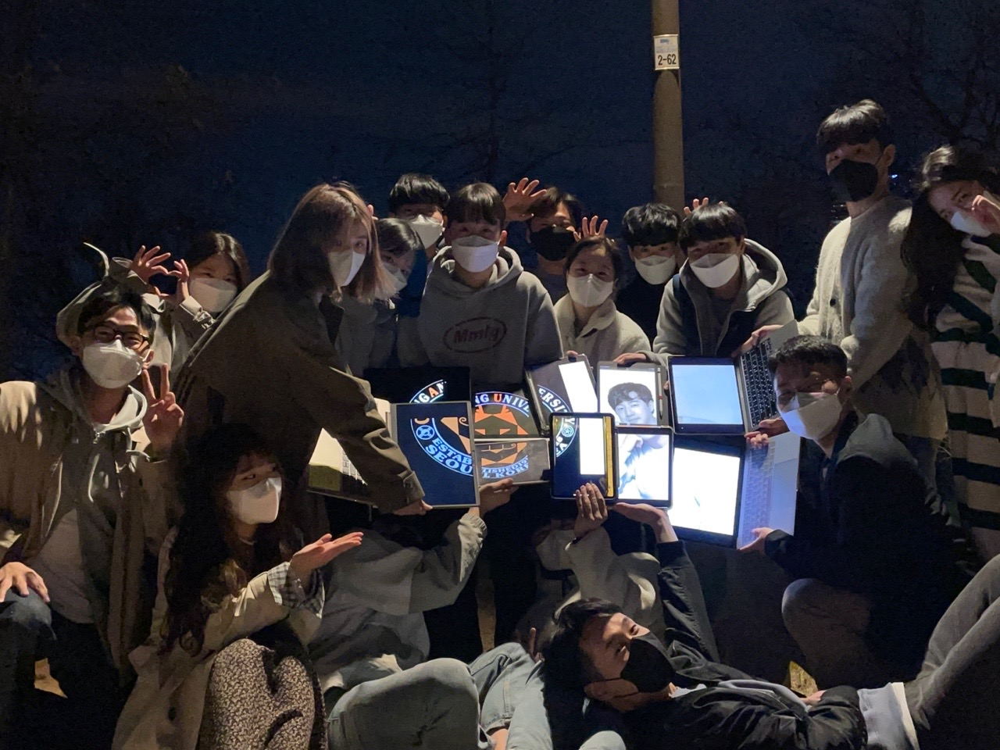
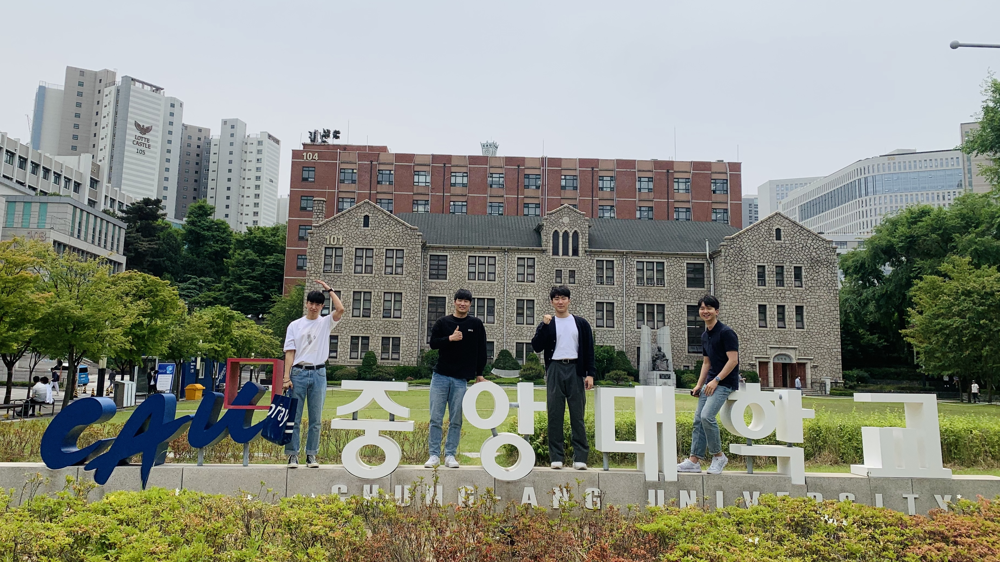
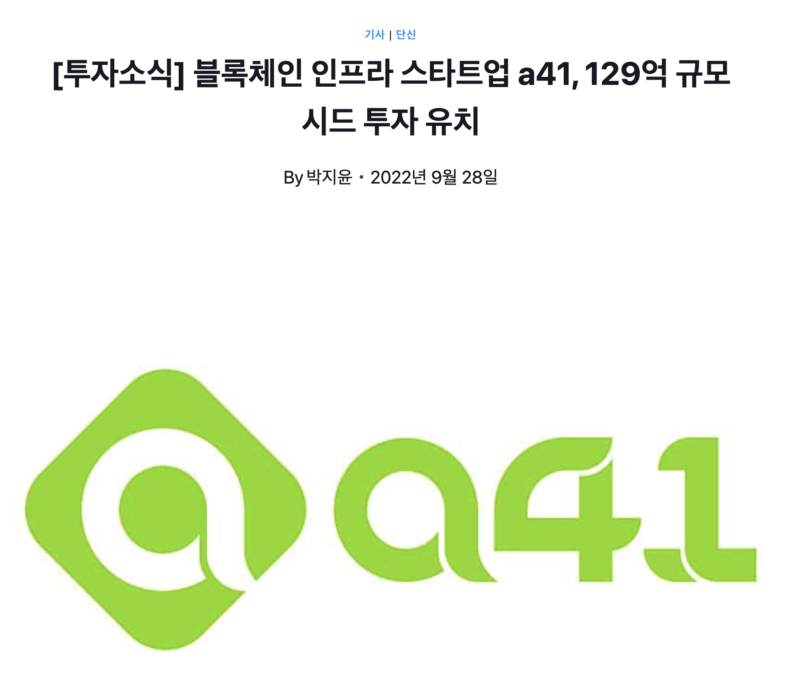
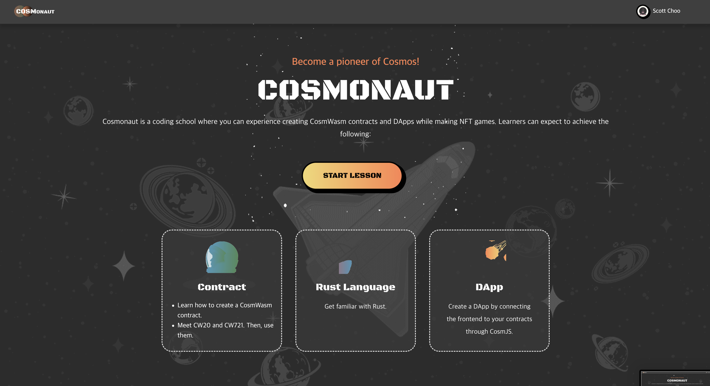
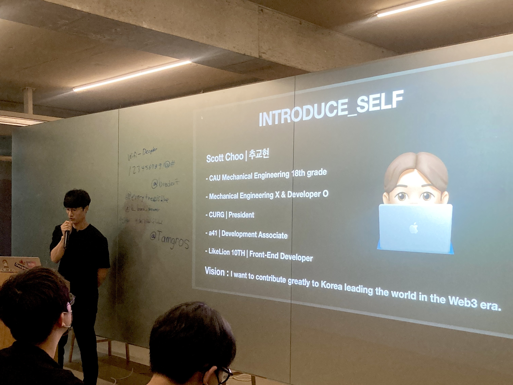
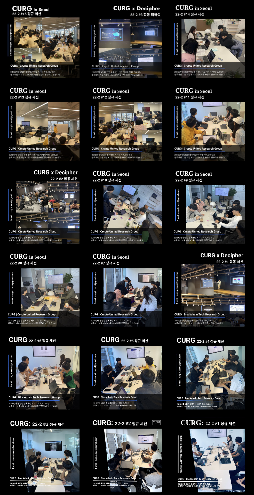
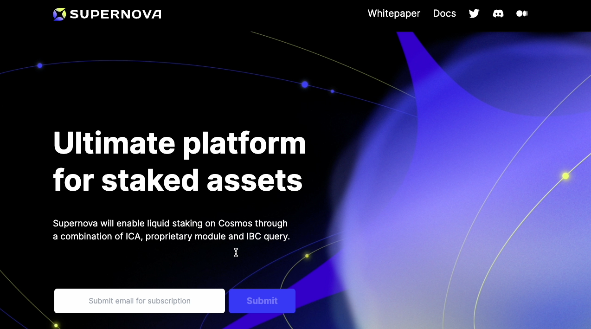
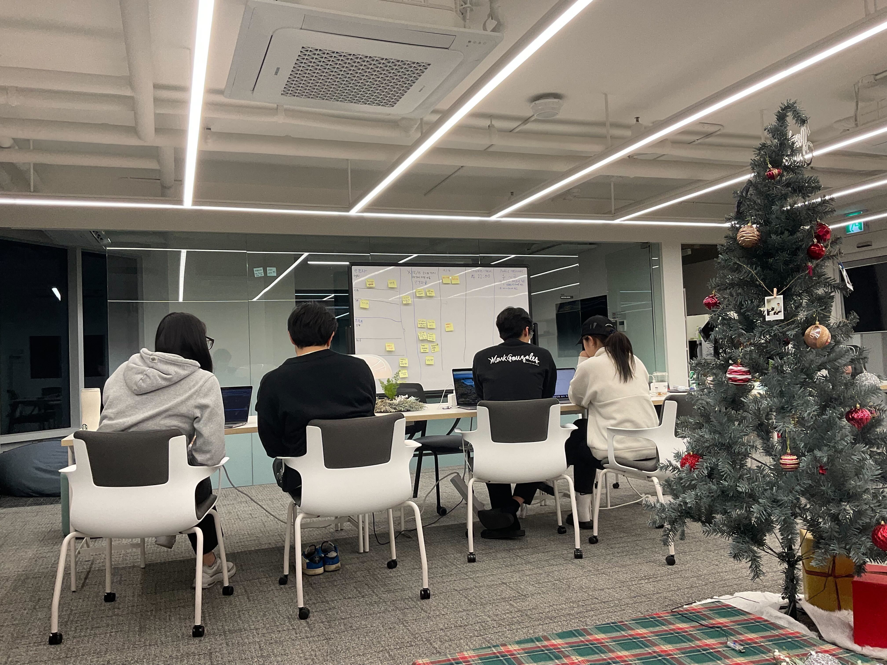

저에게 2022년은 **‘연합 블록체인 리서치 학회인 CURG의 학회장’** 과 **‘블록체인 인프라 스타트업인 A41 입사’** 라는 굵직한 커리어를 동시에 시작하게 된 영광스러운 한 해였습니다. 후회 없는 1년을 보냈던 것 같아서 정말 뿌듯합니다.

올해 저와 함께 지낸 모든 분들께 감사의 말씀 전하고 싶습니다. 감사합니다🙇‍♂️@

---

# Bye 2022

## 🎓 KT&G 상상스타트업 캠프 6기 수료 | 21.01 - 22.03



21년 03월에 전역 이후, 21년 06월부터 대학생 전용 [셰어하우스 사업](https://blog.naver.com/cnryguscnrygus/222350700228)을 시작했었습니다. 셰어하우스 사업을 하면서 알게 된 것은 대학생들의 단기 임대 수요가 정말 많지만 에브리타임에서 익명으로 부동산 거래가 이루어지고 있다는 것이었습니다.

그래서 **대단(DEDAN) | 대학생 전대차 계약 플랫폼**이 필요하다고 느꼈고 이 아이디어로 팀 빌딩을 진행했으며 21년 12월 초부터 22년 03월 초까지 KT&G에서 진행하는 상상 스타트업 캠프 6기에 최종 합격하여 약 3개월 동안 창업 인큐베이팅 프로그램에 참여했습니다.



약 3개월 동안 **상스캠 6기를 참여하면서 배운 6가지**입니다.

```markdown
1. 내가 하고 싶은 것들을 모두 다 할 수는 없다. 선택과 집중이 정말 중요하며 필요하다.
2. 포기하지 말자는 말은 지치지 말자는 말과 같다. 지치지 않아야 포기할 생각이 들지 않는다.
3. 직접 해보지 않고선 절대 모른다. 실행하면서 아이디어가 점점 명확해진다.
4. 피봇을 얼마나 빠르고 크게 흔들림 없이 하는 것이 정말 중요하다.
5. 리더가 팀 전체에 비전과 목표를 계속해서 상기시켜줘야 한다.
6. 거창한 것을 처음부터 하겠다는 것 자체가 어불성설이다. 작은 것부터 하나씩 해나가자.
```

저희 B+People 팀은 아직 대학생들이고 경험도 많이 없으며 개개인의 역량이 부족하다고 느껴 우선 각자의 성장에 집중하고자 상스캠 6기 수료 이후 창업을 멈추게 되었습니다.

그래도 팀원들과는 최근까지 계속해서 연락하며 각자 얼마나 성장하고 있는지 서로 체크해 주는 좋은 관계를 유지하고 있습니다😊

## 🦁 중앙대 멋쟁이사자처럼 10기 | 22.03 - 22.08



제 메인 무기가 될 프론트엔드 개발 역량을 기르기 위해 22년 03월에 **중앙대학교 멋쟁이사자처럼 10기**에 지원을 했었습니다.

감사하게도 멋사 10기에 최종합격하여 상스캠 6기를 수료하자마자 바로 멋사 활동을 시작하게 되었습니다.

멋사를 통해 프론트엔드 개발 역량에 대한 기반을 닦을 수 있었고 열정 넘치고 좋은 분들과 많은 얘기 나눌 수 있는 기회를 갖게 되었습니다.



원래는 1년 동안 활동해야 정식으로 수료를 하지만, 제가 5월부터 A41에 입사하게 되면서 리소스 부족으로 멋사는 1학기까지만 진행하고 끝까지 마무리하지는 못했습니다🥲

하지만, 1학기 동안 멋사를 통해 만났던 좋은 사람들과는 계속해서 감사하게도 인연을 이어나고 있습니다.

## 💼 시드 150억 투자받은 A41 입사 | 22.06 - 23.07



22년 1학기를 휴학한 이유는 멋사 활동을 하며 프론트엔드 개발 공부에 집중하기 위함이었습니다. 그런데 저에게 블록체인 인프라 회사인 A41에서 **프론트엔드 개발자 정규직 풀타임** 이라는 엄청난 기회를 제안해 주셨습니다.

절대 아무에게나 오지 않는 기회라고 생각했고 이 기회를 잘 살리고자 하루하루 최선을 다하고 있습니다.

실제로 혼자서(혹은 대학생들과) 사이드 프로젝트하며 개발하는 것보다 회사에서 직접 프로덕트를 개발하는 것이 질적인 측면에서 실력이 엄청나게 향상되는 것을 느낄 수 있었습니다.

Web3 시장에서 이 정도의 맨파워를 가진 회사가 또 있을까 하는 생각이 듭니다. A41과 함께 Web3 생태계 발전에 확실히 기여하도록 하겠습니다🙌🏼

## 👨🏼‍🚀 CosmWasm 교육 플랫폼, Cosmonaut 프로젝트 | 22.05 - 22.11



연합 블록체인 리서치 학회인 CURG는 작게 팀을 이루어 자주 해커톤, 해커하우스 등에 나가서 그랜트를 받거나 상을 수상하는 이력이 정말 많습니다.

마침 CosmWasm을 개발한 [Confio](https://confio.gmbh/) 측에서 CosmWasm 생태계 확장을 위해 CosmWasm을 보다 쉽고 재밌게 배울 수 있는 개발 교육 플랫폼을 만들자는 연락이 [D3LAB](http://d3lab.xyz)(CURG 내부에서 만든 DAO)로 왔습니다.

그래서 CURG 내에서 이 프로젝트를 진행할 팀을 구성하게 되었는데 저는 프론트엔드 개발자로 참여하게 되었습니다.

22년 05월 당시 TypeScript도 Recoil도 Next.js도 React Query도 몰랐던 제가 첫 개발 프로젝트로 이렇게 큰 규모의 프로젝트를 맡게 되어서 사실 엄청 애를 많이 먹었습니다. 어떻게 코드를 짜야 나중에 고생하지 않는지도 몰랐고 정해진 데드라인에 맞춰서 어떠한 결과물을 낸다는 것이 이렇게 힘들 줄 몰랐습니다.

다행히 22년 09월쯤, 제 첫 Web3 관련 프로젝트인 Cosmonaut가 개발이 마무리되어 현재 서비스 운영 중에 있습니다.

👇🏼 궁금하신 분들은 아래 링크를 참고해 주세요.

> [COSMONAUT - CosmWasm Coding Academy](https://cosmonaut.cosmwasm.com/)

## 🏛️ 연합 블록체인 리서치 학회 CURG 학회장 | 22.06 - 23.05



21년 12월 초에 처음 CURG에 입회를 했습니다.

학회 초반에 학회원들이 얘기하는 블록체인 관련 내용을 1도 이해하지 못했던 기억이 생각나네요… 그래도 학회에 꾸준히 출석하고 열심히 참여한다면 계속해서 배울 것이 있겠다는 확신이 있었습니다. 그래서 매주 성실히 학회에 출석하고 열심히 블록체인 관련 글을 적었습니다.

22년 02월쯤 감사하게도 전학회장님께서 저에게 다음 학회장 자리를 제안해 주셨습니다. 저는 제 실력에 비해 굉장히 큰 자리라고 생각했지만, 한편으로는 정말 말도 안 되게 좋은 기회라고 생각했습니다.

그래서 02월부터 학회장 인수인계를 받았고 06월부터 CURG 학회장으로서 학회를 이끌게 되었습니다.

CURG가 Web3 생태계에서 어느 정도의 위치에 있는지 잘 알고 있던 저로서는 사실 학회장의 자리가 무겁다 못해 버겁지 않을까 라는 생각이 들었습니다.

하지만 저에게는 누구보다 이 학회의 발전으로 Web3 생태계 활성화에 기여하겠다는 목표가 있어서 정말 최선을 다해 학회의 발전과 운영에 노력하고 있습니다.



저희 커그는 매주 토요일 11시에 모여 블록체인 리서치 및 프로젝트를 진행하고 있고 국내 최대 블록체인 학회인 디사이퍼와 합동 세션도 5주마다 진행하고 있습니다.

👇🏼 학회 관련해서 궁금하신 분들은 아래 링크 참고해 주세요!

> http://curg.xyz

## ⭐️ Liquid Staking Protocol, Supernova 프로젝트 | 22.06 - 23.02



A41 회사에서 스테이킹 유동화 서비스인 Supernova 프로젝트를 진행하고 있었고 저는 이 프로젝트 팀의 프론트엔드 개발자로 참여했었습니다. 약 8개월 동안 Supernova를 빌딩 하면서 제 프론트엔드 개발 실력은 많이 증가하게 되었고 이는 좋은 팀원들, 좋은 프로덕트가 있었기에 가능했던 일인 것 같아 정말 감사하게 생각하고 있습니다.



테스트넷 런칭을 위해 몇 주간 야근하고 자주 밤을 새웠던 기억이 벌써 추억이 되어버렸네요. 평생 잊지 못할 순간들이었습니다⭐️

하나의 목표를 위해 팀원들이 열심히 달려가는 그 모습들이 저에겐 강렬하게 뇌리 속에 남아 제 동기부여의 원천이 되었습니다.

+) 비록 여러 가지 이유로 Supernova 프로젝트는 23년 02월에 중단하게 되어 팀이 해체되었지만, Supernova를 빌딩 하는 과정 속에서 얻은 것들이 정말 많고 소중하기에 후회가 전혀 남지 않는 것 같습니다🙂

# Hello 2023

## ✔️ 단계별 인생

제 인생을 크게 나누어 본다면, 아래와 같습니다.

1. **- 21.03 | 앞으로의 인생에 필요한 기초 지식을 쌓아갔던 시기**

   → 군대에서 읽었던 수많은 책들이 제가 지금 있는 곳으로 올 수 있게끔 도와줬던 것 같습니다.

2. **21.03 - 22.05 | 내가 무엇을 잘하고 어떤 것을 할지 찾아가는 시기**

   → 창업, 셰어하우스 사업, 개발, 과외, 알바 등등 최대한 많은 경험을 하면서 저에게 어떤 것이 잘 맞고 어떤 것이 맞지 않은지 찾아가는 시기였습니다.

3. **22.05 - | 제 삶의 큰 방향을 찾았고 그 방향으로 열심히 달려가는 시기**

   → Web3 프론트엔드 개발자로서 제 첫 커리어를 시작하게 되었습니다. 적어도 몇 년간 제 역량을 계속해서 쌓아가는데 모든 리소스를 쏟고 싶습니다.

22년은 그래서 최대한 많은 경험들을 하면서 배운 것들을 토대로 삶의 큰 방향을 찾아가는 시기였고 23년은 그 방향에 맞춰서 저의 가치를 최대치로 끌어올리는 시기라고 생각이 듭니다.

## ✔️ 지킬 것들

다시 한번 더 **건강**이 중요하다는 것을 깨닫게 되었습니다. 따라서 아래 3가지를 무슨 일이 있어도 지키고자 합니다.

1. 소주를 절대 마시지 않는다.
2. 적어도 주 3회는 운동을 한다.
3. 여유 있게 아침에 일어나서 식사를 하고 영양제를 먹는다.

## ✔️ 23년 목표

더욱 제 내실을 다지고 역량을 끌어올리는데 많은 시간을 사용하고자 합니다.

**“Simple is Best”** 절대 많은 것을 하고자 거창하게 계획하는 것보다는 정말 중요한 것 몇 가지에만 집중하는 것이 저에게 가장 필요하고 꼭 지켜야 할 것이라고 생각이 듭니다.

긴 글 읽어주셔서 감사드리고 항상 건강하세요🙇‍♂️ 그리고 2023년 새해 복 많이 받으세요🎉

---

"50대의 추교현이 20대의 추교현에게 감사할 수 있게끔 하루하루 최선을 다해 살고자 합니다."

**_The End._**
