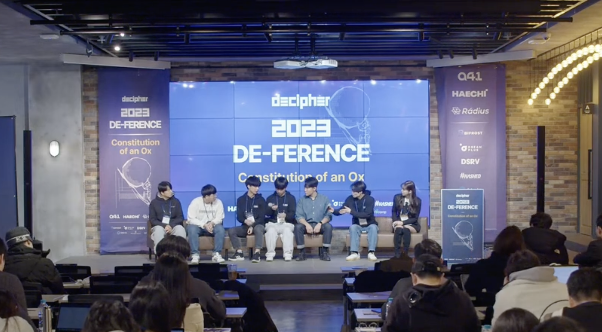
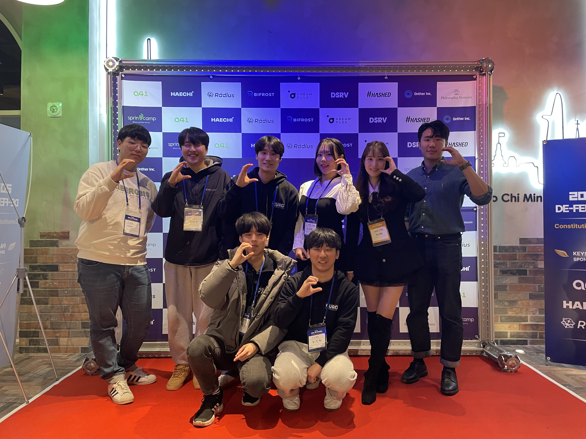
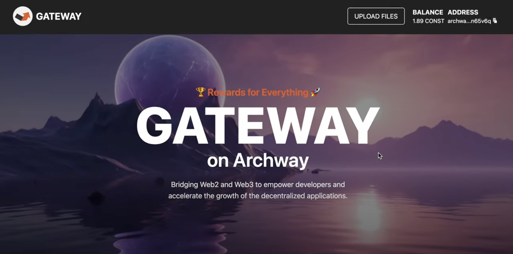
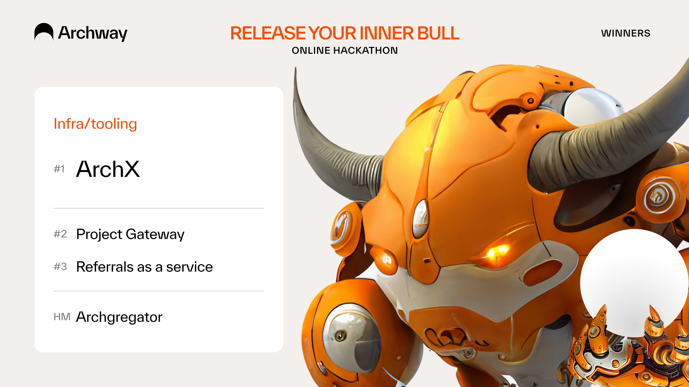
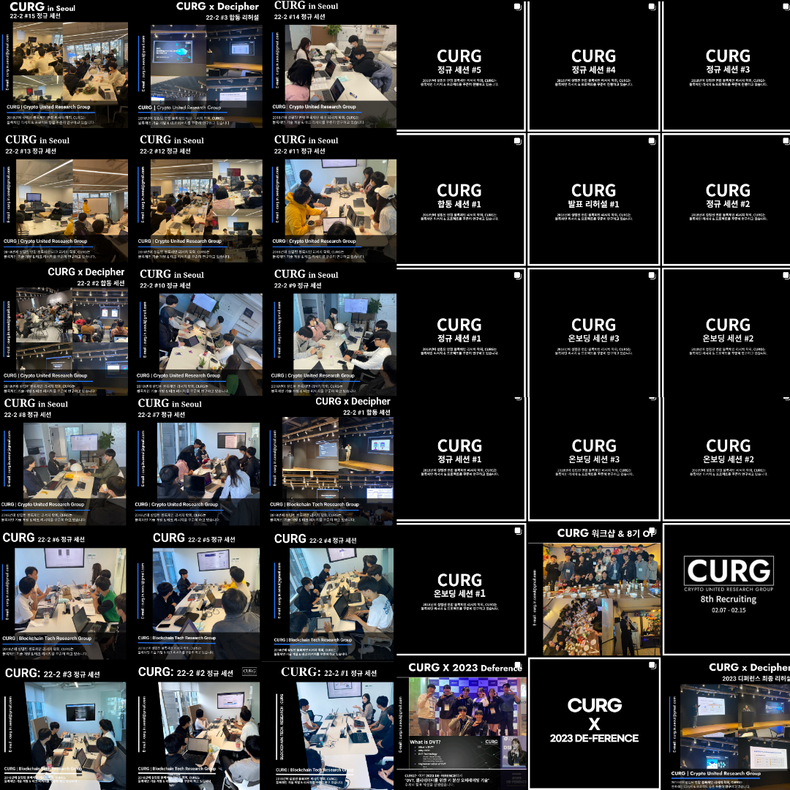
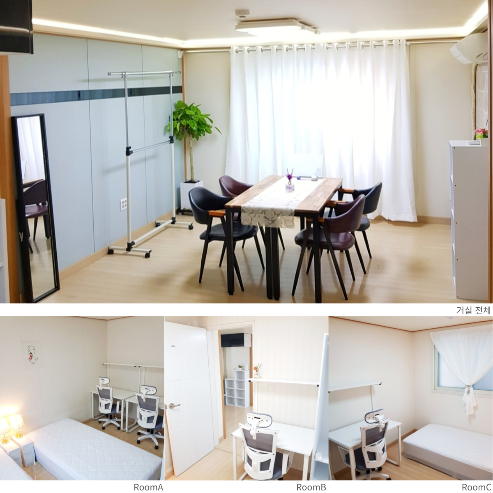
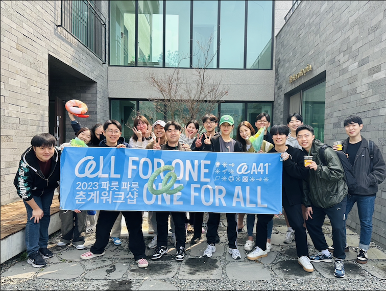
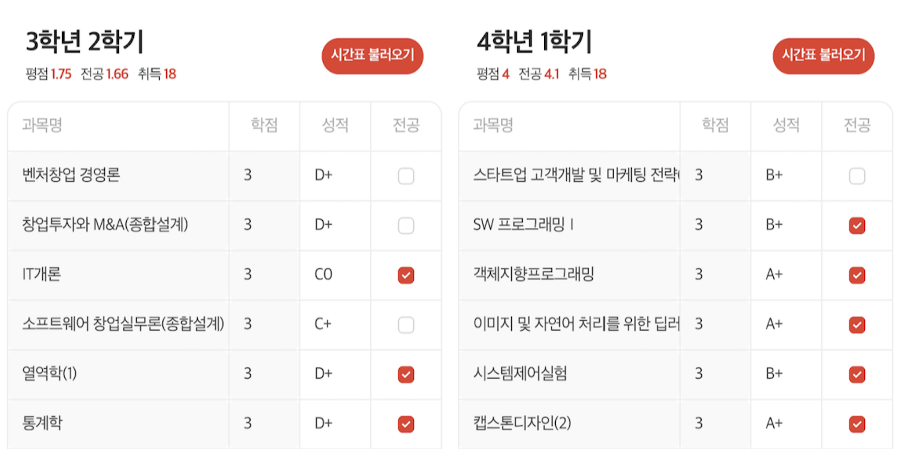
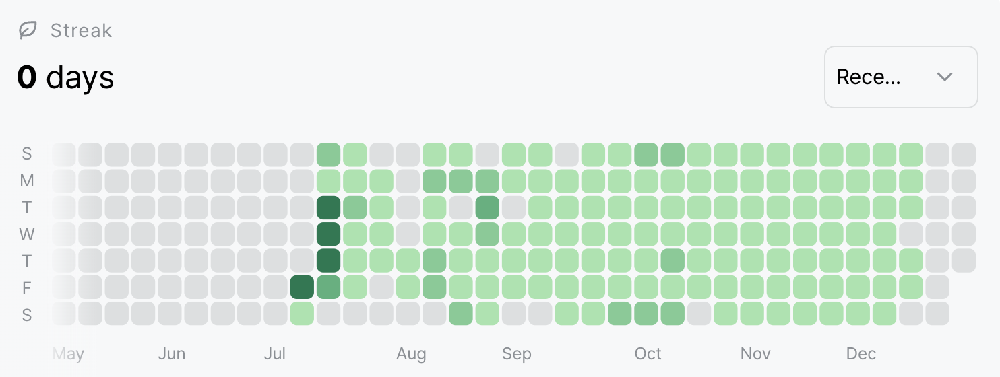
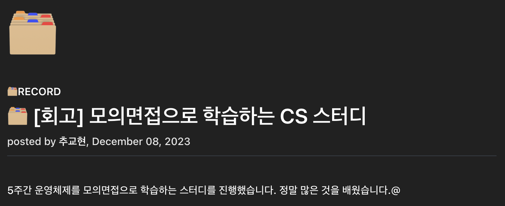

디퍼런스 참여, 블록체인 해커톤 수상, 학회장 자리 물려주기, 셰어하우스 사업 2년 후기, 스타트업 퇴사, 4학년 1학기 그리고 본격적인 취업 준비 시작.@

---

# BYE 2023

[**2021년 회고**](https://scottxchoo.xyz/hello-2022/), [**2022년 회고**](https://scottxchoo.xyz/hello-2023/)에 이어 벌써 **2023년 회고**입니다. 올해 함께 지냈던 분들 덕분에 2023년을 잘 마무리할 수 있었습니다. 정말 감사드립니다😊

저에게 2023년은 **선택과 집중**을 할 수 있었던 한 해였습니다. 올해 어떤 것을 했었는지 시간 순서대로 회고해 보도록 하겠습니다.

## [23.02] DE-FERENCE 🏛️

올해 초 국내 최고 블록체인 학회인 [디사이퍼](https://decipher.ac/)의 연례 행사 디퍼런스에서 CURG가 발표했습니다. 저희 학회가 공개적으로 발표했던 적이 처음이었는데, 학회장으로서 그리고 발표를 준비한 사람으로서 감회가 새로웠고 영광이었습니다.

### “DVT, 밸리데이터를 위한 키 분산 오퍼레이팅“ 발표

> 출처 : [유튜브 디사이퍼](https://www.youtube.com/live/QAUk4662G5M?si=zoB7fQP7SRCZSeDx&t=7110)

저희 CURG는 이번 디퍼런스에서 "**DVT, 밸리데이터를 위한 키 분산 오퍼레이팅**"을 주제로 [발표](https://www.youtube.com/live/QAUk4662G5M?si=zoB7fQP7SRCZSeDx&t=7110)했습니다.

저는 프로젝트 매니징과 기술적인 부분 검토 그리고 PPT 초안을 만들었습니다. 서현님은 PPT 검토 및 발표를 민혁님과 정훈님은 디테일한 기술적인 내용을 꼼꼼하게 추가 및 보완해 주셨습니다.

팀원들의 역할 분배가 정말 잘 되어서 디퍼런스 발표를 잘 마무리했고 덕분에 학회의 위상을 높일 수 있었습니다.

### 크립토 윈터에서 버틴 CURG 7기

> CURG 7기 학회원 전원 at 2023 디퍼런스

CURG 7기분들께서 적극적으로 학회 활동을 해주셔서 CURG가 크립토 윈터에서 버틸 수 있었고 그래서 지금 유능하고 열정 있는 CURG 8기 & 9기분들을 모실 수 있었습니다. **7기분들께 정말 감사하다는 말씀** 꼭 전하고 싶습니다 (Thanks to 서현, 창우, 민혁, 정훈, 은지, 민재, 태영 🙇🏻‍♂️).

## [23.03-04] Archway 해커톤 🚪

> Archway 메인넷 출시 기념 해커톤 | 출처 : Dorahacks

Archway 프로토콜 개발사 파이랩스(Phi Labs)는 [COSMonaut 프로젝트](https://cosmonaut.cosmwasm.com/)를 인상 깊게 봐주셔서 해당 프로젝트 리더인 상현님께 Archway 해커톤 참여를 제안했습니다. COSMonaut 프로젝트의 프론트엔드 개발을 담당했던 저에게 상현님께서 같이 참여하자고 제안하여 해커톤에 참가하게 되었습니다.

### Project Gateway

> Archway 해커톤 출품작 ‘GATEWAY’ | 출처 : 유튜브 D3LAB

저희 팀이 Archway 해커톤에서 출품했던 "**Project Gateway**"는 코스모스 블록체인 생태계에서 dApp 개발자들에게 보상을 제공하는 Archway 프로토콜의 특징을 살려 Web2의 액션들을 Web3의 인센티브 메커니즘과 연결하는 솔루션입니다.

저희 Project Gateway에 대해서 궁금하신 분은 [유튜브 영상](https://youtu.be/RKFvcTzRr3Y?si=Ql-0F1BUKsxzUgw4)을 참고하시면 좋을 것 같습니다.

### 해커톤 수상과 다짐

> Archway 해커톤 Infra/tooling 수상팀 트윗 | 출처 : Archway 공식 X

감사하게도 저희 “Project Gateway”가 Infra/tooling 분야에서 2등을 했습니다🎉

앞으로도 꾸준히 개발자 생태계 활성화를 위한 프로젝트 참여와 해커톤 참가를 통해 **적극적으로 생태계에 기여하는 소프트웨어 엔지니어**가 되고 싶습니다.

## [23.05] CURG 학회장을 물려주며 🎓

> 매주 토요일마다 업로드했던 CURG 인스타 피드들 | 출처 : @curg_in_seoul

21년 12월 CURG에 첫 세션에 참석했던 제가 22년 6월부터 학회장이 되었습니다. 그리고 약 60주 넘는 시간 동안 학회를 운영했고 23년 5월에 학회장 자리를 물려주게 되었습니다.

학회장을 하면서 학회원들의 적극적인 참여를 장려하고자 **직접 팀 활동에 참여**했고([ETH SEOUL 2023 해커톤 참가](https://scottxchoo.xyz/23-0607-recap/#2-eth-seoul-2023-%ED%95%B4%EC%BB%A4%ED%86%A4-%EC%B0%B8%EA%B0%80) 등) **새로운 학회 회칙과 리쿠르팅 시스템을 구축**했으며 **여러 블록체인 학회와의 협업**([디사이퍼](https://decipher.ac/)와의 합동 세션 등)을 확대했습니다.

CURG 학회장이라는 영광스러운 자리를 물려주셨던 전 학회장이신 상현님께 믿고 맡겨줘서 감사하다는 말씀 전하고 싶습니다. 앞으로도 저는 **CURG가 Web3에서 더욱 대체 불가능한 블록체인 학회**로 만드는데 뒤에서 열심히 서포트하고 싶습니다.

## [23.06] 셰어하우스 사업 2년 후기 🏡

> 셰어하우스 여러 사진들

만 22살에 시작했던 [대학생 셰어하우스](https://blog.naver.com/cnryguscnrygus/222569853055) 사업한지 벌써 2년이 지났습니다.

### 시작한 계기

군복무를 하면서(19.10-21.03) 많은 고민 끝에 기계공학도가 아닌 개발자가 되겠다고 다짐했습니다. 그리고 돈을 버는 시스템을 작게 구축하여 **최대한 많은 시간을 개발 공부하는 데 사용**하고 싶었습니다. 그래서 **21년 3월에 전역하자마자 대학생 셰어하우스 사업(21.06 - ing)을 시작**했습니다.

아무것도 모르는 상태에서 어찌 보면 무모하게 시작했던 사업인데, 지금 꽤 안정적으로 운영하는 것을 보면 뿌듯합니다.

공실률 0%를 지금까지 유지할 수 있도록 도와주신 저희 하우스에서 지내셨던 모든 입주자분들께 진심으로 감사드립니다.

### 교훈 3가지

2년 동안 이 사업을 하면서 배운 것이 정말 많습니다. 배운 것들 중 가장 의미있는 3가지는 다음과 같습니다.

**[1] 세상에 공짜는 없다**

사업을 본격적으로 시작하기 전에는 사실 셰어하우스 사업을 큰 노력 없이 돈을 벌 수 있는 쉬운 사업 구조라고 생각했습니다.

하지만, 막상 사업을 시작해 보니 역시 "**세상에는 정말 쉬운 것 하나 없구나**"를 알게 되었습니다. 그리고 대가 없는 보상은 절대 없으며 어떤 식으로든 비용이 지불된다는 것을 배웠습니다.

**[2] 두려움을 극복한 실행력의 중요성**

사업을 시작했던 시기(21.06)는 코로나 시국이어서 대학교 수업 대부분이 비대면으로 전환했습니다. 그래서 공실 걱정으로 셰어하우스 사업 시작을 망설였습니다. 부동산 계약하기 전날에 계약을 할지 말지 새벽까지 엄청 고민했던 기억이 납니다.

그때 제가 읽었던 책에서 "**부자와 빈자의 결정적인 차이를 만드는 것은 실패할 두려움을 극복한 실행력에서 나온다**"라는 구절이 떠올랐습니다. 그날 순간의 선택이 제가 부자가 될지 결정하는 갈림길에 서 있었다고 생각이 들었습니다. 그래서 부자가 되겠다는 결심과 함께 더욱 용기를 갖고 셰어하우스 사업을 시작했습니다.

**[3] 사업 경험과 좋은 인연들**

현금 흐름을 매달 창출하는 사업 경험은 그 자체로 정말 많은 것을 배울 수 있었습니다. 소비자가 아닌 생산자의 관점으로 세상을 바라보게 되었습니다.

제 사업 경험을 높이 평가해 주신 많은 분들과 지금까지 좋은 인연을 유지하고 있고 그분들과의 인연이 제가 사업을 하면서 얻은 것들 중 가장 소중한 보상이지 않나 라는 생각이 들었습니다.

### 다짐

제가 이 사업을 시작하며 세운 비전인 "**더 많은 대학생이 좋은 주거 환경에서 생활하게끔 기여하자**"를 절대 잊지 않고 입주자분들께서 편하게 지내도록 열심히 노력하겠습니다.

## [23.07] 블록체인 스타트업 A41 퇴사 🙇🏻‍♂️

> 2023 워크샵 단체 사진

대학교 2학년이었던 작년 5월에 블록체인 스타트업 A41에서 프론트엔드 개발자로 풀타임 근무를 하게 되었습니다. 그리고 두 학기(22.09 - 23.06)를 회사와 학교를 병행했는데, 졸업까지 꽤 많은 학점이 남아서 학업에 집중하고자 올해 7월에 퇴사했습니다.

약 1년 3개월 동안 근무하면서 프론트엔드 개발 실력이 많이 늘었습니다. 프론트엔드 기술 스택으로 React는 물론이고 Next.js, Recoil, React Query 그리고 TypeScript까지 사용할 수 있게 되었습니다. 또한, 협업을 위한 GitHub를 능숙히 다룰 수 있게 되었으며 커스텀 훅 개발과 블록체인 트랜잭션 및 쿼리 로직 작성이 가능해졌습니다.

회사 생활을 하면서 뵈었던 많은 분들 덕분에 제가 많이 성장할 수 있었습니다. 저 또한 그분들처럼 **선한 영향력을 줄 수 있는 위치에 가서 많은 분들께 좋은 영향력을 줄 수 있는 사람이 되도록 하겠습니다**. 감사했습니다.

## [23.09-23.12] 4학년 1학기 🗂️

### 4학년 1학기 끝

> 회사와 병행 : 1.75 vs 퇴사 후 : 4.0

이번 학기(9월부터 12월)에는 딥러닝, 운영체제, 객체지향, C/C++ 프로그래밍 언어, 자료구조/알고리즘, 시스템 제어, MATLAB 등을 배웠습니다.

또한, 지식뿐만 아니라 효율적인 시간 관리법, 원활한 커뮤니케이션 능력, 깔끔한 PPT 제작 방법 등 기본기에 해당하는 것들도 배웠습니다.

대학 생활이 유한하다는 것을 알기에 4학년이지만, **새내기처럼 열정적으로 이번 학기를 보냈습니다**. 한 학기 동안 지도해 주신 교수님들께 진심으로 감사드립니다.

### 알고리즘 문제 매일 풀기

> 7월부터 11월까지 거의 매일 최소 한 문제를 품 | 잔디

낯선 알고리즘 문제에 익숙해지고 전체적으로 어떤 문제 유형이 있는지 파악하기 위해서 7월부터 11월까지 거의 매일 백준 알고리즘 문제를 풀었습니다.

백준 문제를 풀면 잔디가 심어지는데, 문제 풀 시간이 부족한 날에는 이 잔디를 끊김 없이 매일 심고 싶어서 영양가 없는 브론즈 문제를 풀었습니다.

제가 생각한 코딩 테스트의 본질은 **한 문제를 풀더라도 실제 코딩 테스트를 보는 것처럼 충분한 시간을 사용하여 풀고 그 문제에 대한 여러 풀이들을 보면서 다각도로 문제를 이해하는 것**입니다.

하지만, 잔디 심는 것 때문에 브론즈 문제를 푸는 것은 제가 목표하는 바에 전혀 도움이 되지 않는다는 것을 알게 되었고 **본질에서 벗어난 행동임을 깨달았습니다**.

### 5주간 운영체제 모의면접 스터디

> 출처 : [회고 글](https://scottxchoo.xyz/rvw-cs-study-os/)

11월부터 12월까지 5주 동안 운영체제를 모의면접 방식으로 학습하는 스터디를 진행했습니다. 이 스터디 하나로 CS 공부, 면접 준비, 블로그 포스팅, 개발자 커뮤니티 참여 등 **취업 준비에 필요한 것들을 한 번에 얻을 수 있었습니다**.

이번 스터디를 통해서 운영체제의 시분할 시스템, 시스템 콜, 프로세스와 쓰레드, 컨텍스트 스위칭, CPU 스케줄링, 세마포어, 데드락, 외부/내부 단편화, 페이징, 페이지 교체 알고리즘 등을 배웠습니다.

제가 이번 스터디를 신청하기 전에 다짐했던 것은 "**단 한 번도 스터디에 불참하지 말자**"였습니다.

하지만, 비대면으로 운영되기에 점점 저조해지는 참여율을 보며 ‘나도 딱 하루만 쉴까’라는 생각이 들었습니다. 그래도 이왕 시작한 것 끝까지 해내겠다는 마음가짐으로 꾸준히 참여했습니다.

마지막 스터디까지 완주한 끝에 저는 "**시작을 했으면 끝을 보자**"라는 교훈을 배웠습니다. 이 스터디를 운영해 주신 [JSCODE 재성](https://www.youtube.com/@jscode-official)님께 감사하다는 말씀드리고 싶습니다.

# HELLO 2024

> 달리(DALL-E) 3 | Prompt by 추교현

21년부터 23년까지 정말 많은 것들을 하면서 제 시야를 넓히고 탐색하는 과정을 가졌습니다. 24년부터는 **본질에 가까운 것 위주로 선택과 집중**하여 **일신우일신(日新又日新) 자세**로 하루하루 조금씩 성장할 것입니다.

### 24년 목표

2024년 단 하나의 목표는 네이버, 토스, 카카오, 삼성전자 등과 같이 **거대한 조직 시스템을 경험할 수 있고 체계적인 개발 문화를 배울 수 있는 곳으로 소프트웨어 엔지니어로서 취업하는 것**입니다. 당연히 쉽지 않을 것이고 그렇기에 이 도전은 더욱더 값질 것 같습니다.

### 24년 계획

**1. 소프트웨어 마에스트로 15기 도전 :** 개발자 커리어와 좋은 인적 네트워크를 얻을 수 있는 소마 15기에 도전할 것입니다.

**2. 세상에 필요한 서비스 1년 넘게 운영 :** 세상에 필요한 서비스를 만들고 이를 1년 넘게 운영하면서 배운 내용을 잘 녹여 취업 준비에 활용하고자 합니다.

**3. 정보처리기사 & SQLD 자격증 취득 :** 비전공자인 제가 전공자만큼은 아니더라도 컴퓨터 공학에 대한 흥미와 열정 그리고 실력을 어느 정도 증명할 수 있는 수단으로 자격증을 취득하고자 합니다.

**4. 기계공학 & 컴퓨터 공학 제대로 학습 :** 기본기가 탄탄해야 더 높은 곳을 갈 수 있다고 생각합니다. 졸업이 조금 늦어지더라도 기계공학과 컴퓨터 공학 관련 과목을 제대로 듣고자 합니다.

이를 위해서 2024년에 저는 위와 같은 것들을 계획했습니다. 물론 계획은 얼마든지 바뀔 수 있으며 항상 "**하나를 하더라도 제대로 하기**"를 잊지 않을 것입니다.

### 24년 다짐

**오늘이 마지막 날인 것처럼** 제 주변 사람들(가족, 여자친구, 친한 친구들 등)께 아낌없이 베풀고 사랑하면서 지내고자 합니다. 그리고 **세상에 선한 영향력을 줄 수 있는 사람이 정말 되고 싶습니다**.

#### 다들 2024년에 건강하시고 목표하는 바 모두 이루시는 한 해가 되었으면 좋겠습니다

---

"50대의 추교현이 20대의 추교현에게 감사할 수 있게끔 하루하루 최선을 다해 살고자 합니다."

**_The End._**
