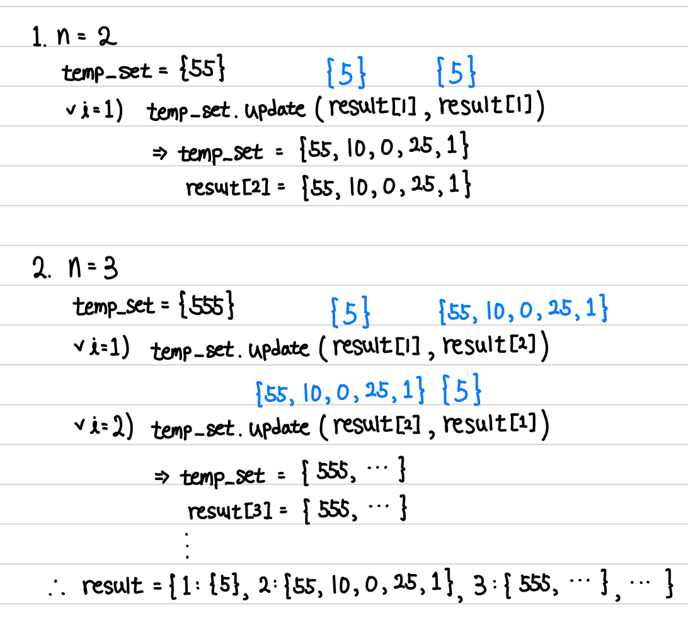

[프로그래머스] N으로 표현 - 42895 | Level 3.@

---

## 문제 요약

[문제 링크](https://school.programmers.co.kr/learn/courses/30/lessons/42895)

- 아래와 같이 5와 사칙연산만으로 12를 표현할 수 있다.
  - 12 = 5 + 5 + (5/5) + (5/5)
  - 12 = 55/5 + 5/5
  - 12 = (55+5)/5
- 5를 사용한 횟수는 각각 6, 5, 4이며 이중 가장 작은 경우는 4이다.
- N은 1 이상 9이하이며 최솟값이 8보다 크면 -1을 리턴하라.

## 정답 코드

```python
def calc_n(X, Y): # X와 Y 모두 {} 형태
    n_set = set()
    for x in X:
        for y in Y:
            n_set.add(x + y)
            n_set.add(x - y)
            n_set.add(x * y)
            if y != 0:
                n_set.add(x // y)
    return n_set # +, -, *, // 모든 경우를 다 넣어서 리턴

def solution(N, number):
    answer = -1
    result = {}
    result[1] = {N}
    if N == number:
        return 1

    for n in range(2, 9):
        temp_set = {int(str(N) * n)} # N이 5일 때: 5, 55, 555, ...
        i = 1
        # update 사용 : 5+1, 1+5의 중복 막음
        # result[i], result[n-i] : 5-1, 1-5의 다름을 구별함
        while i < n:
            temp_set.update(calc_n(result[i], result[n-i]))
            i += 1

        if number in temp_set:
            answer = n
            break

        result[n] = temp_set

    return answer
```

## 풀이 및 배운 점



이 문제를 통해 배운 점이 정말 많습니다. 1) DP를 활용하는 방식, 2) set()과 dict의 활용법, 3) update 함수, 4) `int(str(N) * n)`로 표현하는 방법 등등

또한, 제한사항에서 힌트를 얻을 수 있다는 점도 새롭게 알게 되었습니다. (`for n in range(2, 9)`)

---

"50대의 추교현이 20대의 추교현에게 감사할 수 있게끔 하루하루 최선을 다해 살고자 합니다."

**_The End._**
