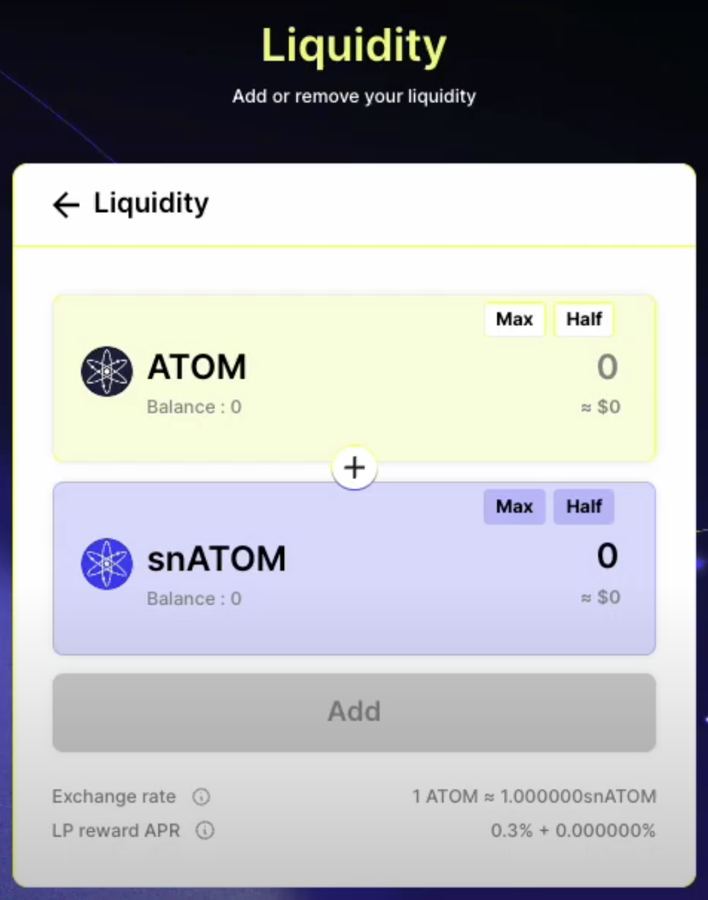

즐겁게 개발했던 탈중앙화 금융 서비스(DeFi)인 Supernova 프로젝트를 소개합니다.@

---


[#GitHub](https://github.com/scottXchoo/Supernova_Front-end/tree/main) [#YouTube](https://youtu.be/VG-m5jsV0Ck?si=gB6YLwXGC7rvIz1Q)

## 프로젝트 소개

Supernova 프로젝트는 자산 예치(stake), 자산 교환(swap), 유동성 공급(liquidity) 등 다양한 기능을 하나의 플랫폼에서 제공하는 Cosmos 블록체인 기반의 탈중앙화 금융 서비스(DeFi)입니다.

Senior FE Developer 1명 / Junior FE Developer 2명(ME) / Web Designer 1명 / Blockchain Core Developer 2명 / Contract Developer 1명 / BE Developer 1명 / PM 2명 / PO 1명이 팀이 되어 프로젝트를 진행했습니다.

이 프로젝트에서 제가 맡은 주요 역할은 FE 페이지 및 React 훅 개발이었습니다.

### 프로젝트 기간

: 22.05 - 23.03 (11M)

### 사용한 기술 스택

**코어 기술** : Next.js / React / TypeScript

**상태관리** : Recoil

**스타일링** : Tailwind CSS

## 구체적인 업무

### [1] useInput 커스텀 훅 개발

프로젝트의 다양한 페이지마다 입력값 처리 로직이 제각각 다르게 작성되어 개발 효율성이 저하되었습니다. 이 문제를 해결하고자 여러 페이지에서 일관되게 사용할 수 있는 useInput 커스텀 훅을 개발했습니다.



```typescript
interface InputProps {
  negativeExponent: number;
  max: string;
  min?: string;
  placeholder?: string;
}

const useInput = ({
  negativeExponent,
  max: _max,
  min: _min = '0',
  placeholder = '0',
}: InputProps) => {
  const [rawInput, setRawInput] = useState('');
  const [input, setInput] = useState('');
  const [errorMessage, setErrorMessage] = useState('');

  const max = useMemo(() => trimTrailingZeros(trimUnderNegativeExponent(_max, negativeExponent)), [
    _max,
    negativeExponent,
  ]);
  const min = useMemo(() => trimTrailingZeros(trimUnderNegativeExponent(_min, negativeExponent)), [
    _min,
    negativeExponent,
  ]);
  const half = useMemo(
    () => trimTrailingZeros(Big(_max).div(2).toFixed(negativeExponent, Big.roundDown)),
    [_max, negativeExponent],
  );

  const isMax = useMemo(() => {
    return Big(max).eq(input || placeholder);
  }, [max, input, placeholder]);
  const isMin = useMemo(() => {
    return Big(min).eq(input || placeholder);
  }, [min, input, placeholder]);
  const isHalf = useMemo(() => {
    return Big(half).eq(input || placeholder);
  }, [half, input, placeholder]);
  const isOverMax = useMemo(() => {
    return Big(input || placeholder).gt(max);
  }, [input, max, placeholder]);

  const toggleMax = useCallback(() => {
    if (isMax) {
      setInput(rawInput);
    } else {
      setInput(max);
    }
  }, [isMax, max, rawInput]);
  const toggleMin = useCallback(() => {
    if (isMin) {
      setInput(rawInput);
    } else {
      setInput(min);
    }
  }, [isMin, min, rawInput]);
  const toggleHalf = useCallback(() => {
    if (isHalf) {
      setInput(rawInput);
    } else {
      setInput(half);
    }
  }, [isHalf, half, rawInput]);

  useEffect(() => {
    setInput(rawInput);
  }, [rawInput]);

  useEffect(() => {
    if (Big(input || placeholder).gt(max)) {
      setErrorMessage('Insufficient Balance');
    }

    if (Big(input || placeholder).lt(min)) {
      setErrorMessage(`Input can't be less than ${min}`);
    }
  }, [input, max, min, placeholder]);

  return {
    input,
    setInput: _setInput,
    resetInput,
    errorMessage,
    isMax,
    isMin,
    isHalf,
    isOverMax,
    toggleMax,
    toggleMin,
    toggleHalf,
  };
};
```

**1. 상태 관리 :** rawInput, input, errorMessage 라는 세 가지 상태를 사용합니다. 이 상태들은 각각 원본 입력 데이터, 처리된 입력 데이터, 오류 메시지를 저장합니다.

**2. 값 계산과 검증 :** max, min, half는 각각 사용자 입력의 최댓값, 최솟값 그리고 절반값을 계산하고 isMax, isMin, isHalf는 입력값이 이들과 일치하는지 판단합니다. 그리고 useMemo를 사용하여 성능을 최적화했습니다.

**3. 토글 버튼 기능 :** toggleMax, toggleMin, toggleHalf 함수는 의존하는 값들이 변경될 때만 함수를 재생성하는 useCallback을 사용하여 구현했습니다. 이를 통해 사용자가 쉽게 최댓값, 최솟값, 절반값을 입력창에 적을 수 있도록 했습니다.

**4. rawInput과 input 상태로 구별 :** 사용자가 입력 과정에서 실수를 하거나 입력을 재조정하는 경우가 있습니다. 이때, 원본 입력 데이터 상태(`rawInput`)를 따로 보관함으로써 사용자가 쉽게 이전 입력값으로 돌아갈 수 있습니다.

### [2] 트랜잭션 로직 개발

자산(swap) 기능은 블록체인에 트랜잭션을 발생시킴으로써 사용자가 보유한 자산을 다른 자산으로 교환합니다. 이러한 트랜잭션 로직은 자산 교환(swap)뿐만 아니라 자산 예치(stake), 유동성 공급(liquidity) 등 다양한 기능에 적용되므로, 높은 추상화 수준으로 설계하여 재사용성을 높였습니다.

```typescript
type MsgType = {
  typeUrl: string;
  value: object;
};

export const executeContractTx = async (
  msg: MsgType,
  client: SigningCosmWasmClient,
  address: string,
) => {
  return executeTx([msg], _.cloneDeep(client), address, {
    gas: CONTRACT_GAS_FEE,
    amount: coins(CONTRACT_GAS_AMOUNT, 'unova'),
  });
};

export const useSwap = () => {
  const wasmClient = useRecoilValue(getWasmClient);
  const novaAddress = useRecoilValue(getNovaAddress);
  const slippageInPercent = useRecoilValue(getSlippageInPercent);

  const executeSwap = useCallback(
    async (
      assetInfo: AssetWithAmount | undefined,
      fromDenom: string,
      toDenom: string,
      inputAmount: string,
    ) => {
      if (assetInfo == null) {
        return;
      }
      const contractAddress = pairAddressByDenoms(
        denomByDisplayDenom(fromDenom),
        denomByDisplayDenom(toDenom),
      );

      const decimal = assetInfo?.assetComponent.decimal || 0;
      const amount = Big(inputAmount || 0).toFixed(decimal, Big.roundDown);
      const decimalMulAmount = ParseDecimal(amount, decimal);

      if (!wasmClient || !novaAddress || !contractAddress) {
        throw new Error('No wasm client, nova address or pair info given');
      }

      const pairMsgComposers = new contracts.Pair.PairMessageComposer(novaAddress, contractAddress);

      /** compose swap msg */
      const pairMsg = pairMsgComposers.swap(
        {
          maxSpread: slippageInPercent.div(100).toString(),
          offerAsset: assetInfo.assetInfoWithAmount(decimalMulAmount),
          to: novaAddress,
        },
        [assetInfo.getCoinInfo(decimalMulAmount)],
      );
      return executeContractTx(pairMsg, wasmClient, novaAddress);
    },
    [novaAddress, slippageInPercent, wasmClient],
  );

  return {
    executeSwap,
  };
};
```

1. 상태 가져오기 : Recoil의 useRecoilValue를 사용해 wasmClient, novaAddress, slippageInPercent 라는 상태값을 가져옵니다.

2. 스왑 실행 로직 : executeSwap 함수는 사용자의 입력값과 선택된 자산 정보를 바탕으로 트랜잭션을 발생시키는 executeContractTx 함수를 실행합니다. 그리고 Big 라이브러리를 사용하여 입력값의 정밀 계산을 보장합니다.

3. 트랜잭션 실행 로직 : pairMsgComposers 객체를 통해 구성된 트랜잭션 메시지를 executeContractTx 함수가 인자로 받고 이를 wasmClient가 블록체인에 트랜잭션을 발생시키는 로직입니다.

## 프로젝트에서 배운 내용

**1. React 훅 활용 및 구현 역량 :** useCallback과 useMemo를 활용하여 불필요한 리렌더링을 방지하고 성능을 최적화한 경험이 있습니다. 또한, 복잡한 상태 관리 로직을 추상화하여 재사용 가능한 useInput과 같은 커스텀 훅을 설계 및 구현한 경험이 있습니다.

**2. 사용자 경험 중심 개발 :** 저의 개발 철학의 핵심은 [항상 사용자 경험을 최우선에 두는 것]입니다. 사용자가 Supernova 서비스를 사용하면서 겪을 수 있는 다양한 에러 상황을 면밀히 분석하여 이를 바탕으로 구체적이고 명확한 에러 메시지를 보여주도록 설계했습니다. 또한, 사용자의 아주 작은 재정적 손해라도 이를 막기 위해 입력 데이터에 대한 정밀한 계산을 수행하는 Big 라이브러리를 활용했습니다.

---

"50대의 추교현이 20대의 추교현에게 감사할 수 있게끔 하루하루 최선을 다해 살고자 합니다."

**_The End._**
