비전 트랜스포머 기반의 폭력 사태 감지 딥러닝 모델인 VDVT(Violence Detection using Vision Transformer) 프로젝트를 소개합니다.@

---

# ABSTRACT

이 연구에서는 CCTV를 통한 폭력 사태 감지를 위한 새로운 딥러닝 기반 모델인 “VDVT: Violence Detection using Vision Transformer”를 제안합니다. 현재 CCTV 모니터링은 인력 부족과 사람의 집중력 저하 문제로 인해 효과적이지 않습니다. 기존의 딥러닝 모델들은 평균 정밀도가 90% 미만이며, 높은 컴퓨팅 리소스와 긴 모델 학습 시간이 필요합니다.

VDVT 모델은 Vision Transformer(ViT)를 사용하여 높은 정확도로 폭력 사태를 신속하게 감지합니다. ViT는 기존 CNN보다 높은 성능을 제공하지만, 학습을 위해 많은 양의 데이터가 필요합니다. 이를 보완하기 위해, 저희는 아키텍처 초반부에 사전 학습된 CNN인 MobileNetV3 모델을 넣어 추출된 특징 맵을 ViT의 입력값으로 사용합니다.

이 모델을 통해 효율적인 모니터링과 빠른 대응이 가능해지며, 정확도와 신뢰성이 향상됩니다. 또한, 작은 데이터 셋으로 빠른 학습이 가능해져 시스템의 비용 효율성이 높아집니다. 이 연구는 CCTV를 통한 폭력 사태 감지의 효율성과 정확성을 높이는 데 기여할 것으로 기대됩니다.

# I. 연구 개요 (INTRODUCTION)

## A. 해결하고자 하는 문제 (Problem)

교통 관리 및 위반 또는 무기 감지와 같이 다양한 목적으로 CCTV가 설치되고 있습니다. 그리고 CCTV를 통해 폭력 사태를 빠르게 감지하여 효과적으로 대응하는 것은 도심 속 시민들을 위해 매우 중요한 일입니다.

CCTV의 수가 증가함에 따라 이를 모니터링하는 인력의 수도증가해야 되지만, 현재 이에 맞춰서 인력을 충분히 확보하는
것은 현실적으로 어렵습니다. 그리고 CCTV를 모니터링하는 사람의 집중력은 대략 20분 정도 지나게 되었을 때, 현저히 떨어지기 때문에 사람이 CCTV를 지속적으로 모니터링하는 것은 매우 어렵습니다.

## B. 기존 솔루션 (Existing Solution)

최근 몇 년 동안 딥러닝 모델 덕분에 실제로 CCTV를 통해 폭력 사태 등을 감지하는 기술이 향상되었지만, CNN을 이용한 기존의 딥러닝 모델들은 평균 정확도가 90% 미만이며, 높은 컴퓨팅 리소스와 긴 학습 기간이 필요하기 때문에 실제 서비스로 쓰이기에는 아직 한계점이 많습니다.

## C. 솔루션 제안 (Our Solution)

이 연구에서 CCTV를 통한 폭력 사태 감지를 위한 새로운 딥러닝 기반 모델인 “VDVT: Violence Detection using Vision Transformer”를 제안합니다.

Vision Transformer(ViT)를 사용하면, 높은 정확도로 폭력 사태를 신속하게 감지한다는 장점이 있습니다. ViT는 기존
CNN보다 높은 성능을 제공하지만, 데이터의 양이 충분하지 않다면 정확도가 급격히 떨어진다는 단점이 있습니다. 저희는
이를 보완하기 위해, 아키텍처 초반부에 사전 학습된 CNN 모델인 MobileNetV3를 넣어 추출된 특징 맵을 ViT의 입력값으로 사용하는 아키텍처를 구현했습니다.

이 모델을 통해 효율적인 모니터링과 빠른 대응이 가능해지며, 정확도와 신뢰성이 향상됩니다. 또한, 작은 데이터 셋으로 빠른 학습이 가능해져 시스템의 비용 효율성이 높아집니다. 이 연구는 CCTV를 통한 폭력 사태 감지의 효율성과 정확성을 높이는 데 기여할 것으로 기대됩니다.

# II. 연구 목적 (RESEARCH PURPOSE)

본 연구를 들어가기 앞서 저희는 선행 연구 논문들인 “A Novel ConvMixer Transformer Based Architecture for Violent Behavior Detection”, “Video Vision Transformer for Violence Detection” 등을 리뷰했습니다. 이를 통해 ViT는 기존 CNN 아키텍처보다 높은 성능을 제공하지만, Transformer 구조 자체가 CNN에 비해 Inductive Bias가 부족하다는 한계가 있어 많은 양의 데이터가 없으면 일반화가 제대로 이뤄지지 않는다는 것을 알게 되었습니다.

이러한 단점을 보완하기 위해 저희는 VGG-16 모델보다 32배 더 가볍고 27배나 연산량이 적지만 성능은 0.9% 정도만 낮은 MobileNetV3 모델을 아키텍처 초반부에 사용하여 이 모델의 출력값으로 나온 특징 맵을 ViT의 인풋 시퀀스로 사용했습니
다.

저희가 제안한 모델을 통해 다음과 같은 기대 효과를 가져갈 수 있습니다.

### [1] 효율적인 모니터링과 신속한 대응

CCTV 영상을 분석하여 폭력 사태를 높은 정확도로 신속히 감지할 수 있게 됩니다. 이는 사람의 직접적인 모니터링에 대한 부담을 대폭 줄이고 사건 발생 시 즉각적인 알림을 통해 신속한 대응이 가능하게 됩니다. 결과적으로 도심 속 안전과 질서 유지에 크게 기여할 것입니다.

### [2] 정확도와 신뢰성 향상

사전 학습된 MobileNetV3를 활용함으로써 기존 모델들과 비교했을 때, 더 높은 정확도와 신뢰도를 제공합니다. 이는 오류 탐지를 줄여 실제 폭력 사태를 더 정확하게 감지하는 데 도움이 됩니다.

### [3] 적은 데이터 셋으로 빠른 학습

사전 학습된 MobileNetV3의 사용으로 모델 학습 시간을 단축시키고, 필요한 컴퓨팅 리소스를 줄일 수 있게 됩니다. 이는 시스템의 비용 효율성을 높여 더 넓은 범위에서 해당 모델을 활용할 수 있게 됩니다.

# III. 선행 연구 (PRIOR RESEARCH)

## A. 논문 리뷰 : “Video Vision Transformers for Violence Detection”

“Video Vision Transformers for Violence Detection” 논문에서는 Pre-processing을 통해 프레임 변환과 크기 조정을 하고 비디오를 여러 프레임으로 변환시킨 다음 Video Frames Augmentation에 대입시킨 후, ViViT(비디오 비전 트랜스포머) 프레임워크를 사용하여 비디오의 폭력과 비폭력 여부를 분류합니다.

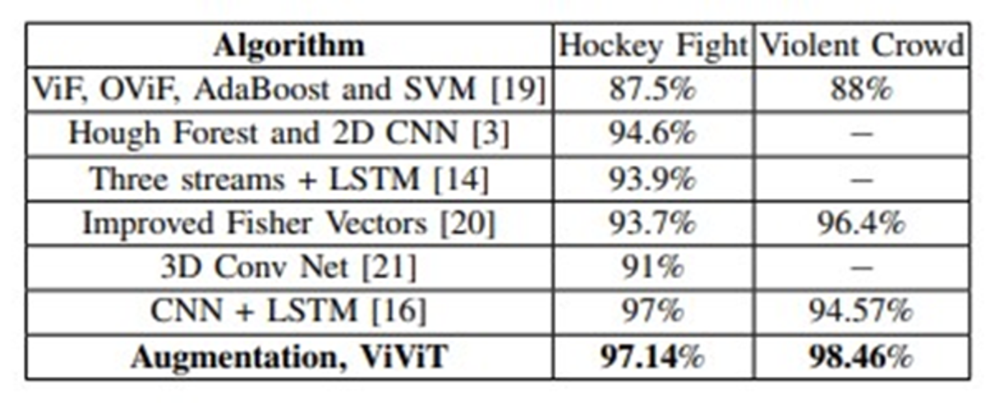

> Figure 1: ViViT Table

ViViT를 활용하는 방법과 이를 활용해서 얻은 성능을 다른 모델과 비교했을 때 더 높은 성능과 정확도를 나타냅니다.

## B. 논문 리뷰 : “A Novel ConvMixer Transformer Based Architecture for Violent Behavior Detection”

“A Novel ConvMixer Transformer Based Architecture for Violent Behavior Detection” 논문에서는 이미지를 격자 형태의 패치로 나누고, 각 패치를 다층 선형 변환을 통해 처리하는 ConvMixer을 이용하는 폭력 상황 탐지 모델을 제안합니다.

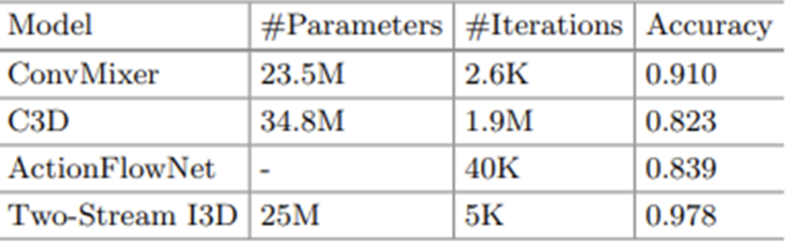

> Figure 2: ConvMixer Table

이 모델에 추가적으로 행동인지 데이터를 선행 학습합니다. 그리고 비디오로부터 frame을 resizing 하여 extracting 한 후 공간적, 시간적 차원을 암호화한 super image로 결합시켜 모든 frame을 사용하지 않고 몇 개 frame만 뽑을 수 있는 Super Image Techinque를 사용해서 다른 모델과 비교했을 때 더 높은 성능과 정확도를 나타냅니다.

## C. 논문 리뷰 : “CrimeNet: Neural Structured Learning using Vision Transformer for violence detection”

“CrimeNet: Neural Structured Learning using Vision Transformer for violence detection" 논문에서는 CrimeNet이라는 ViT와 adversarial NSL을 결합시킨 모델을 제안합니다.

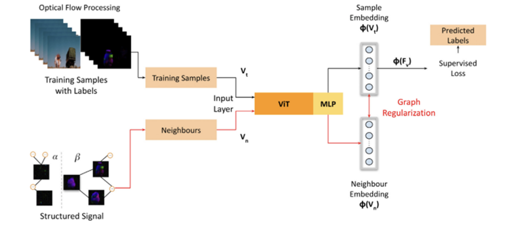

> Figure 3: CrimeNet Architecture

이 모델은 데이터에 Optical flow와 Adversarial neighbours 작업을 적용한 값을 ViT에 입력하고 출력값을 MLP에 적용하여 폭력 상황을 분류하는 아키텍처를 갖습니다. 이 모델은 정확성이 99.98% 이상을 보여주고, ROC AUC는 ViT만 사용한 모델에 비해 9.55% 개선되었습니다.

# IV. 모델 아키텍처 (MODEL ARCHITECTURE)

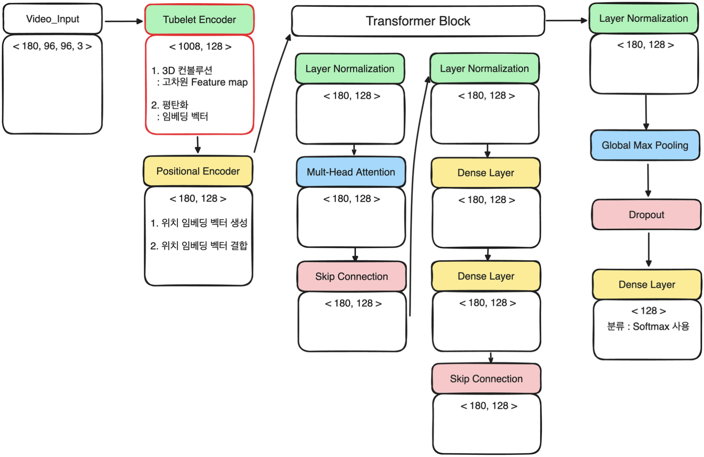

> Figure 4: Baseline Model Architecture

## A. 베이스라인 모델 아키텍처 (Baseline Model Architecture)

### [1] Video Input

비디오는 시간에 따라 연속적으로 나열된 일련의 이미지(혹은 프레임)로 구성되어 있습니다.

### [2] Tubelet Encoder

비디오를 입력값으로 받아서 컨볼루션 연산을 통해 고차원 특징 맵을 얻습니다. 이 특징 맵을 평탄화하여 임베딩 벡터로 변환합니다.

### [3] Positional Encoder

변환된 임베딩 벡터에 맞는 위치 임베딩 벡터를 생성하여 추가합니다. 이를 통해 모델이 각 벡터의 순서를 인식할 수 있도록 합니다.

### [4] Transformer Block

계층 정규화 (Layer Normalization) : 각 데이터에 대해 정규화하여 안정적인 학습 진행에 도움

멀티 헤드 어텐션 (Multi-Head Attention) : 어텐션을 여러 번 병렬로 수행하여 모델의 강건성 증가

스킵 연결 (Skip connection) : 여러 레이어를 건너뛰고 출력에 직접 추가하여 그래디언트 소실 문제 방지

계층 정규화 (Layer Normalization) : 각 데이터에 대해 정규화하여 안정적인 학습 진행에 도움

완전 연결 레이어 (Dense Layer) \* 2개

- 첫 번째 Dense Layer : 입력 데이터의 차원을 확장하는 역할
- 두 번째 Dense Layer : 확장된 차원을 다시 축소하는 역할

스킵 연결 (Skip connection) : 여러 레이어를 건너뛰고 출력에 직접 추가하여 그래디언트 소실 문제 방지

트랜스포머 블록은 이런 식으로 구성되어 있습니다.

### [5] Classification Layer

계층 정규화 (Layer Normalization) : 각 데이터에 대해 정규화하여 안정적인 학습 진행에 도움

전역 최대 풀링 (Global Max Pooling) : 입력 텐서의 각 채널(또는 특징)에 대해 최댓값을 계산하여 고차원의 특징 맵을 1차원 벡터로 축소한다.

드롭아웃 (Dropout) : 과대 적합 방지 기법

완전 연결 레이어 (Dense Layer) : Softmax 사용하여 분류

분류 계층은 이런 식으로 구성되어 있습니다.

## B. MobileNet vs EfficientNet vs ResNet

베이스라인 모델에 사용할 사전 학습 CNN으로 MobileNet, EfficientNet, ReseNet 중 하나를 사용하고자 리서치를 진행했습니다. 메모리 사용량이 적은 경량화된 구조이면서 성능이 낮지 않은 것을 기준으로 모델을 정했습니다.

### [1] MobileNet

MobileNet은 컴퓨팅 자원이 제한된 환경에서도 경량화된 딥러닝 모델을 사용할 수 있게 만들어졌습니다. 주로 모바일 기기나 임베디드 시스템에서 사용하기 적합하며 작은 메모리와 낮은 연산량으로도 빠르게 실행됩니다. Depthwise Separable Convolution을 사용하여 모델을 가볍게 만들었는데, 이는 기존의 Convolution 연산을 효율적으로 분해하는데 공간 방향의 depth-wise 컨볼루션과 채널 방향의 point-wise 컨볼루션을 따로 수행하여 합치는 방식을 사용하여 계산량을 줄입니다.

### [2] EfficientNet

EfficientNet은 Neural Architecture Search(네트워크 아키텍처 자동 탐색) 기법을 사용하여 만들어진 모델입니다. 이 모델은 성능과 효율성을 모두 고려하여 다양한 모델 크기에 대해 최적화된 스케일링 방법을 제안합니다. Compound Scaling을 통해 네트워크의 깊이, 너비, 해상도를 조절하여 네트워크의 크기를 조절하고 이를 통해 최적의 성능을 얻을 수 있도록 합니다. 따라서, 다양한 환경에서 효과적으로 사용될 수 있고 계산 효율성을 유지할 수 있습니다.

### [3] ResNet

ResNet은 잔차 학습(Residual Learning)을 기반으로 한 딥러닝 모델입니다. 이전의 네트워크들은 레이어가 깊어질수록 성능이 좋아지는 경향이 있었지만, 동시에 그래디언트 소실 문제가 발생할 확률이 높아졌습니다. ResNet은 스킵 연결(Skip Connection)을 이용하여 이 문제를 해결하고 더 깊은 네트워크를 구성할 수 있게 되었습니다.

이 3가지 모델의 주요한 차이점은 모델의 경량화/최적화 방식 그리고 네트워크의 구조와 학습 방식에 있습니다. MobileNet은 경량 모델을 위해 설계되었고, EfficientNet은 효율적인 스케일링을 고려한 모델이며, ResNet은 잔차 학습을 통해 깊은 네트워크를 학습시킬 수 있는 구조를 제안했습니다.

본 연구에서 중점적으로 고려해야 될 사항은 제한된 메모리와 시간 그리고 작은 데이터 셋입니다. 리서치 결과 위의 3가지 모델 중 MobileNet이 가장 적은 메모리와 작은 데이터 셋으로도 최적의 성능을 낼 수 있다고 판단했습니다.

그래서 저희는 MobileNet을 사용하여 최종 모델 아키텍처를 구현했습니다.

## C. 최종 모델 아키텍처 (Our Model Architecture)

### [1] 베이스라인 모델과의 차이점

베이스라인 모델의 간단한 아키텍처를 설명드리겠습니다. 시간에 따라 연속적으로 나열된 프레임으로 구성된 비디오를 Tubelet Encoder에 입력값으로 넣습니다. 이 Tubelet Encoder는 비디오들을 구성하는 각 프레임을 3D 컨볼루션(Conv3D)으로 고차원 특징 맵을 얻습니다. 그리고 이 특징 맵들을 평탄화하여 임베딩 벡터로 만듭니다.

이 임베딩 벡터를 Positional Encoder에 넣어 입력으로 받은 벡터에 각각 맞는 위치 임베딩 벡터를 더하여 출력합니다. Positional Encoder에서 출력된 벡터들을 트랜스포머 블록의 여러 계층을 여러 번 통과시킵니다. 다음에 Layer Normalization(계층 정규화), GlobalMaxPool1D(글로벌 최대 풀링), Dropout(드롭아웃) 그리고 분류를 위한 Dense Layer를 통과시킵니다.

이러한 베이스라인 모델에서 고차원 특징 맵을 추출하는 Tubelet Encoder 부분을 사전 학습된 CNN으로 대체한 것이 저희 최종 모델입니다. 즉, 저희 최종 모델은 베이스라인 모델에서 Tubelet Encoder를 사전 학습된 CNN인 MobileNetV3로 변경한 아키텍처입니다.

### [2] 클래스 코드 구현

처음에는 ViT 안에 MobileNetV3를 직접 넣어서 구현했습니다. 이때, 학습 자체가 안 되어서 원인 파악에 시간을 많이 사용했습니다. ViT 안에 MobileNetV3를 직접 넣었기에 메모리 사용량이 급증하여 학습 자체가 안 된 것이었습니다. 그래서 MobileNetV3를 따로 클래스로 만들어서 구현했습니다.

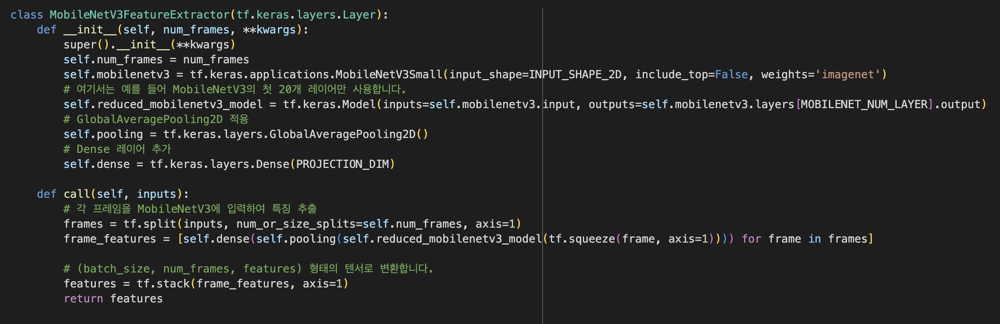

> Figure 5: class MobileNetV3FeatureExtractor

위의 코드가 class MobileNetV3FeatureExtractor이며 다음과 같은 순서로 구현되었습니다.

1. ImageNet을 사전 학습한 MobileNetV3를 호출합니다. 간단히 사전 학습의 이점을 말씀드리겠습니다.

- 학습 시간 단축: 이미 다양한 데이터 셋으로 학습되었기에 학습 속도가 빠릅니다.
- 작은 데이터 셋으로도 학습 가능: 작은 데이터 셋으로도 성능이 좋게 나오며 새로운 데이터 셋에 대한 모델의 일반화 능력이 증가합니다.
- 성능 향상: 미리 학습된 모델은 다양한 이미지 특징을 이미 인식할 수 있도록 학습되었기에 비디오 탐지와 같이 관련성이 높은 작업에서 성능이 증가합니다.

2. MobileNetV3의 N개의 레이어만 사용합니다 (하이퍼 파라미터 실험에서 N을 결정).

- MobileNetV3 전체 네트워크를 사용한다면, 메모리 사용량이 급증하기에 일부만 사용합니다.
- 간단한 실험으로 네트워크의 처음 부분보다는 마지막 부분 계층을 제거하는 것이 더 성능이 좋다는 것을 파악했습니다.

3. GlobalAveragePooling2D 레이어는 특징 맵의 크기를 감소시키고 메모리 사용량을 줄이며 계산 효율성을 높입니다.

- 이를 통해 모델이 특징 맵의 전체적인 정보를 요약할 수 있습니다.
- 최대 풀링이 아닌 평균 풀링을 선택한 이유는 최대 풀링으로 특징 맵의 각 채널에서 최댓값만 선택하여 특정 순간의 강한 움직임이나 두드러진 특징을 감지하는 데는 유리하지만, 본 연구에서는 전체적인 맥락을 이해하는 게 더 중요하기 때문입니다.

4. Dense 레이어는 특징 벡터를 고정된 크기의 벡터로 변환합니다.

- 이 과정은 특징 벡터의 차원을 조정하고, 필요한 경우 더 복잡한 특징을 학습할 수 있게 합니다.
- 이를 통해 정보를 효과적으로 표현하고 필요한 경우 모델의 학습 능력을 강화하는 역할을 합니다.

5. 마지막으로 GlobalAveragePooling2D 레이어와 Dense 레이어를 각 프레임마다 통과시킨 후, 텐서 형태로 변환한 것을 리턴 시킵니다.

정리하자면, 이 class는 ImageNet으로 사전 학습된 MobileNetV3의 일부 레이어를 사용하여 비디오의 각 프레임에 대한 특징들을 추출해 텐서 형태로 변환한 것을 리턴합니다. 이렇게 리턴 한 1D 벡터 시퀀스는 Positional Encoder에 전달됩니다.

### [3] 최종 모델 아키텍처

위에서 구현한 class 코드는 최종 모델의 핵심입니다.

베이스라인 모델에서 사용했던 Vision Transformer보다 사전 학습된 CNN인 MobileNetV3로 특징을 추출한 Vision Transformer 모델은 작은 데이터 셋과 한정된 메모리 리소스인 학습 환경 속에서 성능이 더 좋을 것이고 학습 속도가 훨씬 더 빠를 것입니다.

저희가 예상한 가설이 맞는지 다음 실험 파트에서 구체적으로 검증하도록 하겠습니다.

# V. 연구 실험 (EXPERIMENT)

## A. 데이터 셋 (Dataset Overview)

저희가 선행연구 조사를 위해 읽은 논문에서 주로 사용했던 데이터 셋들을 분류하였습니다.

그중에서도 신뢰도 및 정확성이 제일 높았던 RLVS Dataset, Hockey Fights Dataset을 각각 Kaggle에서 다운로드하여 사용했습니다.

그러나 RLVS Dataset은 mp4 형식이었고 Hockey Fights Dataset은 avi 형식이었습니다. 이를 mp4로 통일하기 위해서 Hockey Fights Dataset에 있는 비디오를 저희가 일일이 mp4로 변환하는 과정을 가졌습니다.

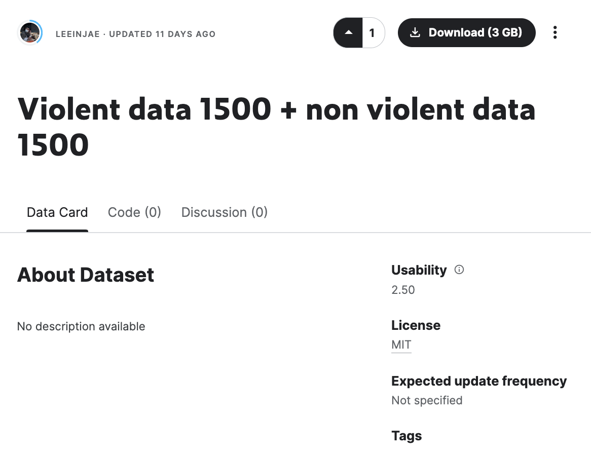

> Figure 6: Our Dataset in Kaggle

그리고 이 두 개의 데이터 셋을 하나로 합쳐 저희가 필요한 데이터 셋을 만들었고 이를 Kaggle에 퍼블릭으로 업로드했습니다.

저희는 모델의 과소 적합(Underfitting)을 방지하기 위해서 폭력 비디오 1500개, 비폭력 비디오 1500개로 총 3000개를 확보했습니다. 하지만, 한정된 메모리 리소스로 인해서 하이퍼 파라미터 실험 결과 폭력 비디오 200개, 비폭력 비디오 200개인 총 400개의 비디오를 사용하게 되었습니다.

## B. 실험 방법 (Experimental Methodology)

### [1] 실험 개요

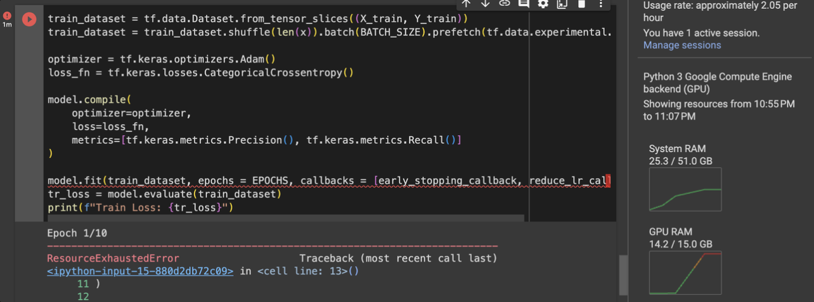

> Figure 7: RAM Resource Error

구현한 모델을 직접 학습시켜보니 생각보다 저희에게 주어진 메모리 리소스가 크지 않다는 것을 알았습니다. 사용할 수 있는 메모리를 최대치로 끌어올리고 학습 속도를 높여 더 많은 실험을 하기 위해서 Colab Pro를 결제하여 실험을 진행했습니다.

이번 실험의 목표는 크게 3가지입니다.

1. 메모리 사용 최소화
2. 성능(Loss, Precision & Recall & F1 Score) 최대화
3. 1에폭 당 5분이 넘지 않는 학습 시간

위의 실험 목표를 달성하기 위해서 다음과 같은 실험들을 진행했으며 비교적 작은 의사결정을 위해 따로 기록하지 않은 여러 작은 실험을 포함하여 총 80번 넘게 진행했습니다.

1. 베이스라인 모델 아키텍처 실험
2. 하이퍼파라미터 실험
3. 베이스라인 vs 최종 모델 성능 비교 실험

### [2] 베이스라인 모델 아키텍처 실험

**실험 목표:**

이 실험의 목표는 ViT로 구현된 베이스라인 모델이 메모리를 초과하지 않으면서 최고의 성능을 내는 아키텍처를 구현하는 것입니다.

이 실험에 사용된 하이퍼 파라미터는 다음과 같습니다.

1. 폭력/비폭력 데이터 셋: 각각 200개
2. 배치 사이즈: 8
3. 최대 프레임: 160
4. 트랜스포머 블록 수: 12개

베이스라인 모델은 ViT 모델의 기본적인 아키텍처를 따르되, 현재 저희 실험의 특징들을 고려하여 몇 가지 부분을 수정해서 실험을 진행했습니다.

**변수 설명:**

저희 실험의 특징은 1) 작은 데이터 셋, 2) 메모리 사용량 제한 이렇게 2가지입니다. 이 두 가지 특징을 고려하여 설정한 변수는 다음과 같습니다.

1. Skip Connection 개수: 작은 데이터 셋에서는 모델이 과대 적합(Overfitting) 될 위험이 있습니다. Skip Connection은 이러한 과대 적합을 방지하고 모델의 일반화 능력을 향상시키는 데 도움을 줍니다.

2. Multi-Head Attention(MHA)의 헤드 수: MHA는 입력 데이터에서 다양한 위치의 정보를 동시에 주목(Attention) 하는 기법입니다. MHA의 헤드 수를 늘리면, 모델이 다양한 정보를 병렬로 처리할 수 있지만 메모리 사용량과 계산 복잡성이 증가합니다. 그리고 헤드 수가 줄어들면, 작은 데이터 셋에서는 과대 적합 위험을 줄일 수 있습니다.

3. 풀링 타입(평균 or 최대): 풀링은 신경망에서 특징 맵의 크기를 줄여주는 동시에 중요한 정보를 유지하는 방법입니다. 이를 통해 메모리 사용량 제한에 도움을 줄 수 있습니다.

**실험 결과 테이블:**

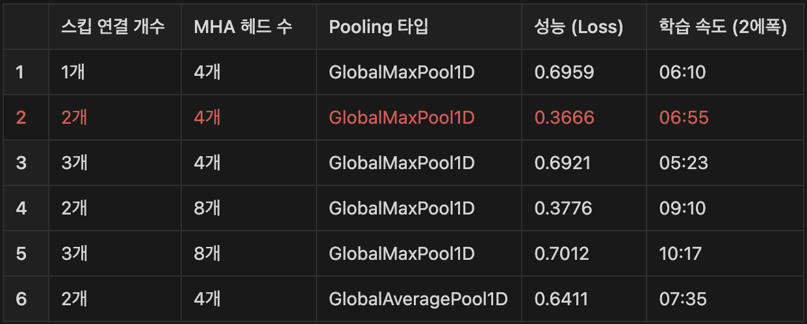

> Figure 8: Baseline Model Experiment Table

위의 3가지 변수를 기반으로 6번 넘는 실험을 진행했습니다. 그리고 스킵 연결 개수는 2개, MHA 헤드 수는 4개, 풀링 타입은 GlobalMaxPool1D가 학습 속도도 빠르고 성능이 좋다는 결과를 얻었습니다.

**실험 결과 분석:**

Skip Connection 수가 2개에서 3개로 많아지니까 오히려 성능이 낮아지는 것을 알 수 있었습니다. 그 이유는 1) 모델의 복잡성이 증가하여 과대 적합(Overfitting)이 발생했고, 2) 필요하지 않은 정보가 계속해서 전달되는 문제가 발생했기 때문입니다.

또한, 풀링의 타입은 평균(Average)보다 최대(Max)가 성능이 더 좋았습니다. 그 이유는 폭력/비폭력 비디오를 판단하는 모델이 비디오에서 특정 순간의 강한 움직임이나 두드러진 특징을 감지하는 데 유리하기 때문입니다.

### [3] 하이퍼 파라미터 실험

**실험 목표:**

이 실험의 목표는 위에서 진행한 “베이스라인 모델 아키텍처 실험”로 얻은 결과를 기반으로 구현된 모델로 메모리 사용이 초과하지 않으면서 최고의 성능을 내는 최적의 하이퍼 파라미터를 정하는 것입니다. 이 하이퍼 파라미터는 최종 모델 학습에도 적용될 예정입니다.

**변수 설명:**

이 실험에서 사용할 변수는 다음과 같습니다.

1. 데이터 셋 개수: 데이터 셋의 크기가 크면 모델이 다양한 패턴을 학습할 수 있지만, 학습 시간이 길어질 수 있습니다. 데이터 셋의 크기가 작으면 빠른 학습이 가능하지만, 과소 적합(Underfitting)의 위험이 있으며, 모델이 일반화되지 못할 수 있습니다.

2. 배치 사이즈: 한 번의 학습 단계(1에폭)에서 네트워크가 처리하는 데이터의 샘플 수입니다. 큰 배치 사이즈는 메모리 사용량을 증가시키지만, 학습이 더 안정적이고 빠를 수 있습니다. 작은 배치 사이즈는 메모리 효율성이 좋지만 학습이 불안정해질 수 있습니다.

3. 최대 프레임: 비디오 데이터를 처리할 때, 각 비디오에서 고려할 최대 프레임의 수입니다. 더 많은 프레임을 고려하면 비디오의 시간적 정보를 더 잘 포착할 수 있지만, 계산 비용과 메모리 사용량이 증가합니다. 반대로 프레임 수를 줄이면 처리 속도가 빨라지지만, 중요한 시간적 정보를 놓칠 수 있습니다.

4. 트랜스포머 블록 수: 더 많은 블록은 모델이 더 복잡한 특징을 학습할 수 있지만, 과대 적합(Overfitting)의 위험이 있습니다. 블록 수를 줄이면, 모델이 더 간단해지고 학습 속도가 빨라질 수 있지만, 성능이 저하될 수 있습니다.

**실험 결과 테이블:**

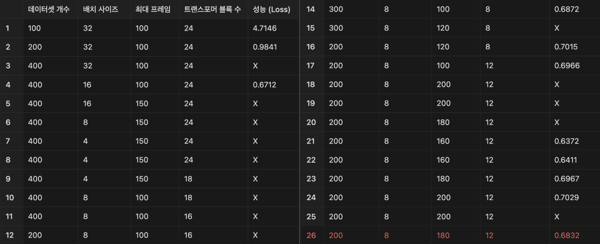

> Figure 9: Hyper Parameter Table

위의 4가지 변수를 기반으로 26번이 넘는 실험을 진행했습니다. 그리고 데이터 셋 개수는 200개, 배치 사이즈는 8, 최대 프레임은 180, 트랜스포머 블록 수는 12개가 가장 최적의 하이퍼 파라미터라는 결과를 얻었습니다.

**실험 결과 분석:**

과소 적합(Underfitting)을 방지하고자 최대한 많은 데이터 셋을 확보했습니다. 이렇게 확보한 데이터 셋은 폭력/비폭력 각각 1,500개씩입니다. 하지만, 한정된 리소스로 인해 이보다 더 적은 데이터 셋 개수로 실제 학습을 진행했습니다.

배치 사이즈를 처음부터 32부터 시작하여 실험을 진행했습니다. 제한된 메모리로 인해 배치 사이즈를 4까지 줄여서 학습을 진행했고 배치 사이즈가 4일 때는 학습 속도가 너무 낮아져 다시 8로 설정하고 실험을 진행했습니다.

최대 프레임 수는 학습할 데이터의 시퀀스를 직접적으로 결정하기 때문에 메모리 사용량에 가장 많은 영향을 주었습니다. 영상이 보통 30FPS이고 학습할 데이터 셋 비디오의 평균 길이가 4-6초이기 때문에 최대 프레임은 120에서 180이 적합하다고 판단하여 학습을 진행했습니다.

트랜스포머 블록의 수는 신경망의 깊이를 결정하는 하이퍼 파라미터입니다. 신경망이 깊어지면, 메모리 사용량이 증가하고 너무 얕으면 성능이 잘 나오지 않습니다. 이를 조절하며 학습을 진행했습니다.

### [4] 베이스라인 모델 vs 최종 모델 성능 비교 실험

**실험 목표:**
이 실험의 목표는 베이스라인 모델과 최종 모델의 성능을 비교하여 최종 모델이 얼마나 더 성능이 좋아졌는지 확인하는 것입니다. 이때, 최종 모델은 하이퍼 파라미터 실험으로 정해진 최적의 하이퍼 파라미터를 사용하였습니다.

**변수 설명:**
이 실험에서 사용할 변수는 다음과 같습니다.

1. MobileNetV3 레이어 수: 제한된 메모리 용량을 고려하여 MobileNetV3 전체 레이어를 활용할 수 없었습니다. 그래서 레이어 수를 블록 단위로 제거하며 실험을 진행했습니다.

2. 데이터 셋 개수: 데이터 셋의 크기가 크면 모델이 다양한 패턴을 학습할 수 있지만, 학습 시간이 길어질 수 있습니다. 데이터 셋의 크기가 작으면 빠른 학습이 가능하지만, 과소 적합(Underfitting)의 위험이 있으며, 모델이 일반화되지 못할 수 있습니다.

3. 최대 프레임: 비디오 데이터를 처리할 때, 각 비디오에서 고려할 최대 프레임의 수입니다. 더 많은 프레임을 고려하면 비디오의 시간적 정보를 더 잘 포착할 수 있지만, 계산 비용과 메모리 사용량이 증가합니다. 프레임 수를 줄이면 처리 속도가 빨라지지만, 중요한 시간적 정보를 놓칠 수 있습니다.

**실험 결과 테이블:**

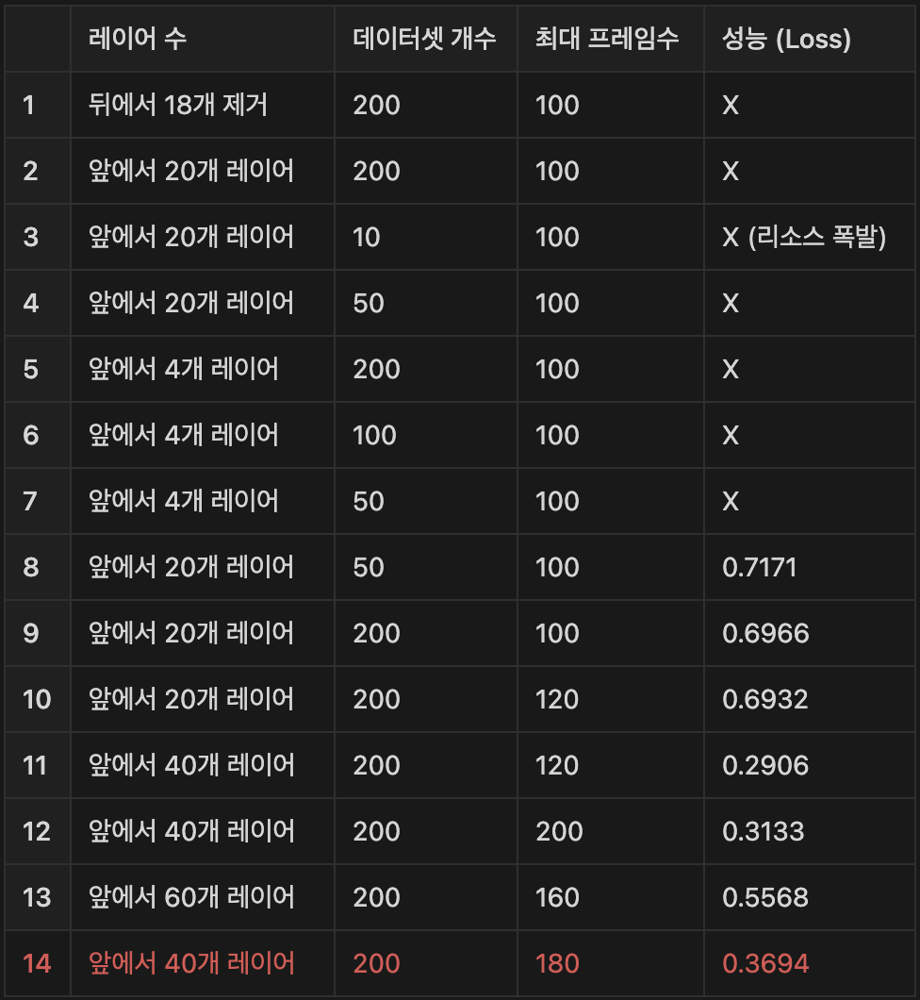

> Figure 10: Baseline Model vs Our Model Table

위의 3가지 변수를 기반으로 14번이 넘는 실험을 진행했습니다. 그리고 데이터 셋 개수는 200개, 최대 프레임은 180인 하이퍼 파라미터에서 MobileNetV3에서 앞의 40개 레이어를 사용할 때가 가장 최고의 성능을 낸다는 결과를 얻었습니다.

**실험 결과 분석:**

최종 모델이 베이스라인 모델보다 훨씬 학습 속도가 빨랐습니다. 그 이유는 다음과 같습니다.

1. 특징 추출의 효율성: 이미 MobileNetV3는 ImageNet의 다양한 이미지에 대해 여러 특징들을 학습한 상태이기 때문에 Vision Transformer가 처음부터 낮은 수준의 특징을 학습할 필요가 없어 빠르게 학습이 진행되었습니다.

2. 파라미터 수 감소: Tubelet Encoder 대신 MobileNetV3를 사용하면서 모델의 전체적인 파라미터 수가 감소했는데, 이로 인해 모델이 학습해야 할 파라미터의 양이 줄어들어 학습 속도도 감소했습니다.

3. 전이 학습의 효과: 전이 학습을 통해 이미 학습된 가중치를 사용함으로써 모델이 보다 특정 작업에 빠르게 적응할 수 있습니다. 특히, 다양한 데이터 셋에서 사전 학습된 CNN은 일반적인 시각적 특징을 포착하는 데 효과적입니다.

4. 최적화된 특징 표현: MobileNetV3는 데이터에 대한 최적화된 특징 표현을 제공하는 데, 이러한 고 수준의 특징은 Vision Transformer 모델이 더 작은 데이터 셋으로도 효과적인 학습을 할 수 있도록 돕습니다.

MobileNetV3의 레이어 수는 60개보다 40개가 오히려 성능이 좋았습니다. 그 이유는 다음과 같습니다.

1. 과대 적합 방지: 데이터 셋이 작을 경우, 너무 깊고 복잡한 신경망은 학습 데이터의 노이즈까지 학습하게 되어 과대 적합(Overfitting)의 위험이 커집니다. 이번 실험은 데이터 셋이 작았으므로 깊은 신경망은 오히려 성능이 떨어지는 요인이 됩니다.

2. 데이터 부족으로 인한 정보 부족: 데이터 셋이 작을 경우, 깊은 신경망은 학습해야 할 정보가 부족할 수 있습니다. 즉, 네트워크가 학습할 수 있는 유의미한 패턴이 충분하지 않아 성능이 떨어질 수 있습니다.

Figure 11에서 1번에서 7번까지의 실험은 잘못된 아키텍처 구현으로 인한 결과입니다. MobileNetV3를 ViT 안에 넣지 않고 따로 class로 만들어 구현했어야 하는데, 그렇지 못하여 학습 자체가 안 되었던 실험들입니다.

## C. 실험 결과 (Experimental Results)

**성능 지표:**

아래 3가지 성능 지표를 활용해서 모델 성능들을 평가했습니다.

1. Precision (정밀도): 정밀도는 모델이 폭력으로 예측한 비디오 중 실제로 폭력인 비디오의 비율을 나타냅니다. 이 지표는 거짓 양성(즉, 비폭력을 폭력으로 잘못 분류한 경우)을 최소화하는 데 중요합니다. 높은 정밀도는 모델이 비폭력적인 내용을 잘못 분류하는 경우가 적다는 것을 의미합니다.

2. Recall (재현율): 재현율은 실제 폭력 비디오 중 모델이 폭력 비디오라고 올바르게 예측한 비율을 나타냅니다. 이 지표는 거짓 음성(즉, 폭력을 비폭력으로 잘못 분류한 경우)을 최소화하는 데 중요합니다. 높은 재현율은 모델이 실제 폭력적인 내용을 놓치지 않고 잘 포착한다는 것을 의미합니다.

3. F1 Score (정밀도와 재현율의 조화 평균): F1 Score는 정밀도와 재현율의 조화 평균을 나타내며, 두 지표의 균형을 나타냅니다. F1 Score는 모델이 정밀도와 재현율 사이에서 얼마나 잘 균형을 이루고 있는지를 보여줍니다.

4. Loss (손실 값): 모델의 예측 오차 측정값이고 값이 작을 수록 정답에 가깝다는 것을 의미합니다.

5. 학습 속도: 학습 과정의 효율성을 의미하며 시간 경과에 따른 모델 개선율입니다.

**실험 결과:**

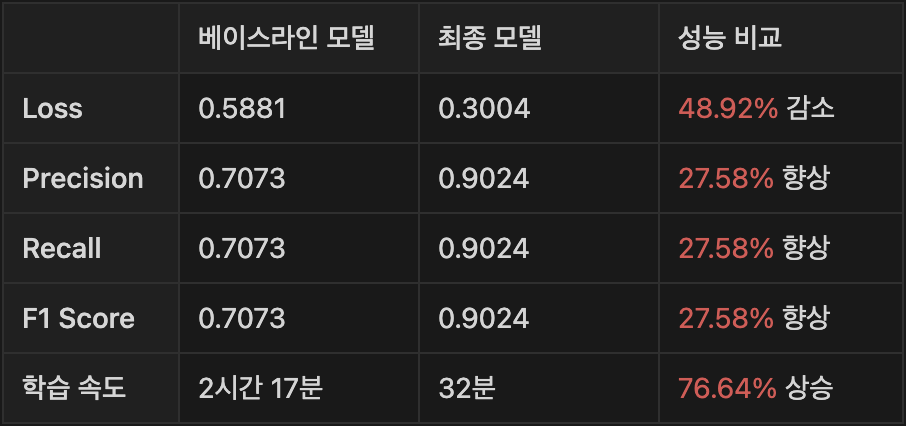

> Figure 11: Final Performance Comparison Table

MobileNetV3 + ViT로 구현된 최종 모델에서 ViT로 구현된 베이스라인 모델보다 성능 지표들인 Loss, Precision, Recall, F1 Score, 학습 속도 모두 향상된 것을 볼 수 있습니다.

그러나 목표였던 정밀도 90%를 가까스로 달성했기 때문에 이 모델은 여전히 개선의 여지가 있음을 알 수 있습니다.

향후 연구에서는 데이터 증강, 하이퍼 파라미터 튜닝, 모델 아키텍처의 추가적인 최적화 등을 통해 성능을 더욱 향상시킬 수 있을 것으로 기대가 됩니다. 이러한 개선은 모델의 일반화 능력을 높이고 실생활의 다양한 시나리오에서의 정확도를 더 향상시킬 수 있을 것입니다.

# VI. 연구 결론 (CONCLUSION)

## A. 연구 요약 (Research Summary)

CCTV를 사람이 지속적으로 모니터링하기 어려운 문제를 해결하고자 폭력 사태를 감지하는 시스템인 VDVT를 제안했습니다.

베이스라인 모델은 오직 Vision Transformer로만 구성되었고 최종 모델은 MobileNetV3와 Vision Transformer로 구성되었습니다.

이 두 모델의 성능을 Loss, Precision, Recall, F1 Score, 학습 속도로 비교했는데, 최종 모델이 모든 지표에서 우수하다는 결과를 얻었습니다.

## B. 연구 한계 (Research Limitations)

본 연구의 진행 과정에서 몇 가지 중요한 제약 사항이 있었습니다.

가장 먼저 “제한된 메모리”는 최종 모델의 성능 최적화에 상당한 악영향을 미쳤습니다. 이러한 메모리 제약은 베이스라인 모델의 성능 향상의 가능성을 제한했으며, 결과적으로 베이스라인 모델의 하이퍼 파라미터를 사용한 최종 모델의 최대 성능에도 좋지 않은 영향을 받았습니다.

또한, “제한된 시간”은 실험의 정밀함을 제한하는 주요 요인이었습니다. 충분한 시간이 주어졌다면, 저희는 대부분 하이퍼 파라미터의 값을 세밀하게 조정하여 최적의 값을 찾았을 것입니다. 예를 들어, 배치 사이즈 32에서 16, 8, 4로 줄이는 것이 아니라 31, 30, 29로 점진적으로 줄이며 최적의 값을 찾는 실험을 진행했을 것입니다. 하지만 시간 제약으로 인해 이러한 세밀한 조정은 불가능했습니다.

“사전 학습된 CNN의 선택 과정”도 중요한 고려 사항이었습니다. 메모리 사용량을 최소화하면서도 좋은 성능을 내는 것을 기준으로 MobileNetV3, EfficientNet, ResNet 중에서 선택해야 했습니다. 가장 이상적인 모델 선택 방법은 각 CNN을 베이스라인 모델에 적용하고 최적의 하이퍼 파라미터를 다시 찾은 뒤, 베이스라인 모델과 직접 성능을 비교하는 것입니다. 하지만, 제한된 메모리와 시간으로 인해 이러한 방법을 채택할 수 없었습니다.

또한, 본 연구의 초기 목표였던 “실시간 처리”는 달성하지 못했습니다. ViT 모델이 실시간 처리에도 충분하다고 가정했지만, ViT의 복잡한 아키텍처는 높은 정확도를 제공하되 계산 복잡성이 높아 실시간 처리에는 적합하지 않았습니다. 실시간 처리를 위해서는 YOLO와 같은 다른 모델을 고려했어야 됩니다.

마지막으로 “데이터 셋의 활용성 문제”도 있습니다. 제한된 메모리로 인해 저희가 확보한 3,000개의 데이터 중 실제 사용된 데이터는 400개에 불과했습니다. 이 400개는 확보한 데이터 셋 중 무작위로 선정된 데이터였습니다. 시간이 충분했다면, 3,000개의 영상을 일일이 검토하여 폭력/비폭력 비디오 탐지에 가장 적합한 데이터를 선별하는 작업이 이루어져야 할 것입니다. 이러한 세밀한 데이터 셋 선별을 통해 모델의 성능을 더욱 향상시킬 수 있습니다.

위와 같은 제약 사항에도 불구하고, 본 연구는 주어진 조건 내에서 최적화된 모델의 아키텍처와 최적의 하이퍼 파라미터를 찾는 데 중점을 두었습니다. 그리고 MobileNetV3와 Vision Transformer의 결합을 통해 얻어진 성과는 향후 연구의 기반을 마련해 주었습니다.

## C. 후속 연구 (Future Work)

본 연구의 결과와 한계를 바탕으로 다음과 같은 방향의 후속 연구를 제안합니다.

1. 메모리 최적화 기법 탐색 : 본 연구에서 메모리 제약은 모델 성능을 제한하는 주요 요인이었습니다. 따라서, 향후 연구에서는 메모리 효율을 높이는 기법, 예를 들어 모델 경량화, 파라미터 최적화 등을 진행해 볼 수 있습니다.

2. 다양한 사전 학습 CNN 모델 비교 연구 : 본 연구에서는 단순 리서치로 MobileNetV3를 사전 학습 CNN으로 선택했지만, EfficientNet, ResNet과 같이 여러 CNN에 대한 성능 비교 연구가 필요합니다. 이러한 연구를 통해 최종 모델을 구현하는데 가장 적합한 CNN을 결정할 수 있습니다.

3. 실시간 처리 기능 통합 : Vision Transformer는 높은 정확도를 제공하지만, 계산 복잡성으로 인해 실시간 처리가 어렵습니다. 후속 연구에서는 YOLO와 같은 실시간 처리에 적합한 모델을 통합하여, 실시간 비디오 분석 능력을 갖춘 모델을 개발할 수 있습니다.

이러한 후속 연구는 본 연구의 결과를 바탕으로 더 발전된 모델과 시스템을 구축하는 데 중요한 기여를 할 것으로 기대가 됩니다. 또한, 보다 효율적이고 정확한 폭력/비폭력 비디오 분류 시스템을 구현하는 것이 최종 목표입니다.

---

"50대의 추교현이 20대의 추교현에게 감사할 수 있게끔 하루하루 최선을 다해 살고자 합니다."

**_The End._**
