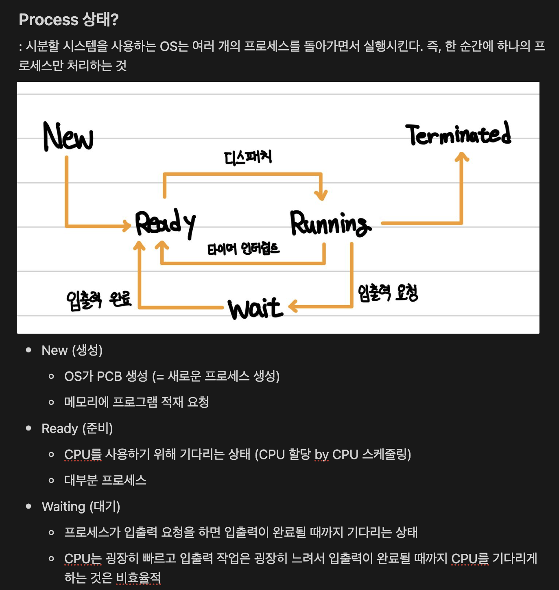

5주간 운영체제를 모의면접으로 학습하는 스터디를 진행했습니다. 정말 많은 것을 배웠습니다.@

---

> 5주간 운영체제 정리한 노션 중 일부

## 스터디 신청한 계기

프레임워크나 프로그래밍 언어는 그저 도구 중 하나일 뿐입니다. 기본기가 탄탄하다면, 어떠한 도구든 배워서 사용하는 것은 어렵지 않습니다.

제가 생각한 소프트웨어 엔지니어의 기본기는 “탄탄한 CS 지식”과 “알고리즘 문제해결 능력”입니다.

“알고리즘 문제해결 능력”을 기르기 위해서 매일 백준 문제 최소 1개를 몰입해서 풀고 이를 제 [블로그](https://scottxchoo.xyz/posts/%F0%9F%95%B9%EF%B8%8FPS)에 정리하고 있습니다.

“탄탄한 CS 지식”을 기르기 위해서 학교에서 CS 관련 수업을 듣고 있습니다. 그리고 CS 지식을 더 많이 배우고 싶다는 생각을 항상 갖고 있었습니다.

그런데 우연히 “[JSCODE] 모의면접으로 학습하는 CS 스터디”를 알게 되었습니다.

CS 지식 공부, 과제를 통한 블로그 포스팅, 모의면접 대비, 개발자 커뮤니티 참여 등 저의 현재 상황에 필요한 것들을 한꺼번에 얻을 수 있는 정말 유익한 스터디라고 생각했습니다.

## 활동 내용

“[JSCODE] 모의면접으로 학습하는 CS 스터디”는 아래와 같은 특징이 있습니다:

### [1] 주차별 예상 질문을 통한 효율적인 학습

많은 분들이 방대한 양의 운영체제를 공부할 때, 무엇부터 & 어느 정도를 공부할지 감이 잡히질 않습니다. 저 또한 그랬습니다.

그런데 이 스터디에서는 주차별로 공부할 내용과 예상 면접 질문을 미리 공유해 주십니다. 이를 통해 더 효율적으로 공부를 할 수 있습니다.

### [2] 과제는 학습한 내용을 블로그에 정리하는 것

저는 학습한 내용, 회고 등을 블로그에 정리하는 것을 좋아하며 개인적으로 개발자에게 필요한 역량이라고 생각합니다.

마침 이 스터디의 과제가 스터디하는 전날까지 학습한 내용을 자신의 블로그에 정리해서 업로드하는 것이었습니다.

블로그에 학습한 내용을 정리함으로써 제가 배운 내용을 제 것으로 만들 수 있었습니다.

### [3] 롤 플레이를 통한 모의면접 진행

4-5명씩 팀을 이뤄 면접관, 관찰자, 면접자의 역할을 돌아가면서 약 1시간 반 동안 모의면접 스터디를 진행합니다.

저를 객관적인 입장에서 피드백을 받을 수 있었고 면접관의 역할이 되어 면접관의 입장을 더욱 이해할 수 있는 시간이었습니다.

또한, 한 주제에 대해 여러 답변을 들음으로써 그 주제에 대해 더 깊게 이해할 수 있었습니다.

추가로, 스터디를 운영하시는 분께서 주차별로 면접 및 취업 준비를 위한 꿀팁도 알려주셨습니다. 그리고 네카라쿠배 출신의 멘토 분들께서 모의면접 중간중간에 날카로운 질문 및 피드백을 해주시고 성심성의껏 질의응답을 해주시는 부분도 정말 유익했습니다 (언제 네이버 출신분께 피드백을 받아볼까요?!).

## 학습 방법

제 학습 방법은 심플합니다.

책 “혼자 공부하는 컴퓨터 구조 + 운영체제”와 인프런 강의 “그림으로 쉽게 배우는 운영체제”를 주차별 주제에 맞는 부분까지 학습했습니다.

이를 기반으로 블로그 등 다른 인터넷 자료들을 참고하여 추가적으로 학습했습니다.

## 배우고 느낀 점

### [1] 시작을 했으면 끝을 보자

제가 이번 스터디를 신청하기 전에 다짐했던 것은 “단 한 번도 스터디에 불참하지 말자.”입니다.

하지만, 비대면으로 운영되기에 점점 저조해지는 참여율을 보며 ‘나도 딱 하루만 쉴까’라는 생각이 들었습니다.

그래도 이왕 시작한 것 끝까지 해내겠다는 마음가짐으로 꾸준히 참여했습니다.

마지막 스터디까지 완주한 끝에 저는 “시작을 했으면 끝을 보자”라는 교훈을 배웠습니다.

### [2] 컴퓨터 공학은 생각보다 더 재밌다

컴퓨터에 대해서 딥하게 더 배우고 싶었던 저는 운영체제, 네트워크, 컴퓨터 구조 등에 대해서 학습하고 싶었습니다.

매번 배워야지, 배워야지 말만 하다가 이번 기회에 처음 운영체제에 대해서 제대로 학습했습니다. 확실히 아는 만큼 보인다고 CS 관련 수업을 듣거나 여러 기술 관련 글을 읽을 때, 운영체제 지식 덕분에 더 잘 이해가 되었습니다.

이제 네트워크, 컴퓨터 구조 등 다른 CS 과목들을 배워서 더 많은 기술 관련 글들을 재밌게 읽고 싶습니다.

[모의면접으로 학습하는 컴퓨터공학(CS) 스터디 링크](https://jscode.notion.site/CS-e7a5eef418f24e83842b331803c34458)

### [3] 5주간 배운 운영체제 키워드

- **1주차 : 운영체제 기본 개념**

  - 시분할 시스템
  - 시스템 콜
  - 커널 모드 (vs 유저 모드)
  - 인터럽트 (vs 폴링)
  - DMA (Direct Memory Access)

- **2주차 : 프로세스와 쓰레드**

  - 프로세스
  - 쓰레드
  - PCB와 TCB
  - 컨텍스트 스위칭

- **3주차 : CPU 스케줄링**

  - CPU 스케줄링 : FCFS, SJF, RR, SRT, 우선순위 스케줄링, MLQ, MLFQ
  - 선점형 vs 비선점형
  - 호위 효과
  - 기아 상태
  - 에이징 기법
  - CPU bound process

- **4주차 : 프로세스 동기화**

  - 동시성과 병렬성
  - 프로세스 동기화
  - 임계 구역 (Critical Section)
  - 상호 배제 (Mutual Exclusion)
  - 경쟁 상태 (Race Condition)
  - 뮤텍스, 세마포어, 모니터
  - 데드락

- **5주차 : 가상메모리, 메모리분할**
  - 메모리 할당
  - 스와핑
  - 외부/내부 단편화
  - 페이징 (+ 페이지 테이블)
  - 세그멘테이션
  - 가상 주소와 물리 주소
  - MMU
  - TLB
  - 페이지 부재 (Page Fault)
  - 요구 페이징 (Demand Paging)
  - 페이지 교체 알고리즘 : FIFO, OPT, LRU, LFU, CLOCK
  - 쓰레싱 (Thrasing)
  - Working set
  - 참조 지역성의 원리

---

"50대의 추교현이 20대의 추교현에게 감사할 수 있게끔 하루하루 최선을 다해 살고자 합니다."

**_The End._**
