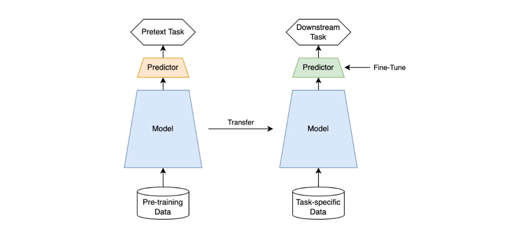

Self-supervised learning 개념에 대해서 정리합니다.@

---

# 등장 배경

딥러닝 모델을 학습시키기 위해 여러가지 요소를 고려해야 하지만, 가장 중요한 것은 양질의 데이터라고 합니다. Supervised Learning(지도 학습)은 2010년대에 접어들면서 굉장히 높은 성능을 달성하였지만 그러한 성능을 달성하기 위해선 무수히 많은 양의 데이터가 필요하고, 데이터를 사용하기 위해선 각 샘플마다 labeling을 해주어야 하기 때문에 많은 시간과 비용이 필요하게 됩니다.

# 여러 대안들

이러한 단점들을 해결하기 위해 여러 학습 방법이 있는데요. 유사한 task에서 학습된 network의 weight를 가져와서 target task에 적용하는 Transfer Learning, 가지고 있는 데이터셋 중에 일부만 라벨링하여 학습을 시키는 Semi-Supervised Learning, 주로 Segmentation에서 기존의 label (segmentation mask) 보다 적은 비용으로 얻은 label (class, point, bounding box 등)을 이용하여 학습을 시키는 Weakly-Supervised Learning 등이 있습니다. 아예 label을 이용하지 않는 Unsupervised Learning도 있는데, 이 분야에 속하는 연구 주제가 바로 Self-Supervised Learning 입니다.

# Self-supervised learning?

이름에서 유추할 수 있듯이 Supervision을 스스로 준다는 것을 의미하며, Unsupervised Learning 방식을 따라 데이터셋은 오로지 레이블이 존재하지 않는(Unlabeled) 데이터만 사용합니다. 이때 사용되는 데이터는 image가 될 수도 있고 text, speech, video 등 다양한 종류의 데이터가 될 수 있습니다.

우선 Unlabeled 데이터들을 이용하여 사용자가 새로운 문제를 정의하며 정답도 사용자가 직접 정해줍니다. 이때, 사용자가 정의한 새로운 문제를 논문들에서는 pretext task 라고 부릅니다. Network로 하여금 만든 pretext task를 학습하게 하여 데이터 자체에 대한 이해를 높일 수 있게 하고, 이렇게 network를 pretraining 시킨 뒤, downstream task로 transfer learning을 하는 접근 방법이 Self-Supervised Learning의 핵심 개념입니다.

# Architecture

Self-Supervised Learning은 Pre-trained 모델 생성과 Downstream task 라는 두 단계로 구성되어 있습니다.

Pre-trained 모델은 대량의 Untagged data를 이용해 해당 응용에 대해 전반적인 특징을 학습하는 단계입니다. 자연어 처리의 대세가 된 Google의 BERT도 Self-supervised learning 학습 방법이 적용되었습니다. BERT에서는 전체 문장에서 하나의 단어를 지운(Masking) 후 해당 단어가 무엇이었을지 추측하는 방법과 다음에 어떠한 문장이 올지 추측하는 방법으로 Pre-trained 모델 학습을 진행합니다. Pre-trained model 학습 시에는 일반적인 문장을 그대로 활용하기 때문에 Tagging이 필요없습니다.

다음 단계인 Downstream task에서는 소량의 Tagged data를 활용하여 사용 목적에 맞게 Pre-trained model을 Fine tuning 합니다. 예를 들어, BERT 같은 경우에는 질의 응답(Q&A) 수행, 문장 속의 감정 분류 등 목적에 맞게 Layer를 1-2개 더 추가한 후 Tagged data와 함께 학습하면 됩니다.

# Reference

[[1] Unsupervised Visual Representation Learning Overview： Toward Self-Supervision](https://hoya012.github.io/blog/Self-Supervised-Learning-Overview/)

[[2] Self-supervised learning (자기지도 학습) 이란?](https://lifeisenjoyable.tistory.com/15)

[[3] Self-supervised learning (자기지도학습)과 Contrastive learning (대조학습): 개념과 방법론 톺아보기](https://sanghyu.tistory.com/184)

[[4] [CV] Self-supervised learning(자기주도학습)과 Contrastive learning - 스스로 학습하는 알고리즘](https://daeun-computer-uneasy.tistory.com/37)

---

"50대의 추교현이 20대의 추교현에게 감사할 수 있게끔 하루하루 최선을 다해 살고자 합니다."

**_The End._**
