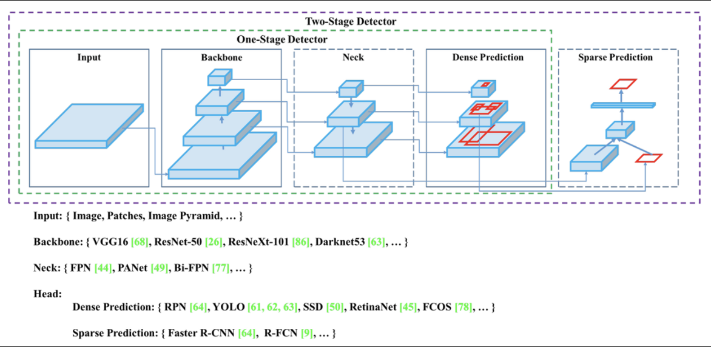

객체 탐지 모델인 YOLO v1부터 v8까지 정리합니다.@

---

## [0] YOLO 버전별 타임라인 및 특징

- YOLO v1 | 2016년 발표 : 실시간 객체 검출을 위한 딥러닝 기반의 네트워크
- YOLO v2 | 2017년 발표 : v1보다 성능을 개선하고 속도를 높인 것이 특징 + 앵커 박스 도입
- YOLO v3 | 2018년 발표 : 네트워크 구조와 학습 방법을 개선하여 객체 검출의 정확도와 속도를 모두 개선
- YOLO v4 | 2020년 4월 발표 : SPP와 PAN 등의 기술이 적용되어 더욱 정확한 객체 검출과 더 높은 속도를 제공
- YOLO v5 | 2020년 6월 발표 : YOLO v4와 비교하여 객체 검출 정확도에서 10% 이상 향상되었으며, 더 빠른 속도와 더 작은 모델 크기를 가짐
- YOLO v7 | 2022년 7월 발표 : 훈련 과정의 최적화에 집중하여 훈련 cost를 강화하는 최적화된 모듈과 최적 기법인 trainable bag-of-freebies를 제안
- YOLO v6 | 2022년 9월 발표 : 여러 방법을 이용하여 알고리즘의 효율을 높이고, 특히 시스템에 탑재하기 위한 Quantization과 distillation 방식도 일부 도입하여 성능 향상
- YOLO v8 | 2023년 1월 발표 : YOLO 모델을 위한 완전히 새로운 레포지토리를 출시하여 인스턴스 세분화 및 이미지 분류 모델을 train하기 위한 통합 프레임워크로 구축

## [1] YOLO v1

### 특징

- 각 Gird Cell은 하나의 Class만 예측
- 인접한 Cell들이 동일한 객체에 대한 Bounding Box를 생성할 수 있음
- 당시 SotA들과 비교했을 때, Real-Time부분에서 가장 좋은 성능을 보임

### First YOLO

.png>)

- S x S 크기의 Grid Cell로 Input Image 분리
- Cell마다 B개의 bounding boxes, confidence score, class probabilities 예측
- Final Output : S x S (B \* 5 + C)
  [ S : Num of Cell, B : Num of Bounding boxes, C : Num of Classes ]

### NMS (None Maximum Suppression)

.png>)

> IoU : Interaction over Union; Area of Overlap / Area of Union

- 각각의 Grid Cell마다 B개의 Bounding Box 생성
- 인접한 Cell이 같은 객체를 예측하는 Bounding Box를 생성하는 문제 발생
- 이를 해결하기 위해 IoU를 측정하여 가장 높은 IoU를 제외한 나머지 Bounding Box 삭제

### Architecture

- 24개의 Conv Layer + 2개의 FC Layer로 구성
- ImageNet dataset으로 Pre-trained network인 Darknet network 사용
- 1x1 Conv Layer와 3x3 Conv Layer의 교차를 통해 Parameter 감수 (GoogLeNet 인용)

### Loss Function

- Bounding box Loss와 Classification Loss를 한 번에 Optimizing
- 𝛌를 사용하여 각 loss들에 가중치를 부여하여 학습
- SSE (Sum Squared Error) 사용

## [2] YOLO v2 (YOLO9000)

### 특징

- 기존 YOLO의 다소 낮은 정확도의 개선
- 높은 해상도의 이미지로 Back Bone network Fine tuning
- Anchor Box 도입으로 인한 학습 안정화
- 높은 해상도의 Feature map을 낮은 해상도의 Feature map에 합치기

### Batch Normalization (배치 정규화)

- 기존 모델에서 Dropout Layer를 제거하고 배치 정규화를 사용해서 mAP 2% 향상
- 기존 모델은 224x224 size로 pre-train, 448x448 size를 input으로 사용하여 불안정한 학습
- 448x448 size로 pre-train 후 학습하여 mAP 4% 향상

### Anchor Box (앵커 박스)

- mAP는 약간 감소하지만 recall이 높아져 더 많은 예측 가능
  - No Anchor Box = mAP : 69.5 | recall : 81%
  - Anchor Box = mAP : 69.2 | recall : 88%

### Architecture

- 기존의 DarkNet을 개선한 DarkNet19 제안
- 기존 network의 마지막 FC Layer 삭제
- Global Average Pooling을 사용해 파라미터를 줄여 속도 향상

## [3] YOLO v3

### Main Idea

.png>)

- YOLO v3는 다른 사람들의 아이디어를 차용한 내용
- 17년 당시 SotA였던 RetinaNet과 비교했을 때, Facebook이 상정한 최소 시간조차 뚫어낸 속도

### Architecture

- Backbone Network를 Darknet-53으로 변경
- 이전 Darknet-19에 ResNet에서 제안된 skip connection 개념 적용

### Multi-Label Classification

- Loss Function을 Softmax가 아닌 Binary cross entropy로 변경
- 하나의 Box 안에 여러 객체가 존재할 경우 Softmax는 적절한 객체 포착 불가능
- Binary cross entropy를 통해 box에서 각 class의 존재 여부를 확인하여 적절한 포착을 가능하게 변경

### Prediction across scales

- 서로 다른 3개의 scale을 사용하여 최종 결과 예측
- 각 Feature map을 FCN(Fully Convolution Network)에 입력
- 더 높은 level의 Feature map으로부터 fine-grained 정보를 얻을 수 있다.
- 더 낮은 level의 Feature map으로부터 유용한 semantic 정보를 얻을 수 있다.

### Comparison

- YOLO v2까지는 Pooling Layer를 사용했지만, v3에서는 사용하지 않음
- Network가 더 깊어지고, Bounding box를 multi scale마다 생성하여 굉장히 많은 수를 생성
- v2보다 정확도는 높였지만, 속도가 느려진 모델
- 연산이 급격하게 늘었기 때문에 이전보다 하드웨어 스펙에 더 의존하게 된 모델

## [4] YOLO v4

### Object detection models

- 기존의 detector 모델들은 Backbone과 Head로 구성되어 있었음
- 서로 다른 scale의 Feature map을 수집하는 neck layer가 등장...!

### Main Idea

- 컴퓨팅 파워가 높지 않은 환경에서도 기존의 1-GPU를 사용해서 Real-time detection을 가능하게끔 구현 목적
- v3와 마찬가지로 당시 연구된 detector 관련 좋은 기술들을 Grid Search를 통해 접목시켜 최적의 model을 생성
- 연산 양의 숫자를 줄이는 것이 아닌 병렬적으로 계산이 가능하도록 하여 속도 최적화
- v4 = v3 + CSPDarkNet53(Backbone) + SPP + PAN + BoF + BoS
- v3와 비교했을 때, AP와 FPS가 각각 10%, 12% 증가

### BoF (Back of Freebies)

- Inference time은 증가시키지 않으면서 더 높은 정확도를 얻기 위해 학습시키는 방법
- Data augmentation : CutMix, Mosaic 등
- Bounding Box Loss Function : 기존의 MSE 대신 CloU 사용
- Regularization method : DropBlock

### BoS (Back of Special)

- Inference time은 조금 증가시키지만 정확도를 크게 향상시키기 위해 학습시키는 방법
- 모델 및 후처리에 적용하는 기술
- Enhance receptive field (강화된 유효수용 영역) : SPP (Spatial Pyramid Pooling)
- Attention module : SAM (Spatial Attention Module)을 사용하여 Inference time 유지, 정확도 향상
- Activation Function : Mish
- Skip-connections : Cross stage partial connections

### Backbone

- CSPDarkNet53
- 기존 DarkNet에 CSP Layer를 연결
- Layer도 깊고 parameter도 많지만 속도를 빠르게 해줌
- 정확도에 손실 없이 빠른 연산이 가능

## [5] YOLO v5

### No Paper & Report

- Paper와 Tech Report 없이 코드만 공개
- 저자는 기존 v3를 PyTorch로 구현했던 사람
- 성능과 코드 외에는 명시한 사항이 없음

### Architecture

- Backbone -> Neck -> Head로 구성
- 최적화가 잘 되어 있어서 weight file 크기가 이전 모델보다 작음
- 다양한 크기의 network를 사용하여 상황에 맞는 선택이 가능 (속도, 정확도 trade-off)

## [6] YOLO v7

### 특징

- Model reparameterization : 학습 시, 여러 개의 레이어들을 학습하고 inference 시에는 해당 레이어들을 하나의 레이어로 fusing함
- Label assignment : Ground truth를 그냥 사용하는 것이 아니라 모델의 prediction, ground truth의 distribution을 고려하여 새로운 strategy 방법 제안
- extend and compound scaling : 방법을 통해 계산에 효율적 사용

### Architecture

- Expand, Shuffle, Merge cardinality를 통해 computational block을 많이 쌓아도 학습능력이 뛰어남
- 아키텍처 측면에서 E-ELAN은 computational block의 아키텍처만 변경하는 반면, transition layer의 아키텍처는 변경되지 않음
- computational layer의 모든 block에 동일한 group parameter와 channel multiplier를 적용하고, 각 computational block에서 계산된 feature map은 설정된 parameter에 따라 group으로 섞인 다음 함께 연결된다.
- 마지막으로 merge cardinality를 수행하기 위해 g개의 feature map group을 추가

## [7] YOLO v6

### 특징

- v6는 v7보다 늦게 출시되었다.
- 더 깊어진 network
- Head가 3개의 scale에서 4개의 scale로 변화
- 이전 v5의 대다수의 모델보다 월등히 빠른 속도를 자랑

### Architecture

- 백본은 EfficientRep Backbone이 사용되었다. Neck 부분은 Rep-PAN이 사용되었다. Head는 Efficient decoupled head가 사용되었다.
- 먼저 네트워크 구조에서 가장 핵심이 되는 기여는 CSPstackRep Block이다. 이는 CSP(Cross Stage Partial) + RepVGG 방식이다.
- 소형 모델은 일반 단일 경로 백본을 특징으로 하고 대형 모델은 효율적인 다중 분기 블록을 기반으로 구축

## [8] YOLO v8

23년 3월 기준 가장 최근에 나온 YOLO 버전이며 Ultralytics에서 개발되었다.

YOLO 모델을 위한 완전히 새로운 레포지토리를 출시하여 개체 감지, 인스턴스 세분화 및 이미지 분류 모델을 train하기 위한 통합 프레임워크로 구축되었다.

#### YOLO v8은 앵커박스의 offset 대신에 객체의 중심을 직접 예측하는 앵커프리모델이며 이로 인해 NMS의 속도를 높였다.

---

"50대의 추교현이 20대의 추교현에게 감사할 수 있게끔 하루하루 최선을 다해 살고자 합니다."

**_The End._**
